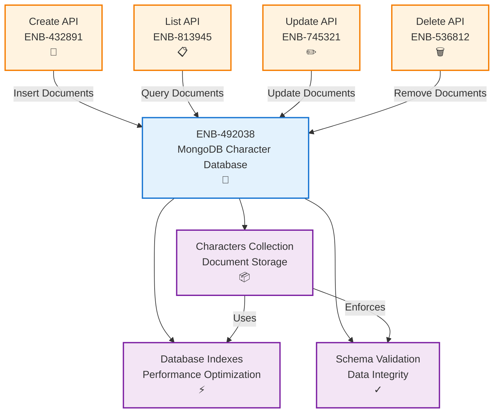
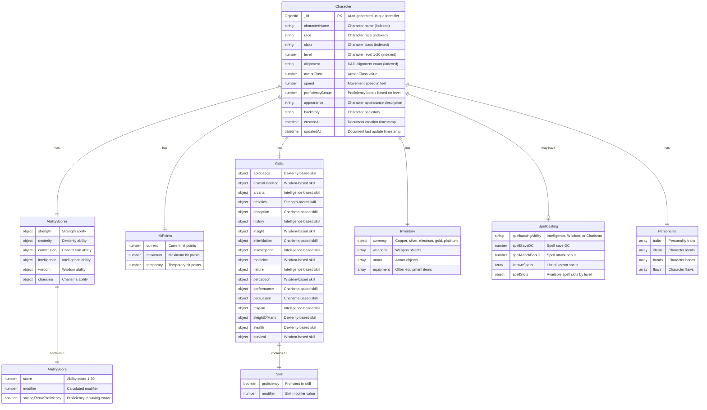
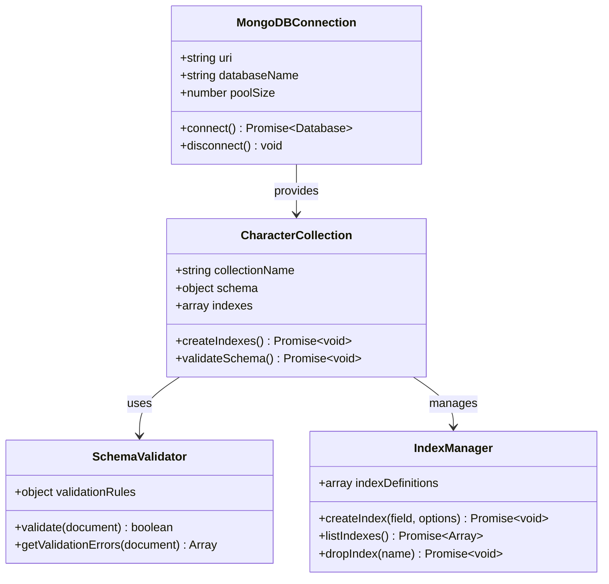
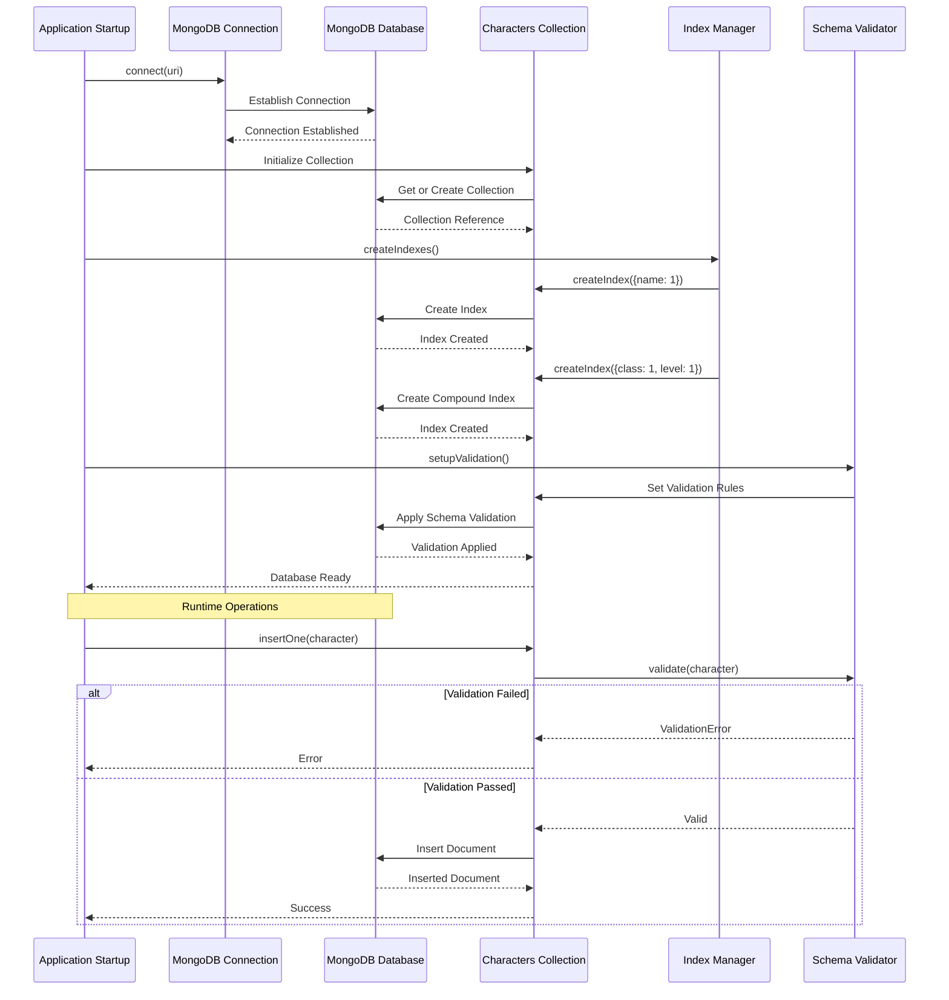
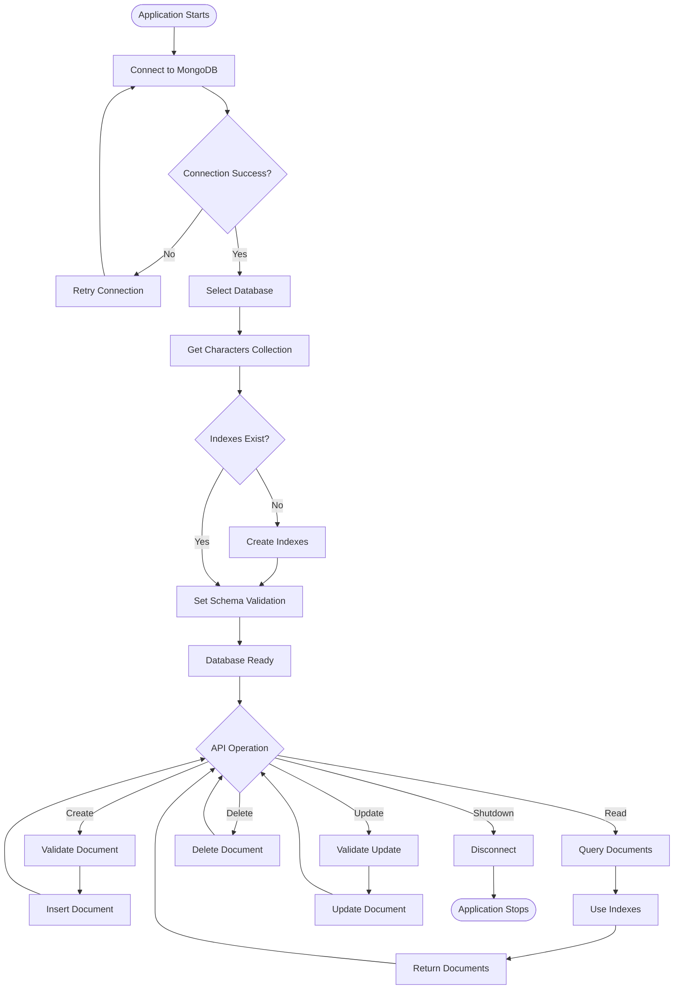
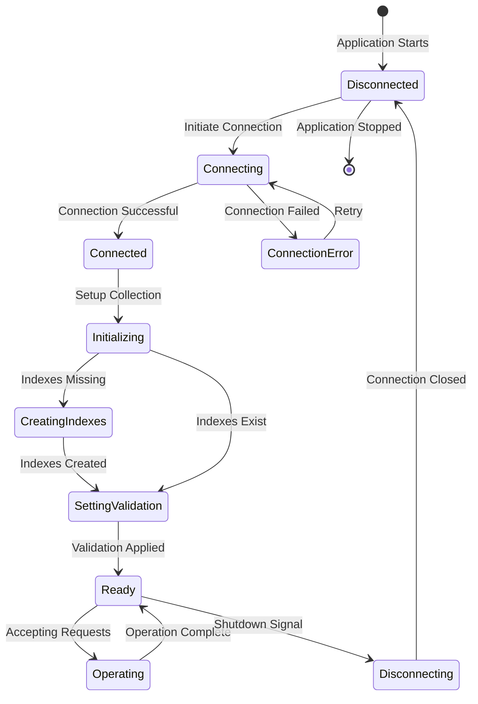

# Mongo Data Store

## Metadata

- **Name**: Mongo Data Store
- **Type**: Enabler
- **ID**: ENB-492038
- **Approval**: Approved
- **Capability ID**: CAP-290474
- **Owner**: Product Team
- **Status**: Ready for Implementation
- **Priority**: High
- **Analysis Review**: Required
- **Code Review**: Required

## Technical Overview
### Purpose
A Mongo Database with a dedicated collection for storing and managing data objects providing persistence, indexing, and query capabilities.

## Functional Requirements

| ID | Name | Requirement | Priority | Status | Approval |
|----|------|-------------|----------|--------|----------|
| FR-492001 | Database Instance | A MongoDB Community Server database instance SHALL be provisioned for storage | High | Implemented | Approved |
| FR-492004 | Unique Identifiers | Each document SHALL have a unique `_id` field (MongoDB ObjectId) | High | Implemented | Approved |
| FR-492005 | Timestamp Fields | All documents SHALL include `createdAt` and `updatedAt` timestamp fields | High | Implemented | Approved |
| FR-492006 | Primary Index | The collection SHALL have a primary index on the `_id` field | High | Implemented | Approved |

## Non-Functional Requirements

| ID | Name | Type | Requirement | Priority | Status | Approval |
|----|------|------|-------------|----------|--------|----------|
| NFR-492002 | Query Performance | Performance | Queries SHALL execute within 100ms for indexed fields | High | Implemented | Approved |
| NFR-492003 | Connection Pool | Performance | The database SHALL support connection pooling for concurrent requests | High | Implemented | Approved |
| NFR-492007 | Deployment | Infrastructure | MongoDB Community Server SHALL be deployed as a Docker container with persistent volumes | High | Ready for Implementation | Approved |
| NFR-492008 | Data Persistence | Reliability | MongoDB data SHALL persist across container restarts using Docker volumes | High | Ready for Implementation | Approved |

## Dependencies

### Internal Upstream Dependency

| Enabler ID | Description |
|------------|-------------|
|  | None - This is a foundational data storage enabler |

### Internal Downstream Impact

| Enabler ID | Description |
|------------|-------------|
| | |

### External Dependencies

**External Upstream Dependencies**: MongoDB server instance (self-hosted or MongoDB Atlas)

**External Downstream Impact**: All API endpoints depend on this database

## Technical Specifications (Template)

### Enabler Dependency Flow Diagram

### API Technical Specifications (if applicable)

| API Type | Operation | Channel / Endpoint | Description | Request / Publish Payload | Response / Subscribe Data |
|----------|-----------|---------------------|-------------|----------------------------|----------------------------|
| MongoDB | insert | `db.characters.insertOne()` | Inserts a new character document | Character document object | Inserted document with `_id` |
| MongoDB | find | `db.characters.find()` | Queries character documents | Query filter object | Array of matching documents |
| MongoDB | update | `db.characters.updateOne()` | Updates a character document | Filter and update objects | Update result |
| MongoDB | delete | `db.characters.deleteOne()` | Deletes a character document | Filter object | Delete result |

### Data Models

### Class Diagrams

### Sequence Diagrams

### Dataflow Diagrams

### State Diagrams

