# Folder Structure

## Metadata

- **Name**: Folder Structure
- **Type**: Enabler
- **ID**: ENB-782116
- **Approval**: Approved
- **Capability ID**: CAP-290474
- **Owner**: Product Team
- **Status**: Ready for Implementation
- **Priority**: High
- **Analysis Review**: Required
- **Code Review**: Not Required

## Technical Overview
### Purpose
Ensure the project maintains a clean folder structure with implementation code separated from specifications and documentation. All implementation code must reside in a dedicated subfolder named after the project (e.g., objectstorage/), keeping the root directory organized and preventing mixing of specifications with implementation files.

## Functional Requirements

| ID | Name | Requirement | Priority | Status | Approval |
|----|------|-------------|----------|--------|----------|
| FR-097067 | Separate Implementation Folder | Create a dedicated subfolder named after the project (e.g., `objectstorage/`) that contains ALL implementation code, dependencies, and build files. The root folder must only contain specifications/, documentation, and project-level files. | Must Have | Ready for Implementation | Approved |
| FR-097068 | Clear Naming Convention | The implementation folder name must clearly identify the project/component being implemented (avoid generic names like `src/`, `code/`, or `app/`). | Must Have | Ready for Implementation | Approved |
| FR-097069 | No Root Implementation Files | Implementation files (source code, go.mod, package.json, etc.) must NOT exist in the project root directory. Only documentation and specification folders are permitted at root level. | Must Have | Ready for Implementation | Approved |

## Non-Functional Requirements

| ID | Name | Type | Requirement | Priority | Status | Approval |
|----|------|------|-------------|----------|--------|----------|
| NFR-097060 | Maintainability | Organization | The folder structure must make it immediately clear where implementation code resides vs specifications, enabling easy navigation and reducing confusion. | Must Have | Ready for Implementation | Approved |
| NFR-097061 | Scalability | Organization | The structure must support multiple implementations or sub-projects by allowing additional named folders alongside the main implementation folder. | Must Have | Ready for Implementation | Approved |
| NFR-097062 | Consistency | Standards | All future implementations must follow the same pattern: root-level specifications and documentation, with implementation in named subfolders. | Must Have | Ready for Implementation | Approved |

## Dependencies

### Internal Upstream Dependency

| Enabler ID | Description |
|------------|-------------|
| | |

### Internal Downstream Impact

| Enabler ID | Description |
|------------|-------------|
| | |

### External Dependencies

**External Upstream Dependencies**: None identified.

**External Downstream Impact**: None identified.

## Technical Specifications (Template)

### Enabler Dependency Flow Diagram

```mermaid
flowchart TD
    ENB_782116["ENB-782116<br/>Folder Structure<br/>📁"]

    %% Add your dependency flows here

    classDef enabler fill:#e3f2fd,stroke:#1976d2,stroke-width:2px
    class ENB_782116 enabler
```

### API Technical Specifications (if applicable)

| API Type | Operation | Channel / Endpoint | Description | Request / Publish Payload | Response / Subscribe Data |
|----------|-----------|---------------------|-------------|----------------------------|----------------------------|
| | | | | | |

### Data Models

### Class Diagrams

### Sequence Diagrams

### Dataflow Diagrams

### State Diagrams

### Testing Strategy
**Unit Testing:**
- Validate folder structure creation
- Test naming convention enforcement
- Verify file placement rules

**Integration Testing:**
- End-to-end project structure validation
- Cross-platform compatibility testing
- Build system integration testing

**Performance Testing:**
- Large project structure operations
- File system operation efficiency
- Memory usage during validation

### Deployment Strategy
**Development Environment:**
- Automated folder structure creation
- Continuous validation during development
- IDE integration for structure enforcement

**Production Environment:**
- Structure validation during CI/CD
- Automated deployment with correct folder structure
- Monitoring of folder structure compliance

### Monitoring and Observability
**Metrics to Monitor:**
- Folder structure compliance percentage
- File placement violations
- Structure validation success rate
- Development time impact

**Logging:**
- Structure validation events
- File placement warnings/errors
- Compliance audit logs

### Security Considerations
**Access Control:**
- Implementation folder permissions
- Specification folder access controls
- Secure file handling during structure operations

**Data Protection:**
- Sensitive configuration file protection
- Secure dependency management
- Audit trail of structure changes

### Backup and Recovery
**Backup Strategy:**
- Regular folder structure snapshots
- Configuration file backups
- Automated recovery procedures

**Recovery Procedures:**
- Structure restoration from backups
- Automated folder recreation
- Integrity validation after recovery

### Scalability Considerations
**Large Projects:**
- Efficient folder traversal algorithms
- Parallel structure validation
- Memory-efficient file operations

**Multiple Projects:**
- Shared structure templates
- Cross-project consistency validation
- Automated structure synchronization

### Migration Strategy
**From Legacy Structures:**
- Automated migration scripts
- Gradual structure transformation
- Backward compatibility during transition

**Version Control:**
- Git-aware structure operations
- Branch-specific structure handling
- Merge conflict resolution for structure changes