# Character Delete Button Component

## Metadata

- **Name**: Character Delete Button Component
- **Type**: Enabler
- **ID**: ENB-219576
- **Approval**: Approved
- **Capability ID**: CAP-336495
- **Owner**: Product Team
- **Status**: Ready for Implementation
- **Priority**: High
- **Analysis Review**: Required
- **Code Review**: Required

## Technical Overview
### Purpose
A UI component that displays a delete button for each player character, providing confirmation before deletion and handling the deletion operation through the API.

## Functional Requirements

| ID | Name | Requirement | Priority | Status | Approval |
|----|------|-------------|----------|--------|----------|
| FR-219001 | Delete Button Display | Each character tile/card SHALL display a delete button | High | Implemented | Approved |
| FR-219002 | Confirmation Dialog | Clicking delete SHALL show a confirmation dialog before proceeding | High | Implemented | Approved |
| FR-219003 | Character Information | The confirmation dialog SHALL display the character name being deleted | High | Implemented | Approved |
| FR-219004 | Cancel Action | Users SHALL be able to cancel the deletion from the confirmation dialog | High | Implemented | Approved |
| FR-219005 | Delete Execution | Confirming deletion SHALL call the delete API endpoint | High | Implemented | Approved |
| FR-219006 | Success Feedback | Successful deletion SHALL show a success message and refresh the character list | High | Implemented | Approved |
| FR-219007 | Error Feedback | Failed deletion SHALL display an error message without removing the character | High | Implemented | Approved |
| FR-219008 | Loading State | The button SHALL show a loading state during deletion operation | Medium | Implemented | Approved |

## Non-Functional Requirements

| ID | Name | Type | Requirement | Priority | Status | Approval |
|----|------|------|-------------|----------|--------|----------|
| NFR-219001 | Visual Design | Usability | The delete button SHALL use a destructive color (red) to indicate danger | High | Implemented | Approved |
| NFR-219002 | Accessibility | Accessibility | The button SHALL have appropriate ARIA labels for screen readers | High | Implemented | Approved |
| NFR-219003 | Confirmation Clarity | Usability | The confirmation dialog SHALL clearly state the action is irreversible | High | Implemented | Approved |
| NFR-219004 | Icon Support | Usability | The button SHALL optionally display a trash/delete icon | Medium | Implemented | Approved |

## Dependencies

### Internal Upstream Dependency

| Enabler ID | Description |
|------------|-------------|
| ENB-729164 | Character List Display Component - Hosts the delete buttons |
| ENB-XXXXXX | Player Character REST API - Delete Endpoint - Performs deletion |

### Internal Downstream Impact

| Enabler ID | Description |
|------------|-------------|
| ENB-729164 | Character List Display Component - Updates after deletion |

### External Dependencies

**External Upstream Dependencies**: REST API delete endpoint

**External Downstream Impact**: None identified.

## Technical Specifications (Template)

### Enabler Dependency Flow Diagram

```mermaid
flowchart TD
    ENB_219576["ENB-219576<br/>Character Delete Button Component<br/>🗑️"]
    
    USER["User<br/>Browser<br/>👤"]
    CONFIRM["Confirmation Dialog<br/>Warning Modal<br/>⚠️"]
    API_SERVICE["API Service<br/>Delete Request<br/>📡"]
    LIST["Character List<br/>Display Component<br/>📋"]
    
    USER -->|Click Delete| ENB_219576
    ENB_219576 -->|Show Dialog| CONFIRM
    CONFIRM -->|Display to| USER
    
    USER -->|Click Cancel| CONFIRM
    CONFIRM -->|Close| ENB_219576
    
    USER -->|Click Confirm| CONFIRM
    CONFIRM -->|Proceed| ENB_219576
    ENB_219576 -->|Set Loading| USER
    ENB_219576 -->|Send Request| API_SERVICE
    API_SERVICE -->|DELETE /api/characters/:id| REST_API["REST API<br/>Backend<br/>⚙️"]
    REST_API -->|204 No Content| API_SERVICE
    API_SERVICE -->|Success| ENB_219576
    ENB_219576 -->|Remove from List| LIST
    LIST -->|Refresh Display| USER
    ENB_219576 -->|Show Success| USER

    classDef enabler fill:#e3f2fd,stroke:#1976d2,stroke-width:2px
    classDef external fill:#fff3e0,stroke:#f57c00,stroke-width:2px
    classDef process fill:#f3e5f5,stroke:#7b1fa2,stroke-width:2px
    
    class ENB_219576 enabler
    class USER,REST_API external
    class CONFIRM,API_SERVICE,LIST process
```

### API Technical Specifications (if applicable)

| API Type | Operation | Channel / Endpoint | Description | Request / Publish Payload | Response / Subscribe Data |
|----------|-----------|---------------------|-------------|----------------------------|----------------------------|
| REST | DELETE | `/api/characters/:id` | Deletes a character | None (ID in URL) | **204 No Content**   **404 Not Found**: `{ "error": "Character not found" }`   **500 Internal Error**: `{ "error": "string" }` |

### Data Models

### Class Diagrams

### Sequence Diagrams

### Dataflow Diagrams

### State Diagrams

## External Dependencies

- **UI Framework**: React, Vue, or Angular for component logic
- **Modal/Dialog Library**: For confirmation dialog UI
- **Toast/Notification Library**: For success/error messages
- **Icon Library**: For delete icon (trash can, X, etc.)

## Testing Strategy

### Unit Tests
- Test button renders with correct character ID
- Test clicking button shows confirmation dialog
- Test cancel closes dialog without API call
- Test confirm triggers delete API call
- Test loading state displays during deletion
- Test success closes dialog and shows toast
- Test error shows error toast without removing character
- Test button disabled state during deletion

### Integration Tests
- Test delete button integrated with character list
- Test successful deletion refreshes the list
- Test deletion updates parent component state
- Test API error handling
- Test confirmation dialog displays character name
- Test toast notifications appear and disappear

### End-to-End Tests
- Test complete delete workflow from list view
- Test deleting multiple characters in sequence
- Test cancel workflow preserves character
- Test error scenarios don't corrupt UI state
- Test keyboard accessibility (Enter to confirm, Esc to cancel)
- Test screen reader announces deletion actions

### Edge Cases
- Test deleting last character in list
- Test deleting character that was already deleted (404)
- Test network timeout during deletion
- Test rapid clicking delete button
- Test deleting while another delete is in progress
