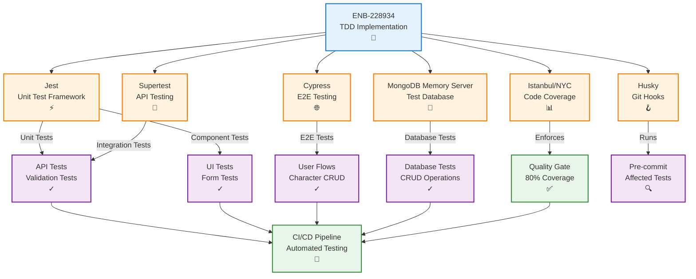

# Test-Driven Development Implementation

## Metadata

- **Name**: Test-Driven Development Implementation
- **Type**: Enabler
- **ID**: ENB-228934
- **Approval**: Approved
- **Capability ID**: CAP-115782
- **Owner**: Product Team
- **Status**: Ready for Implementation
- **Priority**: High
- **Analysis Review**: Required
- **Code Review**: Required

## Technical Overview
### Purpose
Implement Test-Driven Development (TDD) infrastructure, tooling, and practices for the player character application, including test frameworks, runners, coverage tools, and CI/CD integration to ensure all code follows the Red-Green-Refactor cycle.

## Functional Requirements

| ID | Name | Requirement | Priority | Status | Approval |
|----|------|-------------|----------|--------|----------|
| FR-TDD001 | Unit Test Framework | The project SHALL use Jest as the primary unit testing framework | High | Implemented | Approved |
| FR-TDD002 | Integration Test Support | The project SHALL support integration testing with Supertest for API tests | High | Implemented | Approved |
| FR-TDD003 | E2E Test Framework | The project SHALL use Cypress or Playwright for end-to-end testing | Medium | Implemented | Approved |
| FR-TDD004 | Code Coverage | The project SHALL generate code coverage reports with Istanbul/NYC | High | Implemented | Approved |
| FR-TDD005 | Coverage Enforcement | The project SHALL enforce minimum 80% line coverage in CI/CD | High | Implemented | Approved |
| FR-TDD006 | Test Database | The project SHALL use MongoDB Memory Server for isolated database testing | High | Implemented | Approved |
| FR-TDD007 | Mock Data | The project SHALL provide test fixtures using D&D 5e sample characters | High | Implemented | Approved |
| FR-TDD008 | Test Organization | Tests SHALL be colocated with source files using .test.js/.test.jsx extensions | High | Implemented | Approved |
| FR-TDD009 | Pre-commit Hooks | The project SHALL run affected tests before commit using husky | Medium | Implemented | Approved |
| FR-TDD010 | CI/CD Integration | The project SHALL run all tests in CI/CD pipeline before merge | High | Implemented | Approved |
| FR-TDD011 | Coverage Reports | The project SHALL generate HTML coverage reports for local review | Medium | Implemented | Approved |
| FR-TDD012 | Watch Mode | The project SHALL support watch mode for rapid test-driven development | High | Implemented | Approved |

## Non-Functional Requirements

| ID | Name | Type | Requirement | Priority | Status | Approval |
|----|------|------|-------------|----------|--------|----------|
| NFR-TDD001 | Test Speed | Performance | Unit tests SHALL execute in under 5 seconds | High | Implemented | Approved |
| NFR-TDD002 | Test Isolation | Reliability | Each test SHALL be independent and not affect other tests | High | Implemented | Approved |
| NFR-TDD003 | Test Determinism | Reliability | Tests SHALL produce consistent results across runs (no flakiness) | High | Implemented | Approved |
| NFR-TDD004 | Developer Experience | Usability | Test output SHALL be clear, colored, and easy to understand | Medium | Implemented | Approved |

## Dependencies

### Internal Upstream Dependency

| Enabler ID | Description |
|------------|-------------|
|  | None - This is a foundational testing enabler |

### Internal Downstream Impact

| Enabler ID | Description |
|------------|-------------|
| ENB-432891 | Player Character REST API - Create Endpoint - Requires TDD tests |
| ENB-813945 | Player Character REST API - List Endpoint - Requires TDD tests |
| ENB-745321 | Player Character REST API - Update Endpoint - Requires TDD tests |
| ENB-492038 | MongoDB Character Storage - Requires database tests |
| ENB-847291 | Schema Validation Service - Requires validation tests |
| ENB-384629 | Character Creation Form - Requires component tests |
| ENB-652108 | Character Edit Form - Requires component tests |
| ENB-729164 | Character List Display - Requires component tests |

### External Dependencies

**External Upstream Dependencies**:  

**External Downstream Impact**: All developers must use these testing tools

## Technical Specifications (Template)

### Enabler Dependency Flow Diagram


### Configuration Files

#### package.json (test scripts)
```json
{
  "scripts": {
    "test": "jest",
    "test:watch": "jest --watch",
    "test:coverage": "jest --coverage",
    "test:integration": "jest --testMatch='**/tests/integration/**/*.test.js'",
    "test:e2e": "cypress run",
    "test:e2e:open": "cypress open",
    "test:ci": "jest --ci --coverage --maxWorkers=2"
  },
  "devDependencies": {
    "jest": "^29.0.0",
    "supertest": "^6.3.0",
    "cypress": "^13.0.0",
    "@testing-library/react": "^14.0.0",
    "@testing-library/jest-dom": "^6.0.0",
    "mongodb-memory-server": "^9.0.0",
    "husky": "^8.0.0",
    "lint-staged": "^15.0.0"
  },
  "jest": {
    "testEnvironment": "node",
    "collectCoverageFrom": [
      "src/**/*.{js,jsx}",
      "!src/**/*.test.{js,jsx}",
      "!src/config/**",
      "!src/mocks/**"
    ],
    "coverageThreshold": {
      "global": {
        "lines": 80,
        "branches": 75,
        "functions": 90,
        "statements": 80
      }
    },
    "setupFilesAfterEnv": ["<rootDir>/tests/setup.js"],
    "testMatch": [
      "**/__tests__/**/*.[jt]s?(x)",
      "**/?(*.)+(spec|test).[jt]s?(x)"
    ]
  }
}
```

#### jest.config.js
```javascript
module.exports = {
  testEnvironment: 'node',
  collectCoverageFrom: [
    'src/**/*.{js,jsx}',
    '!src/**/*.test.{js,jsx}',
    '!src/config/**',
    '!src/mocks/**'
  ],
  coverageThreshold: {
    global: {
      lines: 80,
      branches: 75,
      functions: 90,
      statements: 80
    }
  },
  setupFilesAfterEnv: ['<rootDir>/tests/setup.js'],
  testMatch: [
    '**/__tests__/**/*.[jt]s?(x)',
    '**/?(*.)+(spec|test).[jt]s?(x)'
  ],
  moduleNameMapper: {
    '^@/(.*)$': '<rootDir>/src/$1'
  }
};
```

#### .huskyrc
```json
{
  "hooks": {
    "pre-commit": "lint-staged",
    "pre-push": "npm run test"
  }
}
```

#### lint-staged.config.js
```javascript
module.exports = {
  '*.{js,jsx}': [
    'eslint --fix',
    'jest --bail --findRelatedTests'
  ]
};
```

### Test Setup File

#### tests/setup.js
```javascript
// Load D&D 5e test data
import sampleCharacters from '../specifications/reference/sample-characters.json';

// Global test utilities
global.sampleCharacters = sampleCharacters;

// Test data factories
global.createTestCharacter = (overrides = {}) => ({
  characterName: 'Test Character',
  race: 'Human',
  class: 'Fighter',
  level: 1,
  alignment: 'Lawful Good',
  abilityScores: {
    strength: { score: 10, modifier: 0, savingThrowProficiency: false },
    dexterity: { score: 10, modifier: 0, savingThrowProficiency: false },
    constitution: { score: 10, modifier: 0, savingThrowProficiency: false },
    intelligence: { score: 10, modifier: 0, savingThrowProficiency: false },
    wisdom: { score: 10, modifier: 0, savingThrowProficiency: false },
    charisma: { score: 10, modifier: 0, savingThrowProficiency: false }
  },
  skills: createDefaultSkills(),
  hitPoints: { current: 10, maximum: 10, temporary: 0 },
  armorClass: 10,
  speed: 30,
  proficiencyBonus: 2,
  inventory: {
    currency: { copper: 0, silver: 0, electrum: 0, gold: 0, platinum: 0 },
    weapons: [],
    armor: [],
    equipment: []
  },
  personality: {
    traits: [],
    ideals: [],
    bonds: [],
    flaws: []
  },
  appearance: '',
  backstory: '',
  ...overrides
});

global.createDefaultSkills = () => ({
  acrobatics: { proficiency: false, modifier: 0 },
  animalHandling: { proficiency: false, modifier: 0 },
  arcana: { proficiency: false, modifier: 0 },
  athletics: { proficiency: false, modifier: 0 },
  deception: { proficiency: false, modifier: 0 },
  history: { proficiency: false, modifier: 0 },
  insight: { proficiency: false, modifier: 0 },
  intimidation: { proficiency: false, modifier: 0 },
  investigation: { proficiency: false, modifier: 0 },
  medicine: { proficiency: false, modifier: 0 },
  nature: { proficiency: false, modifier: 0 },
  perception: { proficiency: false, modifier: 0 },
  performance: { proficiency: false, modifier: 0 },
  persuasion: { proficiency: false, modifier: 0 },
  religion: { proficiency: false, modifier: 0 },
  sleightOfHand: { proficiency: false, modifier: 0 },
  stealth: { proficiency: false, modifier: 0 },
  survival: { proficiency: false, modifier: 0 }
});

// Test constants
global.INVALID_LEVEL_TOO_HIGH = 25;
global.INVALID_LEVEL_TOO_LOW = 0;
global.INVALID_ALIGNMENT = 'Bad Guy';
global.VALID_ALIGNMENTS = [
  'Lawful Good', 'Neutral Good', 'Chaotic Good',
  'Lawful Neutral', 'True Neutral', 'Chaotic Neutral',
  'Lawful Evil', 'Neutral Evil', 'Chaotic Evil'
];
```

### Example Test Files

#### API Unit Test Example
```javascript
// src/api/characters.test.js
import ValidationService from '../services/validation';
import { createCharacter } from './characters';

describe('Characters API', () => {
  describe('createCharacter', () => {
    beforeEach(() => {
      ValidationService.initialize();
    });

    it('should create a character when valid D&D 5e data provided', async () => {
      const characterData = createTestCharacter();
      const result = await createCharacter(characterData);
      
      expect(result).toHaveProperty('_id');
      expect(result.characterName).toBe('Test Character');
    });

    it('should reject character with invalid level', async () => {
      const invalidCharacter = createTestCharacter({ level: INVALID_LEVEL_TOO_HIGH });
      
      await expect(createCharacter(invalidCharacter)).rejects.toThrow('level must be <= 20');
    });

    it('should reject character with missing required fields', async () => {
      const incompleteCharacter = { characterName: 'Test' };
      
      await expect(createCharacter(incompleteCharacter)).rejects.toThrow('must have required property');
    });
  });
});
```

#### Integration Test Example
```javascript
// tests/integration/api.test.js
import request from 'supertest';
import { MongoMemoryServer } from 'mongodb-memory-server';
import app from '../../src/app';

describe('POST /api/characters', () => {
  let mongoServer;

  beforeAll(async () => {
    mongoServer = await MongoMemoryServer.create();
    process.env.MONGO_URI = mongoServer.getUri();
  });

  afterAll(async () => {
    await mongoServer.stop();
  });

  it('should create a character and return 201', async () => {
    const character = createTestCharacter();
    
    const response = await request(app)
      .post('/api/characters')
      .send(character)
      .expect(201);
    
    expect(response.body).toHaveProperty('_id');
    expect(response.body.characterName).toBe('Test Character');
  });

  it('should return 400 for invalid level', async () => {
    const invalidCharacter = createTestCharacter({ level: INVALID_LEVEL_TOO_HIGH });
    
    const response = await request(app)
      .post('/api/characters')
      .send(invalidCharacter)
      .expect(400);
    
    expect(response.body.error).toContain('Validation failed');
  });
});
```

#### Component Test Example
```javascript
// src/ui/CharacterForm.test.jsx
import { render, screen, fireEvent, waitFor } from '@testing-library/react';
import CharacterForm from './CharacterForm';

describe('CharacterForm', () => {
  it('should render all required fields', () => {
    render(<CharacterForm />);
    
    expect(screen.getByLabelText(/character name/i)).toBeInTheDocument();
    expect(screen.getByLabelText(/race/i)).toBeInTheDocument();
    expect(screen.getByLabelText(/class/i)).toBeInTheDocument();
    expect(screen.getByLabelText(/level/i)).toBeInTheDocument();
  });

  it('should show validation error for invalid level', async () => {
    render(<CharacterForm />);
    
    const levelInput = screen.getByLabelText(/level/i);
    fireEvent.change(levelInput, { target: { value: '25' } });
    
    await waitFor(() => {
      expect(screen.getByText(/level must be between 1 and 20/i)).toBeInTheDocument();
    });
  });

  it('should disable submit button when form is invalid', () => {
    render(<CharacterForm />);
    
    const submitButton = screen.getByRole('button', { name: /create character/i });
    expect(submitButton).toBeDisabled();
  });
});
```

