# Character Creation Form Component

## Metadata

- **Name**: Character Creation Form Component
- **Type**: Enabler
- **ID**: ENB-384629
- **Approval**: Approved
- **Capability ID**: CAP-321051
- **Owner**: Product Team
- **Status**: Ready for Implementation
- **Priority**: High
- **Analysis Review**: Required
- **Code Review**: Required

## Technical Overview
### Purpose
A UI form component that provides an interactive interface for creating new D&D 5e player characters with complete schema validation, allowing users to input all required and optional character information including characterName, race, class, level, ability scores (6 abilities with score/modifier/saving throw proficiency), skills (18 skills with proficiency/modifier), alignment, hit points, inventory, spellcasting, personality, appearance, and backstory.

## Functional Requirements

| ID | Name | Requirement | Priority | Status | Approval |
|----|------|-------------|----------|--------|----------|
| FR-384001 | Basic Fields | The form SHALL provide input fields for characterName, class, race, level, alignment, armorClass, speed, and proficiencyBonus | High | Implemented | Approved |
| FR-384002 | Ability Scores Section | The form SHALL provide input fields for all six ability scores (strength, dexterity, constitution, intelligence, wisdom, charisma) with score, modifier (auto-calculated), and saving throw proficiency checkbox | High | Implemented | Approved |
| FR-384003 | Skills Section | The form SHALL provide all 18 D&D 5e skills (acrobatics through survival) with proficiency checkboxes and auto-calculated modifiers | High | Implemented | Approved |
| FR-384004 | Hit Points Section | The form SHALL provide input fields for current, maximum, and temporary hit points | High | Implemented | Approved |
| FR-384005 | Inventory Section | The form SHALL provide input fields for currency (copper, silver, electrum, gold, platinum), weapons array, armor array, and equipment array | Medium | Implemented | Approved |
| FR-384006 | Spellcasting Section | The form SHALL provide optional spellcasting fields for spellcastingAbility, spellSaveDC, spellAttackBonus, knownSpells array, and spellSlots object | Medium | Implemented | Approved |
| FR-384007 | Personality Section | The form SHALL provide array inputs for traits, ideals, bonds, and flaws | Medium | Implemented | Approved |
| FR-384008 | Appearance and Backstory | The form SHALL provide textarea fields for appearance description and backstory | Medium | Implemented | Approved |
| FR-384009 | Real-time Validation | The form SHALL validate all input fields in real-time using D&D 5e schema validation | High | Implemented | Approved |
| FR-384010 | Required Field Indicators | The form SHALL clearly mark required fields (characterName, race, class, level, abilityScores) with visual indicators | High | Implemented | Approved |
| FR-384011 | Dropdown Selections | The form SHALL provide dropdowns for alignment (9 values) and spellcastingAbility (Intelligence/Wisdom/Charisma) | High | Implemented | Approved |
| FR-384012 | Auto-calculations | The form SHALL auto-calculate ability modifiers from scores and skill modifiers from ability modifiers and proficiency bonus | High | Implemented | Approved |
| FR-384013 | Submit Button | The form SHALL have a submit button that is disabled until all required D&D 5e schema fields are valid | High | Implemented | Approved |
| FR-384014 | Cancel Button | The form SHALL have a cancel button that returns to the character list without saving | Medium | Implemented | Approved |
| FR-384015 | Success Feedback | The form SHALL display a success message and redirect after successful character creation | High | Implemented | Approved |
| FR-384016 | Error Feedback | The form SHALL display clear error messages for schema validation failures and API errors | High | Implemented | Approved |

## Non-Functional Requirements

| ID | Name | Type | Requirement | Priority | Status | Approval |
|----|------|------|-------------|----------|--------|----------|
| NFR-384001 | Responsive Layout | Usability | The form SHALL be usable on mobile, tablet, and desktop screens | High | Implemented | Approved |
| NFR-384002 | Accessibility | Accessibility | The form SHALL be fully keyboard navigable and screen-reader compatible | High | Implemented | Approved |
| NFR-384003 | Input Validation | Security | The form SHALL sanitize all user inputs to prevent XSS attacks | High | Implemented | Approved |
| NFR-384004 | User Experience | Usability | The form SHALL provide helpful hints and placeholder text for all fields | Medium | Implemented | Approved |

## Dependencies

### Internal Upstream Dependency

| Enabler ID | Description |
|------------|-------------|
| ENB-501283 | Player Character Web Application - Provides the hosting application |
| ENB-432891 | Player Character REST API - Create Endpoint - Receives form submissions with D&D 5e schema |
| ENB-847291 | Schema Validation Service - Provides client-side D&D 5e schema validation |

### Internal Downstream Impact

| Enabler ID | Description |
|------------|-------------|
| ENB-729164 | Character List Display Component - Receives newly created characters |

### External Dependencies

**External Upstream Dependencies**: 
- REST API endpoint for creating characters
- D&D 5e Character Schema (`specifications/reference/character-schema.json`)

**External Downstream Impact**: None identified.

## Technical Specifications (Template)

### Enabler Dependency Flow Diagram

```mermaid
flowchart TD
    ENB_384629["ENB-384629<br/>Character Creation Form Component<br/>📝"]
    
    USER["User<br/>Form Input<br/>👤"]
    VALIDATION["Form Validation<br/>Client-Side Rules<br/>✓"]
    API_SERVICE["API Service<br/>Submit Character<br/>📡"]
    LIST["Character List<br/>Display Component<br/>📋"]
    
    USER -->|Enter Data| ENB_384629
    ENB_384629 -->|Validate| VALIDATION
    VALIDATION -->|Invalid| ENB_384629
    ENB_384629 -->|Show Errors| USER
    
    VALIDATION -->|Valid| USER
    USER -->|Click Submit| ENB_384629
    ENB_384629 -->|Send Data| API_SERVICE
    API_SERVICE -->|POST /api/characters| REST_API["REST API<br/>Backend<br/>⚙️"]
    REST_API -->|201 Created| API_SERVICE
    API_SERVICE -->|Success| ENB_384629
    ENB_384629 -->|Navigate| LIST
    LIST -->|Display New Character| USER

    classDef enabler fill:#e3f2fd,stroke:#1976d2,stroke-width:2px
    classDef external fill:#fff3e0,stroke:#f57c00,stroke-width:2px
    classDef process fill:#f3e5f5,stroke:#7b1fa2,stroke-width:2px
    
    class ENB_384629 enabler
    class USER,REST_API external
    class VALIDATION,API_SERVICE,LIST process
```


### API Technical Specifications (if applicable)

| API Type | Operation | Channel / Endpoint | Description | Request / Publish Payload | Response / Subscribe Data |
|----------|-----------|---------------------|-------------|----------------------------|----------------------------|
| REST | POST | `/api/characters` | Submits new complete D&D 5e character data | Complete D&D 5e character object: `{ "characterName": "string", "race": "string", "class": "string", "level": number (1-20), "alignment": "enum", "abilityScores": { "strength": {"score": number, "modifier": number, "savingThrowProficiency": boolean}, ... (all 6 abilities) }, "skills": { "acrobatics": {"proficiency": boolean, "modifier": number}, ... (all 18 skills) }, "hitPoints": {"current": number, "maximum": number, "temporary": number}, "armorClass": number, "speed": number, "proficiencyBonus": number, "inventory": {"currency": {...}, "weapons": [...], "armor": [...], "equipment": [...]}, "spellcasting": {...}, "personality": {"traits": [...], "ideals": [...], "bonds": [...], "flaws": [...]}, "appearance": "string", "backstory": "string" }` | **201 Created**: Complete character object with `_id`, all submitted fields, `createdAt`, `updatedAt` <br> **400 Bad Request**: `{ "error": "Validation failed", "details": ["field: reason", ...] }` |

### Data Models


### Class Diagrams


### Sequence Diagrams


### Dataflow Diagrams


### State Diagrams


## External Dependencies

- **UI Framework**: React, Vue, or Angular for form handling
- **Form Validation Library**: Formik, VeeValidate, or Angular Forms with D&D 5e schema integration
- **Ajv**: JSON Schema validator for client-side D&D 5e schema validation
- **D&D 5e Character Schema**: JSON Schema definition in `specifications/reference/character-schema.json`
- **Input Sanitization**: DOMPurify or similar for XSS prevention
- **UI Component Library**: Material-UI, Ant Design, or Bootstrap for form controls and sectioned layout

## Testing Strategy

### Unit Tests
- Test form initializes with empty values
- Test field validation rules for all fields
- Test required field validation
- Test level range validation (1-20)
- Test attribute range validation (1-20)
- Test form submission only allowed when valid
- Test cancel button clears form
- Test error message display for each field

### Integration Tests
- Test form submits data to API service
- Test form handles successful API response
- Test form handles API error responses
- Test form navigation after successful submission
- Test form navigation on cancel
- Test form dirty state prevents accidental navigation

### End-to-End Tests
- Test complete character creation workflow
- Test validation prevents submission of invalid data
- Test error messages are user-friendly
- Test form works on different screen sizes
- Test keyboard navigation through all fields
- Test screen reader announces errors and success

### Validation Test Cases
```javascript
// Valid character
{
  name: "Aragorn",
  class: "Ranger",
  race: "Human",
  level: 10,
  attributes: { str: 16, dex: 14, con: 15, int: 12, wis: 13, cha: 14 },
  skills: ["Survival", "Athletics", "Stealth"],
  background: "A ranger from the north"
}

// Invalid - missing required fields
{
  name: "",
  class: "",
  race: "",
  level: null
}

// Invalid - out of range level
{
  name: "Test",
  class: "Wizard",
  race: "Elf",
  level: 25  // Invalid: max is 20
}
```
