# Player Character REST API - Create Endpoint

## Metadata

- **Name**: Player Character REST API - Create Endpoint
- **Type**: Enabler
- **ID**: ENB-432891
- **Approval**: Approved
- **Capability ID**: CAP-117113
- **Owner**: Product Team
- **Status**: Ready for Implementation
- **Priority**: High
- **Analysis Review**: Required
- **Code Review**: Required

## Technical Overview
### Purpose
A REST API endpoint that accepts HTTP POST requests containing player character JSON data, validates the payload, and persists the player character information to the database.

## Functional Requirements

| ID | Name | Requirement | Priority | Status | Approval |
|----|------|-------------|----------|--------|----------|
| FR-432001 | Accept POST Request | The endpoint SHALL accept HTTP POST requests at `/api/characters` | High | Implemented | Approved |
| FR-432002 | JSON Schema Validation | The endpoint SHALL validate request body against the D&D 5e character JSON schema from `reference/character-schema.json` | High | Implemented | Approved |
| FR-432003 | Required Fields Validation | The endpoint SHALL verify required fields (characterName, race, class, level, abilityScores) are present | High | Implemented | Approved |
| FR-432004 | Ability Scores Validation | The endpoint SHALL validate all six ability scores (strength, dexterity, constitution, intelligence, wisdom, charisma) with score, modifier, and savingThrowProficiency | High | Implemented | Approved |
| FR-432005 | Skills Validation | The endpoint SHALL validate skills object with all 18 D&D skills (proficient, expertise, modifier) | High | Implemented | Approved |
| FR-432006 | Alignment Validation | The endpoint SHALL validate alignment against allowed values (Lawful Good, Neutral Good, Chaotic Good, etc.) | Medium | Implemented | Approved |
| FR-432007 | Level Range Validation | The endpoint SHALL validate level is between 1 and 20 | High | Implemented | Approved |
| FR-432008 | Inventory Validation | The endpoint SHALL validate inventory structure including currency, weapons, armor, and equipment | Medium | Implemented | Approved |
| FR-432009 | Spellcasting Validation | The endpoint SHALL validate spellcasting data for spellcasting classes | Medium | Implemented | Approved |
| FR-432010 | Data Persistence | The endpoint SHALL persist validated player character data to the MongoDB database | High | Implemented | Approved |
| FR-432011 | Success Response | The endpoint SHALL return HTTP 201 Created with the created character object including the assigned ID | High | Implemented | Approved |
| FR-432012 | Error Response | The endpoint SHALL return appropriate HTTP error codes (400 for validation errors, 500 for server errors) with descriptive error messages | High | Implemented | Approved |

## Non-Functional Requirements

| ID | Name | Type | Requirement | Priority | Status | Approval |
|----|------|------|-------------|----------|--------|----------|
| NFR-432001 | Response Time | Performance | The endpoint SHALL respond within 500ms under normal load | High | Implemented | Approved |
| NFR-432002 | Content Type | Compatibility | The endpoint SHALL accept `application/json` content type | High | Implemented | Approved |
| NFR-432003 | CORS Support | Security | The endpoint SHALL support CORS for cross-origin requests from the web application | Medium | Implemented | Approved |
| NFR-432004 | Request Size Limit | Security | The endpoint SHALL reject payloads larger than 1MB | Medium | Implemented | Approved |
| NFR-432005 | Idempotency | Reliability | The endpoint SHOULD handle duplicate submissions gracefully | Low | Implemented | Approved |
| NFR-432006 | Deployment | Infrastructure | The service SHALL be deployed as a Docker container | High | Ready for Implementation | Approved |
| NFR-432007 | Container Size | Performance | The Docker image SHALL be under 200MB using multi-stage builds | Medium | Ready for Implementation | Approved |

## Dependencies

### Internal Upstream Dependency

| Enabler ID | Description |
|------------|-------------|
| ENB-492038 | MongoDB Character Database - Required for persisting player character data |
| ENB-XXXXXX | JSON Schema Validation Service - Validates against D&D 5e character schema |

### Internal Downstream Impact

| Enabler ID | Description |
|------------|-------------|
| ENB-968967 | Player Character Website - Consumes this API to create new characters |

### External Dependencies

**External Upstream Dependencies**: MongoDB database for data persistence

**External Downstream Impact**: Web application forms that submit player character data

## Technical Specifications (Template)

### Enabler Dependency Flow Diagram

```mermaid
flowchart TD
    ENB_432891["ENB-432891<br/>Player Character REST API - Create Endpoint<br/>📡"]
    
    WEB["Web Application<br/>Character Creation Form<br/>🌐"]
    VALIDATION["Request Validation<br/>JSON Schema Validation<br/>✓"]
    DB["MongoDB<br/>Characters Collection<br/>💾"]
    
    WEB -->|HTTP POST /api/characters| ENB_432891
    ENB_432891 --> VALIDATION
    VALIDATION -->|Valid| DB
    DB -->|Created Character| ENB_432891
    ENB_432891 -->|201 Created + Character JSON| WEB
    VALIDATION -->|Invalid| ENB_432891
    ENB_432891 -->|400 Bad Request| WEB

    classDef enabler fill:#e3f2fd,stroke:#1976d2,stroke-width:2px
    classDef external fill:#fff3e0,stroke:#f57c00,stroke-width:2px
    classDef process fill:#f3e5f5,stroke:#7b1fa2,stroke-width:2px
    
    class ENB_432891 enabler
    class WEB,DB external
    class VALIDATION process
```


### API Technical Specifications (if applicable)

| API Type | Operation | Channel / Endpoint | Description | Request / Publish Payload | Response / Subscribe Data |
|----------|-----------|---------------------|-------------|----------------------------|----------------------------|
| REST | POST | `/api/characters` | Creates a new D&D 5e player character | See D&D 5e Character Schema: `characterName`, `race`, `class`, `level` (1-20), `abilityScores` (str, dex, con, int, wis, cha with score/modifier/savingThrowProficiency), `skills` (all 18 skills with proficient/expertise/modifier), `hitPoints`, `armorClass`, `initiative`, `speed`, `proficiencyBonus`, `alignment`, `background`, `languages`, `proficiencies`, `features`, `inventory`, `spellcasting` (optional), `personality`, `appearance`, `backstory` | **201 Created**: Full character object with auto-generated `_id` <br> **400 Bad Request**: `{ "error": "Validation failed", "details": ["field: reason", ...] }` <br> **500 Internal Error**: `{ "error": "string" }` |

### Data Models


### Class Diagrams


### Sequence Diagrams


### Dataflow Diagrams


### State Diagrams


## External Dependencies

- **MongoDB**: Database for persisting player character documents
- **Express.js** (or similar framework): HTTP server framework for handling REST endpoints
- **JSON Schema Validator**: Ajv or similar library for validating against `reference/character-schema.json`
- **D&D 5e Character Schema**: JSON schema definition in `specifications/reference/character-schema.json`

## Testing Strategy

### Unit Tests
- Test JSON schema validation with valid complete character data
- Test JSON schema validation with minimal required fields only
- Test validation of each required field (characterName, race, class, level, abilityScores)
- Test ability scores validation (all six with score, modifier, savingThrowProficiency)
- Test skills validation (all 18 skills with required properties)
- Test alignment enum validation
- Test level range validation (1-20)
- Test inventory structure validation
- Test spellcasting validation for spellcasting classes
- Test error messages for missing required fields
- Test error messages for invalid data types
- Test error messages for out-of-range values

### Integration Tests
- Test end-to-end POST request with sample character from `reference/sample-characters.json`
- Test character creation with minimal required fields
- Test character creation with full D&D 5e data (all optional fields)
- Test spellcaster character creation with spellcasting data
- Test multiclass character creation
- Test validation rejects invalid ability score ranges
- Test validation rejects invalid alignment values
- Test validation rejects invalid level values
- Test CORS headers are properly set
- Test request size limits

### API Tests
- Test HTTP 201 response for valid D&D 5e character
- Test HTTP 400 response for missing required fields
- Test HTTP 400 response for invalid field types
- Test HTTP 400 response for out-of-range values
- Test HTTP 500 response for database failures
- Test response includes all submitted character data
- Test response includes auto-generated _id and timestamps

### Test Data Examples
```json
// Valid D&D 5e Character (Minimal Required Fields)
{
  "characterName": "Thorin Ironforge",
  "race": "Dwarf",
  "class": "Fighter",
  "level": 5,
  "abilityScores": {
    "strength": { "score": 18, "modifier": 4, "savingThrowProficiency": true },
    "dexterity": { "score": 12, "modifier": 1, "savingThrowProficiency": false },
    "constitution": { "score": 16, "modifier": 3, "savingThrowProficiency": true },
    "intelligence": { "score": 10, "modifier": 0, "savingThrowProficiency": false },
    "wisdom": { "score": 13, "modifier": 1, "savingThrowProficiency": false },
    "charisma": { "score": 8, "modifier": -1, "savingThrowProficiency": false }
  }
}

// Valid Complete D&D 5e Character (from sample-characters.json)
{
  "characterName": "Thorin Ironforge",
  "playerName": "Sample Player 1",
  "race": "Dwarf",
  "subrace": "Mountain Dwarf",
  "class": "Fighter",
  "subclass": "Champion",
  "level": 5,
  "experiencePoints": 6500,
  "background": "Soldier",
  "alignment": "Lawful Good",
  "abilityScores": { /* all six abilities */ },
  "proficiencyBonus": 3,
  "skills": { /* all 18 skills */ },
  "hitPoints": { "maximum": 47, "current": 47, "temporary": 0, "hitDice": { "total": "5d10", "current": "5d10" } },
  "armorClass": 18,
  "initiative": 1,
  "speed": { "walking": 25 },
  "passivePerception": 14,
  "inspiration": false,
  "languages": ["Common", "Dwarvish"],
  "proficiencies": { /* armor/weapons/tools */ },
  "features": [ /* racial and class features */ ],
  "inventory": { /* equipment and currency */ }
}

// Invalid - Missing Required Fields
{
  "characterName": "Test Character"
  // Missing: race, class, level, abilityScores
}

// Invalid - Invalid Level
{
  "characterName": "Test Character",
  "race": "Human",
  "class": "Wizard",
  "level": 25,  // Invalid: max is 20
  "abilityScores": { /* valid */ }
}

// Invalid - Invalid Alignment
{
  "characterName": "Test Character",
  "race": "Human",
  "class": "Wizard",
  "level": 10,
  "alignment": "Bad Guy",  // Invalid: not in enum
  "abilityScores": { /* valid */ }
}

// Invalid - Missing Ability Score Properties
{
  "characterName": "Test Character",
  "race": "Human",
  "class": "Wizard",
  "level": 10,
  "abilityScores": {
    "strength": { "score": 10 }  // Missing: modifier, savingThrowProficiency
  }
}
```
