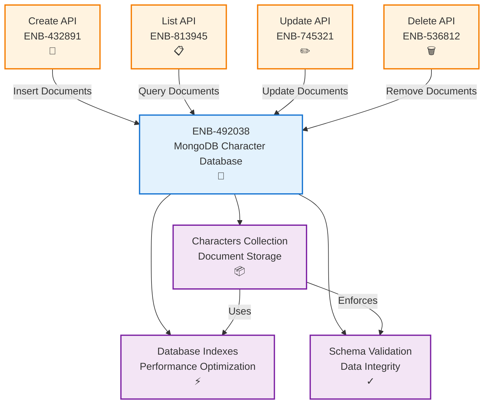
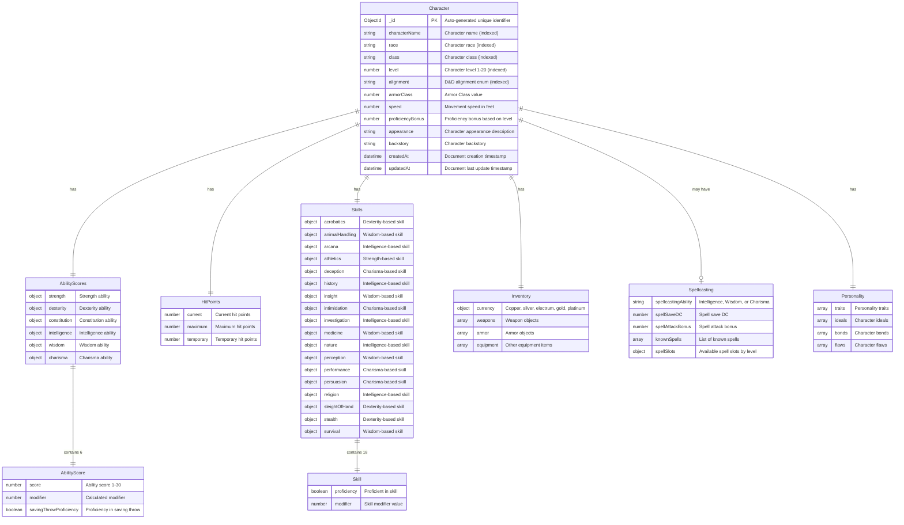
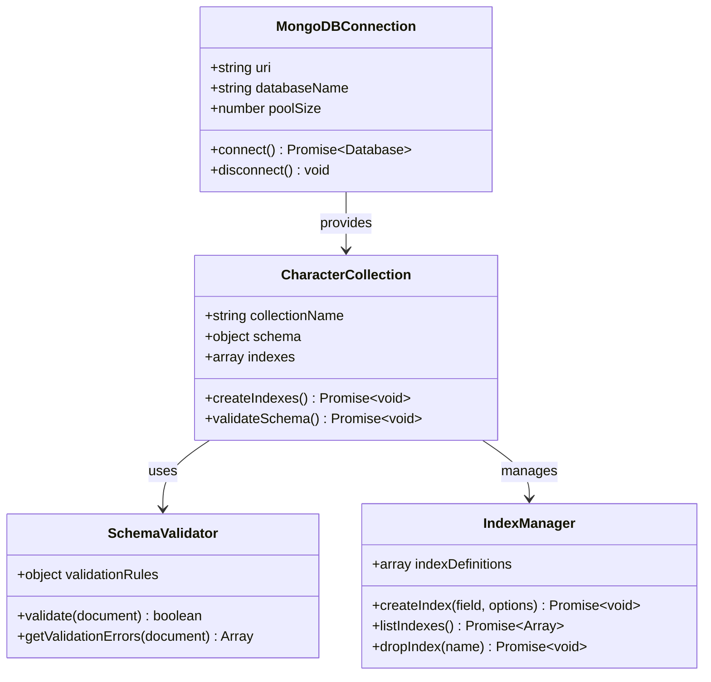
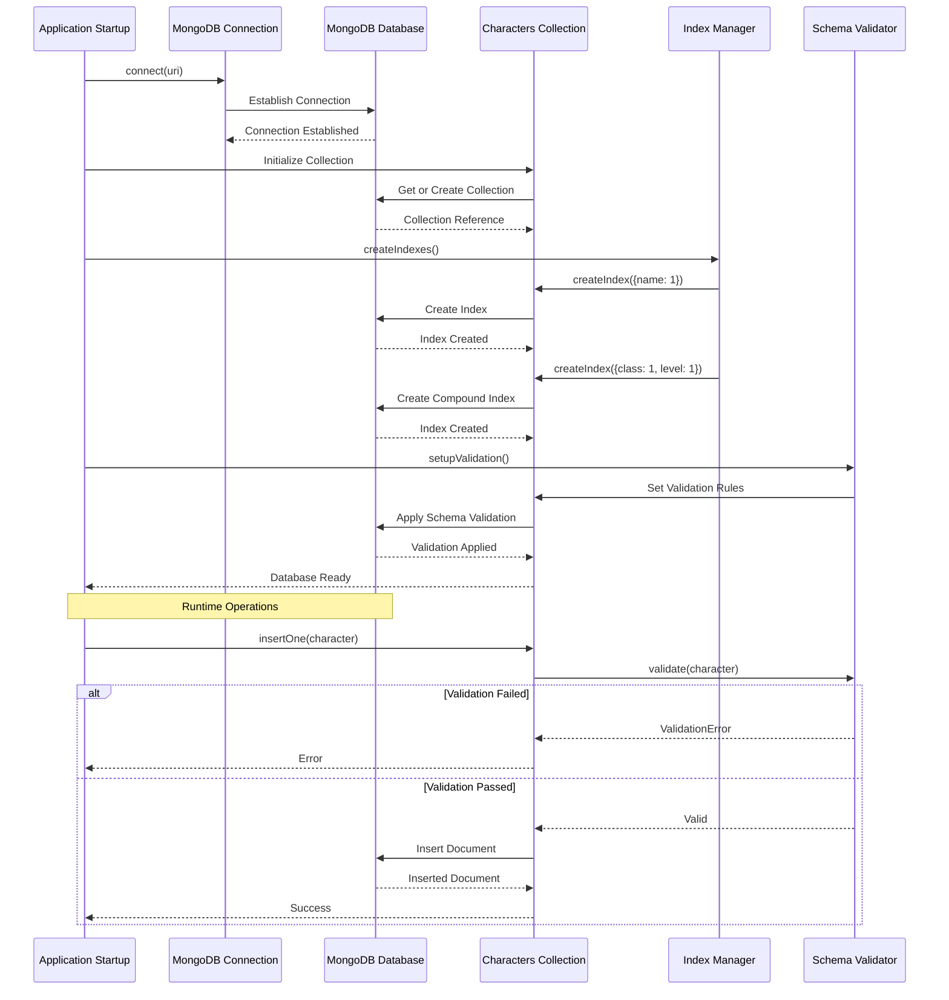
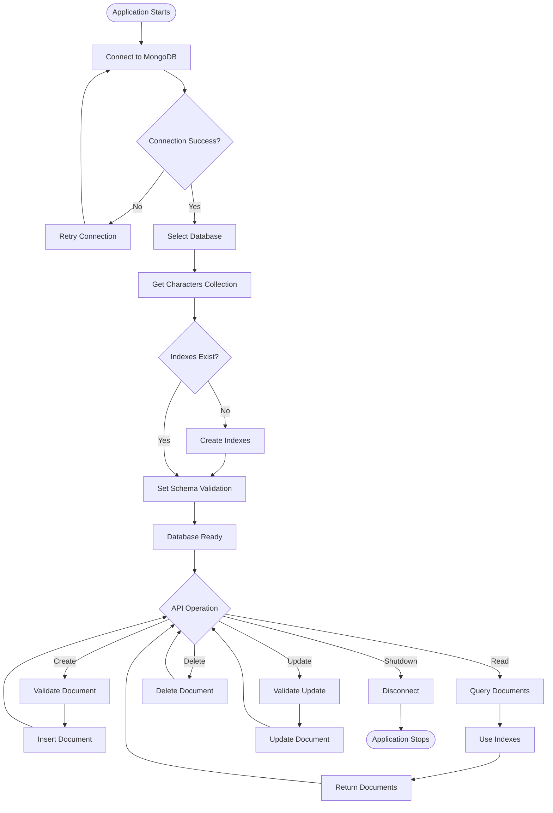
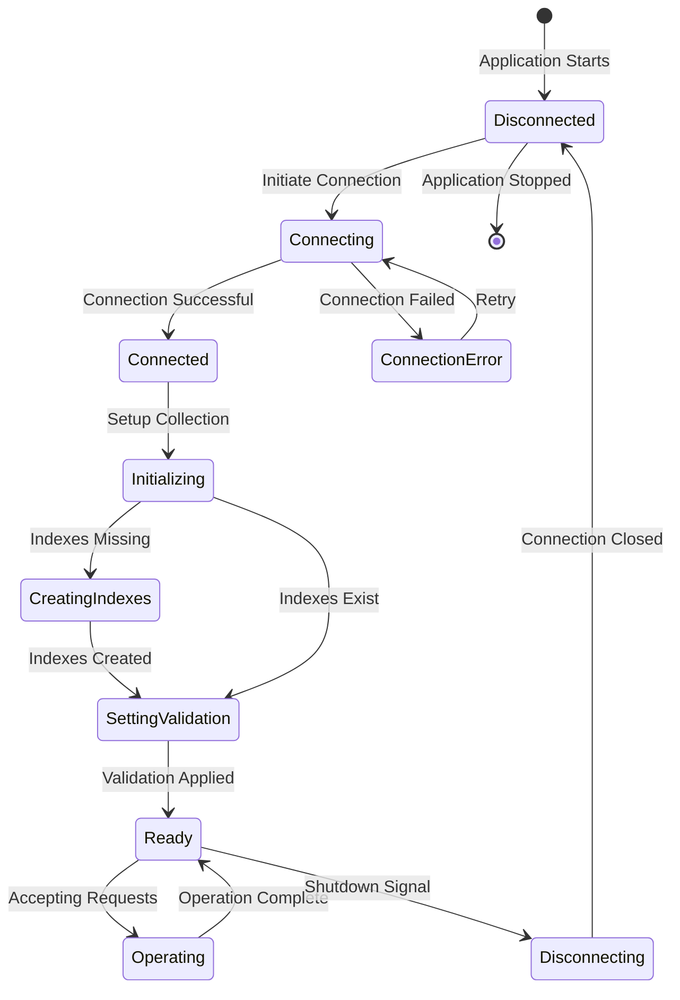

# MongoDB Character Database

## Metadata

- **Name**: MongoDB Character Database
- **Type**: Enabler
- **ID**: ENB-492038
- **Approval**: Approved
- **Capability ID**: CAP-290474
- **Owner**: Product Team
- **Status**: Ready for Implementation
- **Priority**: High
- **Analysis Review**: Required
- **Code Review**: Required

## Technical Overview
### Purpose
A MongoDB Community Server database instance with a dedicated collection for storing and managing player character data, providing persistence, indexing, and query capabilities for all character operations.

## Functional Requirements

| ID | Name | Requirement | Priority | Status | Approval |
|----|------|-------------|----------|--------|----------|
| FR-492001 | Database Instance | A MongoDB Community Server database instance SHALL be provisioned for player character storage | High | Implemented | Approved |
| FR-492002 | Characters Collection | A collection named `characters` SHALL store all player character documents | High | Implemented | Approved |
| FR-492003 | D&D 5e Schema | Character documents SHALL follow the complete D&D 5e JSON schema with all required and optional fields | High | Implemented | Approved |
| FR-492004 | Unique Identifiers | Each character document SHALL have a unique `_id` field (MongoDB ObjectId) | High | Implemented | Approved |
| FR-492005 | Timestamp Fields | All documents SHALL include `createdAt` and `updatedAt` timestamp fields | High | Implemented | Approved |
| FR-492006 | Primary Index | The collection SHALL have a primary index on the `_id` field | High | Implemented | Approved |
| FR-492007 | Name Index | The collection SHALL have an index on the `characterName` field for efficient searching | Medium | Implemented | Approved |
| FR-492008 | Compound Index | The collection SHALL have compound indexes on `class` and `level`, and on `race` and `alignment` for filtering | Medium | Implemented | Approved |
| FR-492009 | Schema Validation | The collection SHALL enforce D&D 5e schema validation including required fields, ability scores structure, skills structure, alignment enum, inventory structure, and spellcasting structure | High | Implemented | Approved |
| FR-492010 | Ability Scores Validation | Ability scores SHALL be validated to include all six abilities (strength, dexterity, constitution, intelligence, wisdom, charisma) with score (1-30), modifier, and savingThrowProficiency | High | Implemented | Approved |
| FR-492011 | Skills Validation | Skills SHALL be validated to include all 18 D&D 5e skills with proficiency boolean and modifier number | Medium | Implemented | Approved |
| FR-492012 | Alignment Validation | Alignment SHALL be validated against the nine allowed values (Lawful Good, Neutral Good, Chaotic Good, Lawful Neutral, True Neutral, Chaotic Neutral, Lawful Evil, Neutral Evil, Chaotic Evil) | Medium | Implemented | Approved |

## Non-Functional Requirements

| ID | Name | Type | Requirement | Priority | Status | Approval |
|----|------|------|-------------|----------|--------|----------|
| NFR-492001 | Data Persistence | Reliability | All character data SHALL be persisted durably to disk | High | Implemented | Approved |
| NFR-492002 | Query Performance | Performance | Character queries SHALL execute within 100ms for indexed fields | High | Implemented | Approved |
| NFR-492003 | Connection Pool | Performance | The database SHALL support connection pooling for concurrent requests | High | Implemented | Approved |
| NFR-492004 | Backup Strategy | Reliability | The database SHALL support automated backups | Medium | Implemented | Approved |
| NFR-492005 | Schema Validation | Data Integrity | The collection SHALL enforce schema validation rules | Medium | Implemented | Approved |
| NFR-492006 | Storage Capacity | Scalability | The database SHALL support storage of at least 100,000 character documents | Low | Implemented | Approved |
| NFR-492007 | Deployment | Infrastructure | MongoDB Community Server SHALL be deployed as a Docker container with persistent volumes | High | Ready for Implementation | Approved |
| NFR-492008 | Data Persistence | Reliability | MongoDB data SHALL persist across container restarts using Docker volumes | High | Ready for Implementation | Approved |

## Dependencies

### Internal Upstream Dependency

| Enabler ID | Description |
|------------|-------------|
| | None - This is a foundational data storage enabler |

### Internal Downstream Impact

| Enabler ID | Description |
|------------|-------------|
| ENB-432891 | Player Character REST API - Create Endpoint - Uses this database |
| ENB-813945 | Player Character REST API - List Endpoint - Queries this database |
| ENB-745321 | Player Character REST API - Update Endpoint - Updates this database |
| ENB-536812 | Player Character REST API - Delete Endpoint - Deletes from this database |

### External Dependencies

**External Upstream Dependencies**: MongoDB server instance (self-hosted or MongoDB Atlas)

**External Downstream Impact**: All API endpoints depend on this database

## Technical Specifications (Template)

### Enabler Dependency Flow Diagram


### API Technical Specifications (if applicable)

| API Type | Operation | Channel / Endpoint | Description | Request / Publish Payload | Response / Subscribe Data |
|----------|-----------|---------------------|-------------|----------------------------|----------------------------|
| MongoDB | insert | `db.characters.insertOne()` | Inserts a new character document | Character document object | Inserted document with `_id` |
| MongoDB | find | `db.characters.find()` | Queries character documents | Query filter object | Array of matching documents |
| MongoDB | update | `db.characters.updateOne()` | Updates a character document | Filter and update objects | Update result |
| MongoDB | delete | `db.characters.deleteOne()` | Deletes a character document | Filter object | Delete result |

### Data Models


### Class Diagrams


### Sequence Diagrams


### Dataflow Diagrams


### State Diagrams


## External Dependencies

- **MongoDB Server**: Version 4.4+ (self-hosted or MongoDB Atlas)
- **MongoDB Driver**: Node.js MongoDB driver or Mongoose ODM
- **Connection String**: MongoDB connection URI with credentials
- **Network Access**: Network connectivity to MongoDB instance
- **D&D 5e Character Schema**: JSON Schema definition in `specifications/reference/character-schema.json`

## Testing Strategy

### Unit Tests
- Test database connection establishment
- Test collection initialization
- Test index creation
- Test schema validation rules
- Test connection pooling
- Test error handling for connection failures

### Integration Tests
- Test CRUD operations (Create, Read, Update, Delete)
- Test index usage for queries
- Test schema validation enforcement
- Test concurrent connections
- Test connection recovery after failure
- Test query performance with indexes

### Performance Tests
- Test query performance with 1,000+ documents
- Test index efficiency for common queries
- Test connection pool under load
- Test concurrent write operations
- Verify 100ms query response time for indexed fields

### Database Schema
```javascript
// MongoDB Schema Validation - D&D 5e Character Schema
{
  validator: {
    $jsonSchema: {
      bsonType: "object",
      required: ["characterName", "race", "class", "level", "abilityScores", "createdAt", "updatedAt"],
      properties: {
        _id: {
          bsonType: "objectId"
        },
        characterName: {
          bsonType: "string",
          maxLength: 100,
          description: "Character name is required and must be a string"
        },
        race: {
          bsonType: "string",
          description: "Character race (e.g., Elf, Dwarf, Human)"
        },
        class: {
          bsonType: "string",
          description: "Character class (e.g., Fighter, Wizard, Rogue)"
        },
        level: {
          bsonType: "int",
          minimum: 1,
          maximum: 20,
          description: "Character level must be between 1 and 20"
        },
        alignment: {
          bsonType: "string",
          enum: ["Lawful Good", "Neutral Good", "Chaotic Good", 
                 "Lawful Neutral", "True Neutral", "Chaotic Neutral",
                 "Lawful Evil", "Neutral Evil", "Chaotic Evil"],
          description: "Character alignment must be one of the nine alignments"
        },
        abilityScores: {
          bsonType: "object",
          required: ["strength", "dexterity", "constitution", "intelligence", "wisdom", "charisma"],
          properties: {
            strength: {
              bsonType: "object",
              required: ["score", "modifier", "savingThrowProficiency"],
              properties: {
                score: { bsonType: "int", minimum: 1, maximum: 30 },
                modifier: { bsonType: "int" },
                savingThrowProficiency: { bsonType: "bool" }
              }
            },
            dexterity: {
              bsonType: "object",
              required: ["score", "modifier", "savingThrowProficiency"],
              properties: {
                score: { bsonType: "int", minimum: 1, maximum: 30 },
                modifier: { bsonType: "int" },
                savingThrowProficiency: { bsonType: "bool" }
              }
            },
            constitution: {
              bsonType: "object",
              required: ["score", "modifier", "savingThrowProficiency"],
              properties: {
                score: { bsonType: "int", minimum: 1, maximum: 30 },
                modifier: { bsonType: "int" },
                savingThrowProficiency: { bsonType: "bool" }
              }
            },
            intelligence: {
              bsonType: "object",
              required: ["score", "modifier", "savingThrowProficiency"],
              properties: {
                score: { bsonType: "int", minimum: 1, maximum: 30 },
                modifier: { bsonType: "int" },
                savingThrowProficiency: { bsonType: "bool" }
              }
            },
            wisdom: {
              bsonType: "object",
              required: ["score", "modifier", "savingThrowProficiency"],
              properties: {
                score: { bsonType: "int", minimum: 1, maximum: 30 },
                modifier: { bsonType: "int" },
                savingThrowProficiency: { bsonType: "bool" }
              }
            },
            charisma: {
              bsonType: "object",
              required: ["score", "modifier", "savingThrowProficiency"],
              properties: {
                score: { bsonType: "int", minimum: 1, maximum: 30 },
                modifier: { bsonType: "int" },
                savingThrowProficiency: { bsonType: "bool" }
              }
            }
          },
          description: "All six D&D 5e ability scores with score, modifier, and saving throw proficiency"
        },
        skills: {
          bsonType: "object",
          required: ["acrobatics", "animalHandling", "arcana", "athletics", "deception", 
                     "history", "insight", "intimidation", "investigation", "medicine", 
                     "nature", "perception", "performance", "persuasion", "religion", 
                     "sleightOfHand", "stealth", "survival"],
          description: "All 18 D&D 5e skills with proficiency and modifier",
          additionalProperties: {
            bsonType: "object",
            required: ["proficiency", "modifier"],
            properties: {
              proficiency: { bsonType: "bool" },
              modifier: { bsonType: "int" }
            }
          }
        },
        hitPoints: {
          bsonType: "object",
          required: ["current", "maximum", "temporary"],
          properties: {
            current: { bsonType: "int", minimum: 0 },
            maximum: { bsonType: "int", minimum: 1 },
            temporary: { bsonType: "int", minimum: 0 }
          }
        },
        armorClass: {
          bsonType: "int",
          minimum: 0,
          description: "Character armor class"
        },
        speed: {
          bsonType: "int",
          minimum: 0,
          description: "Character movement speed in feet"
        },
        proficiencyBonus: {
          bsonType: "int",
          minimum: 2,
          maximum: 6,
          description: "Proficiency bonus based on character level"
        },
        inventory: {
          bsonType: "object",
          properties: {
            currency: {
              bsonType: "object",
              properties: {
                copper: { bsonType: "int", minimum: 0 },
                silver: { bsonType: "int", minimum: 0 },
                electrum: { bsonType: "int", minimum: 0 },
                gold: { bsonType: "int", minimum: 0 },
                platinum: { bsonType: "int", minimum: 0 }
              }
            },
            weapons: {
              bsonType: "array",
              items: { bsonType: "object" }
            },
            armor: {
              bsonType: "array",
              items: { bsonType: "object" }
            },
            equipment: {
              bsonType: "array",
              items: { bsonType: "string" }
            }
          }
        },
        spellcasting: {
          bsonType: "object",
          description: "Optional spellcasting information for spellcasters",
          properties: {
            spellcastingAbility: {
              bsonType: "string",
              enum: ["Intelligence", "Wisdom", "Charisma"]
            },
            spellSaveDC: { bsonType: "int", minimum: 0 },
            spellAttackBonus: { bsonType: "int" },
            knownSpells: {
              bsonType: "array",
              items: { bsonType: "string" }
            },
            spellSlots: {
              bsonType: "object"
            }
          }
        },
        personality: {
          bsonType: "object",
          properties: {
            traits: { bsonType: "array", items: { bsonType: "string" } },
            ideals: { bsonType: "array", items: { bsonType: "string" } },
            bonds: { bsonType: "array", items: { bsonType: "string" } },
            flaws: { bsonType: "array", items: { bsonType: "string" } }
          }
        },
        appearance: {
          bsonType: "string",
          description: "Physical appearance description"
        },
        backstory: {
          bsonType: "string",
          description: "Character backstory and history"
        },
        createdAt: {
          bsonType: "date",
          description: "Document creation timestamp"
        },
        updatedAt: {
          bsonType: "date",
          description: "Document last update timestamp"
        }
      }
    }
  }
}

// Index Definitions
db.characters.createIndex({ characterName: 1 });
db.characters.createIndex({ class: 1, level: 1 });
db.characters.createIndex({ race: 1, alignment: 1 });
db.characters.createIndex({ createdAt: -1 });

// Example Document - D&D 5e Complete Character
{
  "_id": ObjectId("507f1f77bcf86cd799439011"),
  "characterName": "Thorin Ironforge",
  "race": "Mountain Dwarf",
  "class": "Fighter",
  "level": 5,
  "alignment": "Lawful Good",
  "abilityScores": {
    "strength": { "score": 16, "modifier": 3, "savingThrowProficiency": true },
    "dexterity": { "score": 12, "modifier": 1, "savingThrowProficiency": false },
    "constitution": { "score": 15, "modifier": 2, "savingThrowProficiency": true },
    "intelligence": { "score": 10, "modifier": 0, "savingThrowProficiency": false },
    "wisdom": { "score": 13, "modifier": 1, "savingThrowProficiency": false },
    "charisma": { "score": 8, "modifier": -1, "savingThrowProficiency": false }
  },
  "skills": {
    "acrobatics": { "proficiency": false, "modifier": 1 },
    "animalHandling": { "proficiency": false, "modifier": 1 },
    "arcana": { "proficiency": false, "modifier": 0 },
    "athletics": { "proficiency": true, "modifier": 6 },
    "deception": { "proficiency": false, "modifier": -1 },
    "history": { "proficiency": true, "modifier": 3 },
    "insight": { "proficiency": false, "modifier": 1 },
    "intimidation": { "proficiency": true, "modifier": 2 },
    "investigation": { "proficiency": false, "modifier": 0 },
    "medicine": { "proficiency": false, "modifier": 1 },
    "nature": { "proficiency": false, "modifier": 0 },
    "perception": { "proficiency": true, "modifier": 4 },
    "performance": { "proficiency": false, "modifier": -1 },
    "persuasion": { "proficiency": false, "modifier": -1 },
    "religion": { "proficiency": false, "modifier": 0 },
    "sleightOfHand": { "proficiency": false, "modifier": 1 },
    "stealth": { "proficiency": false, "modifier": 1 },
    "survival": { "proficiency": false, "modifier": 1 }
  },
  "hitPoints": {
    "current": 47,
    "maximum": 47,
    "temporary": 0
  },
  "armorClass": 18,
  "speed": 25,
  "proficiencyBonus": 3,
  "inventory": {
    "currency": {
      "copper": 0,
      "silver": 0,
      "electrum": 0,
      "gold": 150,
      "platinum": 5
    },
    "weapons": [
      {
        "name": "Battleaxe",
        "type": "Martial Melee",
        "damage": "1d8",
        "damageType": "Slashing",
        "properties": ["Versatile (1d10)"]
      }
    ],
    "armor": [
      {
        "name": "Plate Armor",
        "type": "Heavy",
        "armorClass": 18,
        "stealthDisadvantage": true
      }
    ],
    "equipment": [
      "Bedroll",
      "Mess kit",
      "Tinderbox",
      "10 torches",
      "10 days of rations",
      "Waterskin",
      "50 feet of hempen rope"
    ]
  },
  "personality": {
    "traits": ["I am always polite and respectful.", "I'm haunted by memories of war."],
    "ideals": ["Honor. I don't steal from others in the trade."],
    "bonds": ["I will face any challenge to win the approval of my family."],
    "flaws": ["I have a weakness for the vices of the city, especially hard drink."]
  },
  "appearance": "A stout dwarf with a long braided beard, wearing heavy plate armor with clan insignia.",
  "backstory": "Born in the mountain halls, trained as a warrior to defend the clan.",
  "createdAt": ISODate("2025-11-05T10:00:00Z"),
  "updatedAt": ISODate("2025-11-05T10:00:00Z")
}
```

### Connection Configuration
```javascript
// MongoDB Connection Settings
{
  uri: "mongodb://localhost:27017",  // or MongoDB Atlas URI
  database: "playerCharacters",
  options: {
    useNewUrlParser: true,
    useUnifiedTopology: true,
    maxPoolSize: 10,
    minPoolSize: 2,
    serverSelectionTimeoutMS: 5000,
    socketTimeoutMS: 45000,
  }
}
```
