# Player Character Web Application

## Metadata

- **Name**: Player Character Web Application
- **Type**: Enabler
- **ID**: ENB-501283
- **Approval**: Approved
- **Capability ID**: CAP-924443
- **Owner**: Product Team
- **Status**: Ready for Implementation
- **Priority**: High
- **Analysis Review**: Required
- **Code Review**: Required

## Technical Overview
### Purpose
A single-page web application that provides the user interface for all player character operations including viewing, creating, editing, and deleting characters.

## Functional Requirements

| ID | Name | Requirement | Priority | Status | Approval |
|----|------|-------------|----------|--------|----------|
| FR-501001 | Application Shell | The application SHALL provide a navigation structure and routing for all character management features | High | Implemented | Approved |
| FR-501002 | Responsive Layout | The application SHALL adapt to different screen sizes (mobile, tablet, desktop) | High | Implemented | Approved |
| FR-501003 | Navigation Menu | The application SHALL provide a navigation menu to access all character operations | High | Implemented | Approved |
| FR-501004 | Loading States | The application SHALL display loading indicators during data fetching operations | Medium | Implemented | Approved |
| FR-501005 | Error Handling | The application SHALL display user-friendly error messages when operations fail | High | Implemented | Approved |

## Non-Functional Requirements

| ID | Name | Type | Requirement | Priority | Status | Approval |
|----|------|------|-------------|----------|--------|----------|
| NFR-501001 | Framework | Technology | The application SHALL be built using a modern JavaScript framework specifically React | High | Implemented | Approved |
| NFR-501002 | Browser Support | Compatibility | The application SHALL support modern browsers (Chrome, Firefox, Safari, Edge) | High | Implemented | Approved |
| NFR-501003 | Performance | Performance | The application SHALL load the initial page within 3 seconds | Medium | Implemented | Approved |
| NFR-501004 | Accessibility | Usability | The application SHALL meet WCAG 2.1 Level AA accessibility standards | Medium | Implemented | Approved |
| NFR-501005 | Deployment | Infrastructure | The application SHALL be deployed as a Docker container using nginx | High | Ready for Implementation | Approved |
| NFR-501006 | Container Size | Performance | The Docker image SHALL be optimized to under 100MB using multi-stage builds | Medium | Ready for Implementation | Approved |

## Dependencies

### Internal Upstream Dependency

| Enabler ID | Description |
|------------|-------------|
| ENB-432891 | Player Character REST API - Create Endpoint |
| ENB-XXXXXX | Player Character REST API - List Endpoint |
| ENB-XXXXXX | Player Character REST API - Update Endpoint |
| ENB-XXXXXX | Player Character REST API - Delete Endpoint |

### Internal Downstream Impact

| Enabler ID | Description |
|------------|-------------|
|  | This is the primary UI that hosts all other UI components |

### External Dependencies

**External Upstream Dependencies**: REST API endpoints for all character operations

**External Downstream Impact**: None identified.

## Technical Specifications (Template)

### Enabler Dependency Flow Diagram

```mermaid
flowchart TD
    ENB_501283["ENB-501283<br/>Player Character Web Application<br/>🌐"]
    
    USER["User<br/>Browser<br/>👤"]
    ROUTER["Client-Side Router<br/>Page Navigation<br/>🧭"]
    COMPONENTS["UI Components<br/>Character Views<br/>🎨"]
    API["REST API Client<br/>HTTP Requests<br/>📡"]
    
    USER -->|Access Website| ENB_501283
    ENB_501283 --> ROUTER
    ROUTER --> COMPONENTS
    COMPONENTS --> API
    API -->|HTTP Requests| REST_API["Backend REST API<br/>Character Operations<br/>⚙️"]
    REST_API -->|JSON Responses| API
    API --> COMPONENTS
    COMPONENTS --> USER

    classDef enabler fill:#e3f2fd,stroke:#1976d2,stroke-width:2px
    classDef external fill:#fff3e0,stroke:#f57c00,stroke-width:2px
    classDef process fill:#f3e5f5,stroke:#7b1fa2,stroke-width:2px
    
    class ENB_501283 enabler
    class USER,REST_API external
    class ROUTER,COMPONENTS,API process
```

### API Technical Specifications (if applicable)

| API Type | Operation | Channel / Endpoint | Description | Request / Publish Payload | Response / Subscribe Data |
|----------|-----------|---------------------|-------------|----------------------------|----------------------------|
| N/A | N/A | N/A | This is a frontend application that consumes APIs | N/A | N/A |

### Data Models

### Class Diagrams

### Sequence Diagrams

### Dataflow Diagrams

### State Diagrams

