# Player Character REST API - Delete Endpoint

## Metadata

- **Name**: Player Character REST API - Delete Endpoint
- **Type**: Enabler
- **ID**: ENB-536812
- **Approval**: Approved
- **Capability ID**: CAP-916209
- **Owner**: Product Team
- **Status**: Ready for Implementation
- **Priority**: High
- **Analysis Review**: Required
- **Code Review**: Required

## Technical Overview
### Purpose
A REST API endpoint that accepts HTTP DELETE requests to permanently remove a player character from the database by ID.

## Functional Requirements

| ID | Name | Requirement | Priority | Status | Approval |
|----|------|-------------|----------|--------|----------|
| FR-536001 | Accept DELETE Request | The endpoint SHALL accept HTTP DELETE requests at `/api/characters/:id` | High | Implemented | Approved |
| FR-536002 | Character ID Validation | The endpoint SHALL validate that the character ID exists before attempting deletion | High | Implemented | Approved |
| FR-536003 | Permanent Deletion | The endpoint SHALL permanently remove the character document from the database | High | Implemented | Approved |
| FR-536004 | Success Response | The endpoint SHALL return HTTP 204 No Content on successful deletion | High | Implemented | Approved |
| FR-536005 | Not Found Response | The endpoint SHALL return HTTP 404 when the character doesn't exist | High | Implemented | Approved |
| FR-536006 | Idempotent Behavior | Multiple DELETE requests for the same ID SHALL return consistent responses | Medium | Implemented | Approved |
| FR-536007 | Error Response | The endpoint SHALL return appropriate HTTP error codes for failures | High | Implemented | Approved |

## Non-Functional Requirements

| ID | Name | Type | Requirement | Priority | Status | Approval |
|----|------|------|-------------|----------|--------|----------|
| NFR-536001 | Response Time | Performance | The endpoint SHALL respond within 300ms under normal load | High | Implemented | Approved |
| NFR-536002 | CORS Support | Security | The endpoint SHALL support CORS for cross-origin requests | Medium | Implemented | Approved |
| NFR-536003 | Audit Logging | Compliance | The endpoint SHALL log all deletion operations for audit purposes | High | Implemented | Approved |
| NFR-536004 | Soft Delete Option | Data Integrity | The endpoint SHOULD support soft delete (mark as deleted) as an alternative | Low | Implemented | Approved |
| NFR-536005 | Authorization | Security | The endpoint SHOULD verify user authorization before deletion (future enhancement) | Medium | Implemented | Approved |

## Dependencies

### Internal Upstream Dependency

| Enabler ID | Description |
|------------|-------------|
| ENB-XXXXXX | MongoDB Database Connection - Required for deleting character data |

### Internal Downstream Impact

| Enabler ID | Description |
|------------|-------------|
| ENB-219576 | Character Delete Button Component - Consumes this API for deletion |
| ENB-729164 | Character List Display Component - Updates after character deletion |

### External Dependencies

**External Upstream Dependencies**: MongoDB database for data deletion

**External Downstream Impact**: Web application delete buttons trigger this endpoint

## Technical Specifications (Template)

### Enabler Dependency Flow Diagram

```mermaid
flowchart TD
    ENB_536812["ENB-536812<br/>Player Character REST API - Delete Endpoint<br/>📡"]
    
    WEB["Web Application<br/>Delete Button<br/>🌐"]
    SERVICE["Character Service<br/>Business Logic<br/>⚙️"]
    REPO["Character Repository<br/>Data Access<br/>💾"]
    DB["MongoDB<br/>Characters Collection<br/>💾"]
    AUDIT["Audit Logger<br/>Deletion Log<br/>📝"]
    
    WEB -->|HTTP DELETE /api/characters/:id| ENB_536812
    ENB_536812 --> SERVICE
    SERVICE -->|Check Exists| REPO
    REPO -->|Query by ID| DB
    
    DB -->|Not Found| REPO
    REPO -->|null| SERVICE
    SERVICE -->|404 Not Found| ENB_536812
    ENB_536812 -->|404| WEB
    
    DB -->|Character Found| REPO
    REPO -->|Character| SERVICE
    SERVICE -->|Log Deletion| AUDIT
    AUDIT -->|Logged| SERVICE
    SERVICE -->|Delete Document| REPO
    REPO -->|Remove from DB| DB
    DB -->|Deleted| REPO
    REPO -->|Success| SERVICE
    SERVICE -->|204 No Content| ENB_536812
    ENB_536812 -->|204| WEB

    classDef enabler fill:#e3f2fd,stroke:#1976d2,stroke-width:2px
    classDef external fill:#fff3e0,stroke:#f57c00,stroke-width:2px
    classDef process fill:#f3e5f5,stroke:#7b1fa2,stroke-width:2px
    
    class ENB_536812 enabler
    class WEB,DB external
    class SERVICE,REPO,AUDIT process
```


### API Technical Specifications (if applicable)

| API Type | Operation | Channel / Endpoint | Description | Request / Publish Payload | Response / Subscribe Data |
|----------|-----------|---------------------|-------------|----------------------------|----------------------------|
| REST | DELETE | `/api/characters/:id` | Deletes a player character | None (ID in URL) | **204 No Content** (empty body) <br> **404 Not Found**: `{ "error": "Character not found" }` <br> **500 Internal Error**: `{ "error": "string" }` |

### Data Models


### Class Diagrams


### Sequence Diagrams


### Dataflow Diagrams


### State Diagrams


## External Dependencies

- **MongoDB**: Database for removing player character documents
- **Express.js** (or similar framework): HTTP server framework for handling REST endpoints
- **Logging Framework**: Winston, Bunyan, or similar for audit logging

## Testing Strategy

### Unit Tests
- Test ID extraction from URL parameters
- Test ID format validation
- Test character existence check
- Test audit logging is called
- Test successful deletion
- Test error handling for various failure scenarios
- Test idempotent behavior (deleting same ID multiple times)

### Integration Tests
- Test end-to-end DELETE request flow with actual MongoDB instance
- Test 404 response when character doesn't exist
- Test audit log is persisted
- Test database state after deletion
- Test response time meets performance requirements (<300ms)

### API Tests
- Test HTTP 204 response for successful deletion
- Test HTTP 400 response for invalid ID format
- Test HTTP 404 response for non-existent character
- Test HTTP 500 response for database failures
- Test CORS headers are properly set
- Test idempotent behavior (multiple deletes)

### Test Scenarios
```javascript
// Successful deletion
DELETE /api/characters/507f1f77bcf86cd799439011
Response: 204 No Content (empty body)

// Character not found
DELETE /api/characters/507f1f77bcf86cd799439999
Response: 404 Not Found
{
  "error": "Character not found"
}

// Invalid ID format
DELETE /api/characters/invalid-id
Response: 400 Bad Request
{
  "error": "Invalid character ID format"
}

// Idempotent - deleting same character twice
DELETE /api/characters/507f1f77bcf86cd799439011  (first time)
Response: 204 No Content

DELETE /api/characters/507f1f77bcf86cd799439011  (second time)
Response: 404 Not Found
{
  "error": "Character not found"
}
```

### Audit Log Verification
```javascript
// After successful deletion, audit log should contain:
{
  "characterId": "507f1f77bcf86cd799439011",
  "characterName": "Gandalf the Grey",
  "deletedAt": "2025-11-05T14:30:00Z",
  "deletedBy": "user-id-here",  // Future enhancement
  "action": "DELETE",
  "endpoint": "/api/characters/507f1f77bcf86cd799439011"
}
```

### Edge Cases
- Test deleting with malformed ObjectId
- Test database connection failure during deletion
- Test concurrent deletion attempts
- Test deletion of character that is referenced elsewhere (future consideration)
- Test soft delete vs hard delete behavior (if implemented)
