# Coding Standards Implementation

## Metadata

- **Name**: Coding Standards Implementation
- **Type**: Enabler
- **ID**: ENB-582736
- **Approval**: Approved
- **Capability ID**: CAP-673294
- **Owner**: Product Team
- **Status**: Ready for Implementation
- **Priority**: High
- **Analysis Review**: Required
- **Code Review**: Required

## Technical Overview
### Purpose
Implement automated tooling and configuration for enforcing coding standards, including ESLint, Prettier, pre-commit hooks, and code quality gates to ensure consistent, maintainable, well-documented code across the player character application.

## Functional Requirements

| ID | Name | Requirement | Priority | Status | Approval |
|----|------|-------------|----------|--------|----------|
| FR-CODE001 | ESLint Configuration | The project SHALL configure ESLint with Airbnb style guide | High | Implemented | Approved |
| FR-CODE002 | Prettier Integration | The project SHALL integrate Prettier with ESLint | High | Implemented | Approved |
| FR-CODE003 | Pre-commit Hooks | The project SHALL use Husky and lint-staged for pre-commit linting | High | Implemented | Approved |
| FR-CODE004 | JSDoc Validation | ESLint SHALL enforce JSDoc comments on exported functions/classes | High | Implemented | Approved |
| FR-CODE005 | Import Ordering | ESLint SHALL enforce consistent import ordering | Medium | Implemented | Approved |
| FR-CODE006 | Complexity Limits | ESLint SHALL enforce cyclomatic complexity ≤ 10 | Medium | Implemented | Approved |
| FR-CODE007 | Function Length | ESLint SHALL warn on functions exceeding 50 lines | Medium | Implemented | Approved |
| FR-CODE008 | No Console Logs | ESLint SHALL prevent console.log in production code | High | Implemented | Approved |
| FR-CODE009 | No Magic Numbers | ESLint SHALL warn on magic numbers (except -1, 0, 1, 2) | Medium | Implemented | Approved |
| FR-CODE010 | Naming Conventions | ESLint SHALL enforce camelCase for variables, PascalCase for classes | High | Implemented | Approved |
| FR-CODE011 | Error Handling | ESLint SHALL require error handling for async operations | High | Implemented | Approved |
| FR-CODE012 | EditorConfig | The project SHALL include .editorconfig for consistent editor settings | Medium | Implemented | Approved |
| FR-CODE013 | Git Hooks Testing | Pre-push hooks SHALL run affected tests | Medium | Implemented | Approved |
| FR-CODE014 | Commit Message Linting | The project SHALL use commitlint for Conventional Commits | Medium | Implemented | Approved |

## Non-Functional Requirements

| ID | Name | Type | Requirement | Priority | Status | Approval |
|----|------|------|-------------|----------|--------|----------|
| NFR-CODE001 | Linting Speed | Performance | Linting SHALL complete within 10 seconds for full codebase | Medium | Implemented | Approved |
| NFR-CODE002 | Auto-fix Coverage | Usability | Auto-fixable rules SHALL fix at least 80% of common violations | High | Implemented | Approved |
| NFR-CODE003 | Developer Experience | Usability | Linting errors SHALL provide clear, actionable messages | High | Implemented | Approved |

## Dependencies

### Internal Upstream Dependency

| Enabler ID | Description |
|------------|-------------|
| | None - Foundational coding standards enabler |

### Internal Downstream Impact

| Enabler ID | Description |
|------------|-------------|
| ENB-432891 | Create API - Must follow coding standards |
| ENB-813945 | List API - Must follow coding standards |
| ENB-745321 | Update API - Must follow coding standards |
| ENB-492038 | MongoDB - Must follow coding standards |
| ENB-847291 | Validation Service - Must follow coding standards |
| ENB-384629 | Create Form UI - Must follow coding standards |
| ENB-652108 | Edit Form UI - Must follow coding standards |
| ENB-729164 | List Display UI - Must follow coding standards |
| ENB-228934 | TDD Implementation - Test code must follow standards |
| ENB-924156 | Performance Monitoring - Monitoring code must follow standards |

### External Dependencies

**External Upstream Dependencies**: 
- ESLint - Linting framework
- Prettier - Code formatter
- Husky - Git hooks
- lint-staged - Run linters on staged files
- commitlint - Commit message linting
- eslint-config-airbnb - Airbnb style guide

**External Downstream Impact**: All developers follow consistent coding standards

## Technical Specifications

### Enabler Dependency Flow Diagram

```mermaid
flowchart TD
    ENB_582736["ENB-582736<br/>Coding Standards<br/>📋"]
    
    ESLINT["ESLint<br/>Code Linting<br/>🔍"]
    PRETTIER["Prettier<br/>Code Formatting<br/>✨"]
    HUSKY["Husky<br/>Git Hooks<br/>🪝"]
    COMMITLINT["Commitlint<br/>Commit Messages<br/>💬"]
    EDITORCONFIG["EditorConfig<br/>Editor Settings<br/>⚙️"]
    
    ENB_582736 --> ESLINT
    ENB_582736 --> PRETTIER
    ENB_582736 --> HUSKY
    ENB_582736 --> COMMITLINT
    ENB_582736 --> EDITORCONFIG
    
    ESLINT -->|Enforces| RULES["Code Quality Rules<br/>Complexity, Length, Naming<br/>✓"]
    PRETTIER -->|Formats| CODE["Formatted Code<br/>Consistent Style<br/>📝"]
    HUSKY -->|Triggers| HOOKS["Git Hooks<br/>Pre-commit, Pre-push<br/>🔒"]
    COMMITLINT -->|Validates| MESSAGES["Commit Messages<br/>Conventional Commits<br/>📜"]
    EDITORCONFIG -->|Configures| EDITORS["Editor Settings<br/>Indent, Line Endings<br/>⌨️"]
    
    HOOKS -->|Runs| LINT_STAGED["Lint-staged<br/>Lint Changed Files<br/>⚡"]
    LINT_STAGED -->|Uses| ESLINT
    LINT_STAGED -->|Uses| PRETTIER
    
    RULES --> QUALITY["Code Quality<br/>Maintainable, Readable<br/>🌟"]
    CODE --> QUALITY
    MESSAGES --> QUALITY

    classDef enabler fill:#e3f2fd,stroke:#1976d2,stroke-width:2px
    classDef tool fill:#fff3e0,stroke:#f57c00,stroke-width:2px
    classDef enforcement fill:#f3e5f5,stroke:#7b1fa2,stroke-width:2px
    classDef outcome fill:#e8f5e9,stroke:#388e3c,stroke-width:2px
    
    class ENB_582736 enabler
    class ESLINT,PRETTIER,HUSKY,COMMITLINT,EDITORCONFIG tool
    class RULES,CODE,HOOKS,MESSAGES,EDITORS,LINT_STAGED enforcement
    class QUALITY outcome
```


### Configuration Files

#### .eslintrc.js
```javascript
module.exports = {
  extends: [
    'airbnb',
    'airbnb/hooks',
    'plugin:react/recommended',
    'plugin:jsx-a11y/recommended',
    'plugin:jsdoc/recommended',
    'prettier'
  ],
  plugins: ['react', 'jsx-a11y', 'import', 'jsdoc'],
  parserOptions: {
    ecmaVersion: 2021,
    sourceType: 'module',
    ecmaFeatures: {
      jsx: true
    }
  },
  env: {
    browser: true,
    node: true,
    jest: true,
    es2021: true
  },
  rules: {
    // Naming conventions
    'camelcase': ['error', { 
      properties: 'never',
      ignoreDestructuring: false,
      ignoreImports: false,
      ignoreGlobals: false
    }],
    
    // Console statements
    'no-console': ['error', { allow: ['warn', 'error'] }],
    
    // Code length limits
    'max-len': ['warn', { 
      code: 100, 
      ignoreUrls: true, 
      ignoreStrings: true,
      ignoreTemplateLiterals: true,
      ignoreComments: false
    }],
    'max-lines-per-function': ['warn', { 
      max: 50, 
      skipBlankLines: true, 
      skipComments: true,
      IIFEs: true
    }],
    'max-lines': ['warn', {
      max: 300,
      skipBlankLines: true,
      skipComments: true
    }],
    
    // Complexity
    'complexity': ['warn', 10],
    'max-depth': ['warn', 4],
    'max-nested-callbacks': ['warn', 3],
    'max-params': ['warn', 4],
    
    // Variables
    'no-unused-vars': ['error', { 
      argsIgnorePattern: '^_',
      varsIgnorePattern: '^_',
      caughtErrorsIgnorePattern: '^_'
    }],
    'no-use-before-define': ['error', { 
      functions: false, 
      classes: true, 
      variables: true 
    }],
    
    // JSDoc comments
    'jsdoc/require-jsdoc': ['warn', {
      require: {
        FunctionDeclaration: true,
        MethodDefinition: true,
        ClassDeclaration: true,
        ArrowFunctionExpression: false,
        FunctionExpression: false
      },
      contexts: [
        'ExportNamedDeclaration[declaration.type="FunctionDeclaration"]',
        'ExportDefaultDeclaration[declaration.type="FunctionDeclaration"]',
      ]
    }],
    'jsdoc/require-description': 'warn',
    'jsdoc/require-param': 'warn',
    'jsdoc/require-returns': 'warn',
    'jsdoc/require-param-description': 'warn',
    'jsdoc/require-returns-description': 'warn',
    'jsdoc/check-param-names': 'error',
    'jsdoc/check-tag-names': 'error',
    'jsdoc/check-types': 'warn',
    
    // Error handling
    'consistent-return': 'error',
    'no-return-await': 'error',
    'prefer-promise-reject-errors': 'error',
    'require-await': 'warn',
    'no-async-promise-executor': 'error',
    
    // Magic numbers
    'no-magic-numbers': ['warn', { 
      ignore: [-1, 0, 1, 2],
      ignoreArrayIndexes: true,
      ignoreDefaultValues: true,
      enforceConst: true,
      detectObjects: false
    }],
    
    // Best practices
    'no-var': 'error',
    'prefer-const': 'error',
    'prefer-template': 'warn',
    'prefer-arrow-callback': 'warn',
    'no-param-reassign': ['error', { props: true }],
    'eqeqeq': ['error', 'always'],
    'no-eval': 'error',
    'no-implied-eval': 'error',
    'no-new-func': 'error',
    'no-alert': 'error',
    
    // React specific
    'react/prop-types': 'error',
    'react/jsx-no-bind': ['warn', { 
      allowArrowFunctions: true,
      allowFunctions: false,
      allowBind: false
    }],
    'react/jsx-key': 'error',
    'react/no-array-index-key': 'warn',
    'react/jsx-no-duplicate-props': 'error',
    'react/jsx-uses-vars': 'error',
    'react/jsx-uses-react': 'error',
    'react/react-in-jsx-scope': 'off', // Not needed in React 17+
    'react/function-component-definition': ['error', {
      namedComponents: 'function-declaration',
      unnamedComponents: 'arrow-function'
    }],
    
    // Import order
    'import/order': ['error', {
      groups: [
        'builtin',
        'external',
        'internal',
        ['parent', 'sibling'],
        'index',
        'object',
        'type'
      ],
      'newlines-between': 'always',
      alphabetize: { 
        order: 'asc', 
        caseInsensitive: true 
      },
      pathGroups: [
        {
          pattern: '@/**',
          group: 'internal',
          position: 'before'
        }
      ]
    }],
    'import/no-duplicates': 'error',
    'import/no-unresolved': 'error',
    'import/no-cycle': 'warn',
    'import/no-unused-modules': 'warn',
    
    // Accessibility
    'jsx-a11y/anchor-is-valid': 'error',
    'jsx-a11y/alt-text': 'error',
    'jsx-a11y/aria-props': 'error',
    'jsx-a11y/aria-role': 'error',
    'jsx-a11y/label-has-associated-control': 'error'
  },
  settings: {
    react: {
      version: 'detect'
    },
    'import/resolver': {
      node: {
        extensions: ['.js', '.jsx', '.json']
      },
      alias: {
        map: [
          ['@', './src']
        ],
        extensions: ['.js', '.jsx', '.json']
      }
    }
  }
};
```

#### .prettierrc.js
```javascript
module.exports = {
  // Formatting
  semi: true,
  trailingComma: 'es5',
  singleQuote: true,
  printWidth: 100,
  tabWidth: 2,
  useTabs: false,
  
  // JavaScript
  arrowParens: 'avoid',
  bracketSpacing: true,
  jsxBracketSameLine: false,
  jsxSingleQuote: false,
  quoteProps: 'as-needed',
  
  // Newlines
  endOfLine: 'lf',
  
  // Other
  proseWrap: 'preserve',
  htmlWhitespaceSensitivity: 'css',
  embeddedLanguageFormatting: 'auto'
};
```

#### .prettierignore
```
# Dependencies
node_modules/

# Build outputs
dist/
build/
.next/
out/

# Coverage
coverage/

# Logs
*.log
npm-debug.log*

# Caches
.eslintcache
.cache/
.parcel-cache/

# Generated files
*.min.js
*.bundle.js
```

#### .editorconfig
```ini
# EditorConfig is awesome: https://EditorConfig.org

root = true

[*]
charset = utf-8
end_of_line = lf
insert_final_newline = true
trim_trailing_whitespace = true
indent_style = space
indent_size = 2

[*.md]
trim_trailing_whitespace = false
max_line_length = off

[*.json]
indent_size = 2

[*.{yml,yaml}]
indent_size = 2

[Makefile]
indent_style = tab

[*.py]
indent_size = 4
```

#### package.json (Linting scripts and dependencies)
```json
{
  "scripts": {
    "lint": "eslint src --ext .js,.jsx",
    "lint:fix": "eslint src --ext .js,.jsx --fix",
    "format": "prettier --write \"src/**/*.{js,jsx,json,css,md}\"",
    "format:check": "prettier --check \"src/**/*.{js,jsx,json,css,md}\"",
    "type-check": "tsc --noEmit",
    "prepare": "husky install"
  },
  "devDependencies": {
    // ESLint
    "eslint": "^8.50.0",
    "eslint-config-airbnb": "^19.0.4",
    "eslint-config-prettier": "^9.0.0",
    "eslint-plugin-import": "^2.28.1",
    "eslint-plugin-jsx-a11y": "^6.7.1",
    "eslint-plugin-react": "^7.33.2",
    "eslint-plugin-react-hooks": "^4.6.0",
    "eslint-plugin-jsdoc": "^46.8.2",
    
    // Prettier
    "prettier": "^3.0.3",
    
    // Git hooks
    "husky": "^8.0.3",
    "lint-staged": "^15.0.2",
    
    // Commit linting
    "@commitlint/cli": "^18.0.0",
    "@commitlint/config-conventional": "^18.0.0"
  },
  "lint-staged": {
    "*.{js,jsx}": [
      "eslint --fix",
      "prettier --write",
      "jest --bail --findRelatedTests"
    ],
    "*.{json,css,md}": [
      "prettier --write"
    ]
  }
}
```

### Git Hooks Configuration

#### .husky/pre-commit
```bash
#!/usr/bin/env sh
. "$(dirname -- "$0")/_/husky.sh"

# Run lint-staged on changed files
npx lint-staged
```

#### .husky/pre-push
```bash
#!/usr/bin/env sh
. "$(dirname -- "$0")/_/husky.sh"

# Run tests before push
npm run test

# Run type checking (if using TypeScript)
# npm run type-check
```

#### .husky/commit-msg
```bash
#!/usr/bin/env sh
. "$(dirname -- "$0")/_/husky.sh"

# Validate commit message format
npx --no -- commitlint --edit $1
```

### Commit Message Configuration

#### commitlint.config.js
```javascript
module.exports = {
  extends: ['@commitlint/config-conventional'],
  rules: {
    'type-enum': [
      2,
      'always',
      [
        'feat',     // New feature
        'fix',      // Bug fix
        'docs',     // Documentation changes
        'style',    // Code style changes (formatting)
        'refactor', // Code refactoring
        'perf',     // Performance improvements
        'test',     // Adding or updating tests
        'chore',    // Build process or tooling
        'revert',   // Revert previous commit
        'ci',       // CI/CD changes
        'build'     // Build system changes
      ]
    ],
    'type-case': [2, 'always', 'lower-case'],
    'type-empty': [2, 'never'],
    'scope-case': [2, 'always', 'lower-case'],
    'subject-empty': [2, 'never'],
    'subject-full-stop': [2, 'never', '.'],
    'subject-case': [
      2,
      'never',
      ['sentence-case', 'start-case', 'pascal-case', 'upper-case']
    ],
    'header-max-length': [2, 'always', 72],
    'body-leading-blank': [2, 'always'],
    'body-max-line-length': [2, 'always', 100],
    'footer-leading-blank': [2, 'always']
  }
};
```

### VS Code Integration

#### .vscode/settings.json
```json
{
  // ESLint
  "eslint.enable": true,
  "eslint.validate": [
    "javascript",
    "javascriptreact"
  ],
  "eslint.run": "onType",
  "eslint.format.enable": true,
  
  // Prettier
  "editor.defaultFormatter": "esbenp.prettier-vscode",
  "editor.formatOnSave": true,
  "editor.formatOnPaste": false,
  
  // JavaScript
  "[javascript]": {
    "editor.defaultFormatter": "esbenp.prettier-vscode",
    "editor.codeActionsOnSave": {
      "source.fixAll.eslint": true
    }
  },
  "[javascriptreact]": {
    "editor.defaultFormatter": "esbenp.prettier-vscode",
    "editor.codeActionsOnSave": {
      "source.fixAll.eslint": true
    }
  },
  
  // Editor settings matching .editorconfig
  "editor.tabSize": 2,
  "editor.insertSpaces": true,
  "files.eol": "\n",
  "files.insertFinalNewline": true,
  "files.trimTrailingWhitespace": true,
  
  // Other
  "javascript.suggest.autoImports": true,
  "javascript.updateImportsOnFileMove.enabled": "always"
}
```

#### .vscode/extensions.json
```json
{
  "recommendations": [
    "dbaeumer.vscode-eslint",
    "esbenp.prettier-vscode",
    "editorconfig.editorconfig"
  ]
}
```

### ESLint Custom Rules (Optional)

#### .eslint-rules/d20-specific-rules.js
```javascript
/**
 * Custom ESLint rules specific to D&D 5e character application.
 */
module.exports = {
  'require-ability-score-validation': {
    meta: {
      type: 'problem',
      docs: {
        description: 'Require validation when setting ability scores',
        category: 'Best Practices',
      },
      schema: []
    },
    create(context) {
      return {
        AssignmentExpression(node) {
          // Check if assigning to an ability score property
          if (node.left.property && 
              ['strength', 'dexterity', 'constitution', 'intelligence', 'wisdom', 'charisma']
                .includes(node.left.property.name)) {
            
            // Look for validation in the same function
            const functionNode = context.getAncestors()
              .reverse()
              .find(n => n.type === 'FunctionDeclaration' || n.type === 'ArrowFunctionExpression');
            
            // This is a simplified check - in practice, you'd scan the function body
            context.report({
              node,
              message: 'Ability score assignments should include validation (1-30 range)'
            });
          }
        }
      };
    }
  }
};
```

### Documentation Templates

#### JSDoc Template for Functions
```javascript
/**
 * [Brief one-line description of what the function does]
 * 
 * [Optional: More detailed explanation of the function's behavior,
 * edge cases, or important implementation notes]
 * 
 * @param {type} paramName - Description of the parameter
 * @param {type} [optionalParam] - Description of optional parameter
 * @returns {type} Description of what is returned
 * @throws {ErrorType} Description of when this error is thrown
 * 
 * @example
 * functionName(exampleArg); // Returns expectedResult
 * 
 * @see relatedFunction
 * @since 1.0.0
 */
```

#### JSDoc Template for React Components
```javascript
/**
 * [Brief description of what the component renders]
 * 
 * [Optional: More details about the component's behavior,
 * state management, or usage notes]
 * 
 * @component
 * @param {Object} props - Component props
 * @param {type} props.propName - Description of prop
 * @param {Function} props.onEvent - Description of callback prop
 * @returns {React.Element} The rendered component
 * 
 * @example
 * <ComponentName
 *   propName="value"
 *   onEvent={(data) => console.log(data)}
 * />
 */
```

### CI/CD Integration

#### .github/workflows/code-quality.yml
```yaml
name: Code Quality

on:
  pull_request:
  push:
    branches: [main, develop]

jobs:
  lint:
    runs-on: ubuntu-latest
    steps:
      - uses: actions/checkout@v3
      
      - uses: actions/setup-node@v3
        with:
          node-version: '18'
      
      - name: Install dependencies
        run: npm ci
      
      - name: Run ESLint
        run: npm run lint
      
      - name: Check formatting
        run: npm run format:check
  
  commitlint:
    runs-on: ubuntu-latest
    if: github.event_name == 'pull_request'
    steps:
      - uses: actions/checkout@v3
        with:
          fetch-depth: 0
      
      - uses: actions/setup-node@v3
        with:
          node-version: '18'
      
      - name: Install dependencies
        run: npm ci
      
      - name: Validate commit messages
        run: npx commitlint --from ${{ github.event.pull_request.base.sha }} --to HEAD --verbose
```

### Code Quality Dashboard

Track these metrics over time:
- **ESLint Error Count**: Target 0 errors
- **ESLint Warning Count**: Target < 10 warnings
- **Formatting Violations**: Target 0 violations
- **JSDoc Coverage**: Target 100% for exported functions
- **Commit Message Compliance**: Target ≥ 90%
- **Code Review Rejections**: Track standards-related rejections

### Example: Good vs Bad Code

#### Bad Code (Multiple Violations)
```javascript
// BAD: No JSDoc, magic numbers, poor naming, console.log
function calc(x) {
  console.log(x);
  let y = (x - 10) / 2;
  if (y < 0) {
    return Math.floor(y);
  } else {
    return Math.floor(y);
  }
}
```

#### Good Code (Follows Standards)
```javascript
/**
 * Calculates the ability modifier for a D&D 5e ability score.
 * 
 * Uses the formula: floor((score - 10) / 2)
 * 
 * @param {number} abilityScore - The ability score (typically 1-30)
 * @returns {number} The calculated modifier (typically -5 to +10)
 * @throws {Error} If abilityScore is not a number
 * 
 * @example
 * calculateAbilityModifier(16); // Returns 3
 */
function calculateAbilityModifier(abilityScore) {
  const ABILITY_SCORE_BASE = 10;
  const MODIFIER_DIVISOR = 2;
  
  if (typeof abilityScore !== 'number') {
    throw new Error('Ability score must be a number');
  }
  
  const rawModifier = (abilityScore - ABILITY_SCORE_BASE) / MODIFIER_DIVISOR;
  return Math.floor(rawModifier);
}
```

## Testing Strategy

### Linting Tests
- ESLint runs on all commits (pre-commit hook)
- ESLint runs on all PRs (CI/CD)
- Zero tolerance for errors
- Warnings should be addressed before merge

### Integration Testing
- Verify git hooks work correctly
- Test commit message validation
- Verify auto-fix functionality

## Success Criteria

- ✅ ESLint configured with Airbnb style guide
- ✅ Prettier integrated and configured
- ✅ Pre-commit hooks run linting and formatting
- ✅ Pre-push hooks run tests
- ✅ Commit message linting configured
- ✅ VS Code settings configured for team
- ✅ All code passes ESLint with zero errors
- ✅ EditorConfig configured
- ✅ CI/CD enforces code quality gates
- ✅ Documentation for coding standards in README
