# Character Edit Form Component

## Metadata

- **Name**: Character Edit Form Component
- **Type**: Enabler
- **ID**: ENB-652108
- **Approval**: Approved
- **Capability ID**: CAP-798009
- **Owner**: Product Team
- **Status**: Ready for Implementation
- **Priority**: High
- **Analysis Review**: Required
- **Code Review**: Required

## Technical Overview
### Purpose
A UI form component that allows users to edit existing D&D 5e player character information, pre-populated with current complete character data including all ability scores, skills, inventory, spellcasting, and other fields, with full schema validation and update capabilities.

### Implementation Learnings

#### Critical Schema-to-Model Alignment Issues

**Issue**: Mongoose model fields did not match JSON schema field names and types, causing data to be validated correctly but not persisted to the database.

**Root Cause**: The D&D 5e JSON schema defines `personality` as an object with arrays (`personalityTraits`, `ideals`, `bonds`, `flaws` as arrays of strings), but the original Mongoose Character model defined `traits` (different name) with string values instead of arrays. When frontend sent data matching the JSON schema, MongoDB silently ignored the `personality` field because it wasn't defined in the Mongoose schema.

**Solution Implemented**:
```javascript
// WRONG - Original Mongoose model
traits: {
    personalityTraits: String,  // String, not array
    ideals: String,
    bonds: String,
    flaws: String,
}

// CORRECT - Updated Mongoose model to match JSON schema
personality: {
    personalityTraits: [String],  // Array of strings
    ideals: [String],
    bonds: [String],
    flaws: [String],
}
```

**Detection Method**: Added server-side logging showed data arriving correctly but returning `undefined` after `findByIdAndUpdate`:
```javascript
console.log('Update character - Personality:', req.body.personality);
// Output: { personalityTraits: [], ideals: ['Honor'], bonds: [], flaws: [] }

console.log('Character updated successfully, personality:', character.personality);
// Output: undefined  <-- This revealed the Mongoose schema was rejecting the field
```

**Prevention Guidelines**:
1. **Schema-First Development**: ALWAYS define Mongoose models directly from the JSON schema specification
2. **Field Name Consistency**: Ensure exact field name matches between JSON schema and Mongoose model (e.g., `personality` not `traits`)
3. **Type Consistency**: Match data types exactly - arrays in schema = arrays in model, objects = objects, etc.
4. **Model Validation**: Create automated tests that validate Mongoose model against JSON schema
5. **Update Logging**: Log data before and after MongoDB operations to detect silently dropped fields
6. **Schema Comparison Tool**: Build script to compare `character-schema.json` properties with Mongoose model fields

#### MongoDB Internal Fields in Edit Forms

**Issue**: MongoDB-generated `_id` fields appeared in nested objects (`abilityScores._id`, `skills._id`) and were displayed in the UI as editable number fields.

**Root Cause**: Mongoose automatically adds `_id` to nested subdocuments unless explicitly disabled. These internal fields leaked into API responses and form rendering logic that used `Object.keys()` to iterate fields.

**Solution Implemented**:
```javascript
// Mongoose schema - Disable _id for subdocuments
const abilityScoreSchema = new mongoose.Schema({
    score: Number,
    modifier: Number,
    savingThrowProficiency: Boolean,
}, { _id: false });  // <-- Critical: prevents _id generation

const skillSchema = new mongoose.Schema({
    proficient: Boolean,
    expertise: Boolean,
    modifier: Number,
}, { _id: false });  // <-- Critical: prevents _id generation

// Frontend - Filter out internal fields when rendering
Object.keys(formData.abilityScores)
    .filter((ability) => !ability.startsWith('_') && ability !== '__v')
    .map((ability) => ...)

// Frontend - Strip internal fields on load
const { _id, __v, createdAt, updatedAt, ...cleanData } = characterData;

// Frontend - Strip nested internal fields before save
if (updateData.abilityScores) {
    const { _id: abilityId, ...cleanAbilityScores } = updateData.abilityScores;
    updateData.abilityScores = cleanAbilityScores;
}
```

**Prevention Guidelines**:
1. **Subdocument Schema Configuration**: Always set `{ _id: false }` on Mongoose subdocument schemas
2. **API Response Sanitization**: Strip `_id`, `__v`, `createdAt`, `updatedAt` from API responses
3. **Form Field Filtering**: Filter object keys to exclude fields starting with `_` or named `__v`
4. **Multi-Layer Defense**: Clean data at load, during rendering, and before save
5. **Schema Documentation**: Document which fields are MongoDB artifacts in schema comments

#### Personality Field Structure Mismatch

**Issue**: Frontend sent personality traits as top-level fields (`traits`, `ideals`, `bonds`, `flaws`) but schema expected them nested under `personality` object as arrays.

**Root Cause**: Initial form implementation didn't match the nested object structure defined in JSON schema.

**Solution Implemented**:
```javascript
// WRONG - Initial form implementation
<TextArea
    value={formData.ideals || ''}
    onChange={(e) => handleChange('ideals', e.target.value)}
/>

// CORRECT - Match schema structure
<TextArea
    value={formData.personality?.ideals?.join(', ') || ''}
    onChange={(e) => {
        const ideals = e.target.value 
            ? e.target.value.split(',').map(s => s.trim()).filter(s => s) 
            : [];
        setFormData(prev => ({
            ...prev,
            personality: { ...prev.personality, ideals: ideals }
        }));
    }}
/>

// Clean old fields before save
const { _id, __v, traits, ideals, bonds, flaws, ...updateData } = formData;
```

**Prevention Guidelines**:
1. **Review JSON Schema First**: ALWAYS review complete schema structure before implementing forms
2. **Initialize Nested Objects**: Ensure parent objects exist before setting nested properties
3. **UI Convention for Arrays**: Use comma-separated text inputs for string arrays, convert on save
4. **Backward Compatibility**: Strip old field names when migrating to new structures

#### Empty Personality Data Handling

**Issue**: Logic incorrectly deleted `personality` object when any field was empty, preventing partial updates.

**Root Cause**: Used AND logic instead of OR to check if personality had data.

**Solution Implemented**:
```javascript
// WRONG - Deletes personality if ANY field is empty
if (personality && !traits.length && !ideals.length && !bonds.length && !flaws.length)

// CORRECT - Only delete if ALL fields are empty
const hasPersonalityData = 
    (personality.personalityTraits?.length > 0) ||
    (personality.ideals?.length > 0) ||
    (personality.bonds?.length > 0) ||
    (personality.flaws?.length > 0);

if (!hasPersonalityData) {
    delete updateData.personality;
}
```

#### Development Workflow Best Practices

1. **Three-Way Schema Validation**:
   - JSON schema (source of truth)
   - Mongoose model (database layer)
   - Frontend types/interfaces (UI layer)
   - All three MUST be kept in sync

2. **Comprehensive Logging**:
   - Log request body on server receive
   - Log data after validation
   - Log data after MongoDB save
   - Log response data sent to client
   - Compare before/after to detect silent failures

3. **Schema Comparison Automation**:
   ```javascript
   // Test to validate Mongoose model against JSON schema
   const schemaFields = Object.keys(characterSchema.properties);
   const modelFields = Object.keys(Character.schema.paths);
   const missing = schemaFields.filter(f => !modelFields.includes(f));
   expect(missing).toEqual([]);  // Fails if model missing schema fields
   ```

4. **Incremental Field Implementation**:
   - Implement one complex field type at a time
   - Test persistence end-to-end before moving to next field
   - Don't assume similar fields work the same way

5. **Database Verification**:
   - Always verify data in MongoDB after save operations
   - Use MongoDB Compass or CLI to inspect actual documents
   - Don't trust API responses alone - check the database

## Functional Requirements

| ID | Name | Requirement | Priority | Status | Approval |
|----|------|-------------|----------|--------|----------|
| FR-652001 | Pre-populated Form | The form SHALL load and display existing complete D&D 5e character data in all fields (characterName, race, class, level, abilityScores, skills, alignment, inventory, spellcasting, etc.) | High | Implemented | Approved |
| FR-652002 | Editable Fields | Users SHALL be able to modify all D&D 5e character fields except the character _id (which is a MongoDB artifact and must be hidden from the UI) | High | Implemented | Approved |
| FR-652003 | Ability Scores Editing | Users SHALL be able to edit all six ability scores with automatic modifier recalculation | High | Implemented | Approved |
| FR-652004 | Skills Editing | Users SHALL be able to edit all 18 skill proficiencies with automatic modifier recalculation | High | Implemented | Approved |
| FR-652005 | Inventory Management | Users SHALL be able to add, edit, and remove weapons, armor, equipment, and update currency | Medium | Implemented | Approved |
| FR-652006 | Spellcasting Management | Users SHALL be able to edit spellcasting information including known spells and spell slots | Medium | Implemented | Approved |
| FR-652007 | Real-time Validation | The form SHALL validate all changes in real-time using D&D 5e schema validation | High | Implemented | Approved |
| FR-652008 | Save Button | The form SHALL have a save button that updates the character via PUT API with complete or partial data | High | Implemented | Approved |
| FR-652009 | Cancel Button | The form SHALL have a cancel button that discards changes and returns to previous view | Medium | Implemented | Approved |
| FR-652010 | Dirty State Detection | The form SHALL detect when changes have been made and warn before discarding | Medium | Implemented | Approved |
| FR-652011 | Success Feedback | The form SHALL display success message and refresh data after successful update | High | Implemented | Approved |
| FR-652012 | Error Feedback | The form SHALL display clear error messages for D&D 5e schema validation failures and API errors | High | Implemented | Approved |

## Non-Functional Requirements

| ID | Name | Type | Requirement | Priority | Status | Approval |
|----|------|------|-------------|----------|--------|----------|
| NFR-652001 | Load Performance | Performance | The form SHALL load character data within 500ms | High | Implemented | Approved |
| NFR-652002 | Responsive Design | Usability | The form SHALL be fully functional on mobile, tablet, and desktop | High | Implemented | Approved |
| NFR-652003 | Accessibility | Accessibility | The form SHALL support keyboard navigation and screen readers | High | Implemented | Approved |
| NFR-652004 | Data Integrity | Security | The form SHALL prevent modification and display of the character _id field (MongoDB internal identifier) | High | Implemented | Approved |

## Dependencies

### Internal Upstream Dependency

| Enabler ID | Description |
|------------|-------------|
| ENB-501283 | Player Character Web Application - Provides the hosting application |
| ENB-813945 | Player Character REST API - List Endpoint - Retrieves character data for editing |
| ENB-745321 | Player Character REST API - Update Endpoint - Saves character changes with D&D 5e schema validation |
| ENB-847291 | Schema Validation Service - Provides client-side D&D 5e schema validation |

### Internal Downstream Impact

| Enabler ID | Description |
|------------|-------------|
| ENB-729164 | Character List Display Component - Receives updated character data |

### External Dependencies

**External Upstream Dependencies**: 
- REST API endpoints for fetching and updating character data
- D&D 5e Character Schema (`specifications/reference/character-schema.json`)

**External Downstream Impact**: None identified.

## Technical Specifications (Template)

### Enabler Dependency Flow Diagram

```mermaid
flowchart TD
    ENB_652108["ENB-652108<br/>Character Edit Form Component<br/>✏️"]
    
    USER["User<br/>Form Editor<br/>👤"]
    FETCH_API["API Service<br/>Fetch Character<br/>📡"]
    VALIDATION["Form Validation<br/>Client-Side Rules<br/>✓"]
    UPDATE_API["API Service<br/>Update Character<br/>📡"]
    
    USER -->|Select Edit| ENB_652108
    ENB_652108 -->|Load Data| FETCH_API
    FETCH_API -->|GET /api/characters/:id| REST_API["REST API<br/>Backend<br/>⚙️"]
    REST_API -->|Character Data| FETCH_API
    FETCH_API -->|Populate Form| ENB_652108
    ENB_652108 -->|Display| USER
    
    USER -->|Edit Fields| ENB_652108
    ENB_652108 -->|Validate| VALIDATION
    VALIDATION -->|Invalid| ENB_652108
    ENB_652108 -->|Show Errors| USER
    
    USER -->|Click Save| ENB_652108
    ENB_652108 -->|Send Updates| UPDATE_API
    UPDATE_API -->|PUT /api/characters/:id| REST_API
    REST_API -->|200 OK| UPDATE_API
    UPDATE_API -->|Success| ENB_652108
    ENB_652108 -->|Navigate Back| USER

    classDef enabler fill:#e3f2fd,stroke:#1976d2,stroke-width:2px
    classDef external fill:#fff3e0,stroke:#f57c00,stroke-width:2px
    classDef process fill:#f3e5f5,stroke:#7b1fa2,stroke-width:2px
    
    class ENB_652108 enabler
    class USER,REST_API external
    class FETCH_API,VALIDATION,UPDATE_API process
```


### API Technical Specifications (if applicable)

| API Type | Operation | Channel / Endpoint | Description | Request / Publish Payload | Response / Subscribe Data |
|----------|-----------|---------------------|-------------|----------------------------|----------------------------|
| REST | GET | `/api/characters/:id` | Fetches existing character data | None (ID in URL) | `{ "id": "string", "name": "string", "class": "string", "race": "string", "level": number, ... }` |
| REST | PUT | `/api/characters/:id` | Updates character data | `{ "name": "string", "class": "string", "race": "string", "level": number, "attributes": {...}, "skills": [...] }` | **200 OK**: `{ "id": "string", "name": "string", ... }` <br> **400 Bad Request**: `{ "error": "string", "details": [...] }` <br> **404 Not Found**: `{ "error": "Character not found" }` |

### Data Models


### Class Diagrams


### Sequence Diagrams


### Dataflow Diagrams


### State Diagrams


## External Dependencies

- **UI Framework**: React, Vue, or Angular for form state management
- **Form Validation Library**: Formik, VeeValidate, or Angular Forms
- **Router**: Client-side router for navigation and parameter extraction
- **Diff Library**: For detecting changes between original and modified data

## Testing Strategy

### Unit Tests
- Test form loads character data on mount
- Test form fields populate with existing character data
- Test character ID field is read-only
- Test dirty state detection when fields change
- Test validation on all editable fields
- Test cancel without changes navigates immediately
- Test cancel with changes shows confirmation dialog
- Test form compares changes before submission

### Integration Tests
- Test form fetches character data from API
- Test form submits updated data to API
- Test form handles 404 when character not found
- Test form handles API validation errors
- Test form navigates after successful update
- Test form preserves data integrity

### End-to-End Tests
- Test complete edit workflow from list to save
- Test editing multiple fields and saving
- Test cancel with unsaved changes workflow
- Test error handling for network failures
- Test form works on different screen sizes
- Test keyboard navigation through form

### Test Scenarios
```javascript
// Load existing character
GET /api/characters/123
Response: { id: "123", name: "Gandalf", class: "Wizard", ... }

// Update character
PUT /api/characters/123
Body: { name: "Gandalf the White", class: "Wizard", level: 20, ... }
Response: { id: "123", name: "Gandalf the White", ... }

// Character not found
GET /api/characters/999
Response: 404 Not Found

// Validation error
PUT /api/characters/123
Body: { name: "", level: 25 }
Response: 400 Bad Request { error: "Validation failed", details: [...] }
```
