# Character List Display Component

## Metadata

- **Name**: Character List Display Component
- **Type**: Enabler
- **ID**: ENB-729164
- **Approval**: Approved
- **Capability ID**: CAP-182373
- **Owner**: Product Team
- **Status**: Ready for Implementation
- **Priority**: High
- **Analysis Review**: Required
- **Code Review**: Required

## Technical Overview
### Purpose
A UI component that displays all saved D&D 5e player characters in a responsive tile-based grid layout, showing comprehensive character information including ability scores, skills, alignment, level, and equipment, allowing users to view character summaries and navigate to detailed views or edit forms.

## Functional Requirements

| ID | Name | Requirement | Priority | Status | Approval |
|----|------|-------------|----------|--------|----------|
| FR-729001 | Tile Grid Layout | The component SHALL display characters in a responsive grid of tiles | High | Implemented | Approved |
| FR-729002 | Character Summary | Each tile SHALL display characterName, class, race, level, alignment, and key ability scores | High | Implemented | Approved |
| FR-729003 | Ability Scores Display | Each tile SHALL show the six ability scores with modifiers in a compact format | High | Implemented | Approved |
| FR-729004 | Quick Stats | Each tile SHALL display armor class, hit points, speed, and proficiency bonus | High | Implemented | Approved |
| FR-729005 | Skills Preview | Each tile SHALL show proficient skills with their modifiers | Medium | Implemented | Approved |
| FR-729006 | Equipment Preview | Each tile SHALL display primary weapon and armor if equipped | Medium | Implemented | Approved |
| FR-729007 | Spellcaster Indicator | Each tile SHALL indicate if the character is a spellcaster and show spellcasting ability | Low | Implemented | Approved |
| FR-729008 | Empty State | The component SHALL display a helpful message when no characters exist | Medium | Implemented | Approved |
| FR-729009 | Loading State | The component SHALL display a loading indicator while fetching complete character data | High | Implemented | Approved |
| FR-729010 | Character Selection | Users SHALL be able to click on a character tile to view full details | High | Implemented | Approved |
| FR-729011 | Sorting Options | Users SHALL be able to sort by characterName, level, class, race, or alignment | Medium | Implemented | Approved |
| FR-729012 | Filtering Options | Users SHALL be able to filter by class, race, alignment, or level range | Medium | Implemented | Approved |
| FR-729013 | Refresh Data | The component SHALL provide a way to refresh the character list | Medium | Implemented | Approved |

## Non-Functional Requirements

| ID | Name | Type | Requirement | Priority | Status | Approval |
|----|------|------|-------------|----------|--------|----------|
| NFR-729001 | Responsive Design | Usability | The grid SHALL adapt to display 1-4 columns based on screen width | High | Implemented | Approved |
| NFR-729002 | Visual Appeal | Usability | Character tiles SHALL have clear visual hierarchy and attractive styling | Medium | Implemented | Approved |
| NFR-729003 | Performance | Performance | The component SHALL render efficiently even with 100+ characters | Medium | Implemented | Approved |
| NFR-729004 | Accessibility | Accessibility | Character tiles SHALL be keyboard navigable and screen-reader friendly | High | Implemented | Approved |

## Dependencies

### Internal Upstream Dependency

| Enabler ID | Description |
|------------|-------------|
| ENB-501283 | Player Character Web Application - Provides the hosting application |
| ENB-813945 | Player Character REST API - List Endpoint - Provides complete D&D 5e character data |

### Internal Downstream Impact

| Enabler ID | Description |
|------------|-------------|
| ENB-652108 | Character Edit Form Component - Receives character selection for editing |
| ENB-536812 | Delete Character Component - Works in conjunction to show delete buttons |

### External Dependencies

**External Upstream Dependencies**: 
- REST API endpoint for retrieving complete character list with D&D 5e schema
- D&D 5e Character Schema (`specifications/reference/character-schema.json`)

**External Downstream Impact**: None identified.

## Technical Specifications (Template)

### Enabler Dependency Flow Diagram

```mermaid
flowchart TD
    ENB_729164["ENB-729164<br/>Character List Display Component<br/>📋"]
    
    USER["User<br/>Browser<br/>👤"]
    API_SERVICE["API Service<br/>Character Fetch<br/>📡"]
    TILE["Character Tile<br/>Individual Card<br/>🎴"]
    DETAIL["Character Detail<br/>View Component<br/>📄"]
    
    USER -->|Views List| ENB_729164
    ENB_729164 -->|Fetch Characters| API_SERVICE
    API_SERVICE -->|GET /api/characters| REST_API["REST API<br/>Backend<br/>⚙️"]
    REST_API -->|Character Array| API_SERVICE
    API_SERVICE -->|Update State| ENB_729164
    ENB_729164 -->|Render for Each| TILE
    TILE -->|Display to| USER
    USER -->|Click Tile| TILE
    TILE -->|Navigate| DETAIL

    classDef enabler fill:#e3f2fd,stroke:#1976d2,stroke-width:2px
    classDef external fill:#fff3e0,stroke:#f57c00,stroke-width:2px
    classDef process fill:#f3e5f5,stroke:#7b1fa2,stroke-width:2px
    
    class ENB_729164 enabler
    class USER,REST_API external
    class API_SERVICE,TILE,DETAIL process
```

### API Technical Specifications (if applicable)

| API Type | Operation | Channel / Endpoint | Description | Request / Publish Payload | Response / Subscribe Data |
|----------|-----------|---------------------|-------------|----------------------------|----------------------------|
| REST | GET | `/api/characters` | Consumes complete D&D 5e character list from backend with optional filtering and sorting | Query params: `?sort=characterName&order=asc&class=Wizard&race=Elf&level_min=5&level_max=10&alignment=Lawful Good` | Array of complete D&D 5e character objects with all fields: `[{ "_id": "string", "characterName": "string", "race": "string", "class": "string", "level": number, "alignment": "string", "abilityScores": {...}, "skills": {...}, "hitPoints": {...}, "armorClass": number, "speed": number, "proficiencyBonus": number, "inventory": {...}, "spellcasting": {...}, "personality": {...}, "appearance": "string", "backstory": "string", "createdAt": "datetime", "updatedAt": "datetime" }]` |

### Data Models

### Class Diagrams

### Sequence Diagrams

### Dataflow Diagrams

### State Diagrams

## External Dependencies

- **UI Framework**: React, Vue, or Angular for component rendering
- **CSS Grid/Flexbox**: For responsive tile layout
- **Icon Library**: For character class/race icons (optional)
- **API Client**: HTTP client for fetching character data

## Testing Strategy

### Unit Tests
- Test component renders correctly with empty character array
- Test component renders loading state
- Test component renders error state
- Test component renders character tiles when data is present
- Test click handler calls navigation function with correct character ID
- Test sorting functionality
- Test filtering functionality

### Integration Tests
- Test component fetches data on mount
- Test component updates when API returns new data
- Test refresh button triggers new API call
- Test error handling when API call fails
- Test navigation to detail view with selected character

### Visual Regression Tests
- Test grid layout on mobile (1 column)
- Test grid layout on tablet (2 columns)
- Test grid layout on desktop (3-4 columns)
- Test tile styling and hover states
- Test empty state appearance
- Test loading spinner appearance

### Accessibility Tests
- Test keyboard navigation between tiles
- Test screen reader announces character information
- Test focus indicators are visible
- Test ARIA labels are present and correct
