# Player Character REST API - Update Endpoint

## Metadata

- **Name**: Player Character REST API - Update Endpoint
- **Type**: Enabler
- **ID**: ENB-745321
- **Approval**: Approved
- **Capability ID**: CAP-597492
- **Owner**: Product Team
- **Status**: Ready for Implementation
- **Priority**: High
- **Analysis Review**: Required
- **Code Review**: Required

## Technical Overview
### Purpose
A REST API endpoint that accepts HTTP PUT/PATCH requests to update an existing player character's information, validates the payload, and persists the changes to the database.

## Functional Requirements

| ID | Name | Requirement | Priority | Status | Approval |
|----|------|-------------|----------|--------|----------|
| FR-745001 | Accept PUT Request | The endpoint SHALL accept HTTP PUT requests at `/api/characters/:id` | High | Implemented | Approved |
| FR-745002 | Character ID Validation | The endpoint SHALL validate that the character ID exists before attempting update | High | Implemented | Approved |
| FR-745003 | JSON Payload Validation | The endpoint SHALL validate that the request body contains valid JSON conforming to D&D 5e character schema | High | Implemented | Approved |
| FR-745004 | Schema Validation | The endpoint SHALL validate all updated fields against the D&D 5e JSON schema definition | High | Implemented | Approved |
| FR-745005 | Partial Updates | The endpoint SHALL support updating only specific fields (partial update) while maintaining schema validity | Medium | Implemented | Approved |
| FR-745006 | ID Immutability | The endpoint SHALL prevent modification of the character _id | High | Implemented | Approved |
| FR-745007 | Ability Scores Validation | When updating abilityScores, the endpoint SHALL validate all six abilities with score (1-30), modifier, and savingThrowProficiency | High | Implemented | Approved |
| FR-745008 | Skills Validation | When updating skills, the endpoint SHALL validate all 18 D&D 5e skills with proficiency and modifier values | Medium | Implemented | Approved |
| FR-745009 | Alignment Validation | When updating alignment, the endpoint SHALL validate against allowed values (Lawful Good, Neutral Good, Chaotic Good, Lawful Neutral, True Neutral, Chaotic Neutral, Lawful Evil, Neutral Evil, Chaotic Evil) | Medium | Implemented | Approved |
| FR-745010 | Inventory Validation | When updating inventory, the endpoint SHALL validate currency, weapons, armor, and equipment arrays | Medium | Implemented | Approved |
| FR-745011 | Spellcasting Validation | When updating spellcasting (optional), the endpoint SHALL validate spellcastingAbility, spellSaveDC, spellAttackBonus, knownSpells, and spellSlots | Low | Implemented | Approved |
| FR-745012 | Timestamp Update | The endpoint SHALL automatically update the `updatedAt` timestamp | High | Implemented | Approved |
| FR-745013 | Success Response | The endpoint SHALL return HTTP 200 OK with the complete updated D&D 5e character object | High | Implemented | Approved |
| FR-745014 | Not Found Response | The endpoint SHALL return HTTP 404 when the character doesn't exist | High | Implemented | Approved |
| FR-745015 | Error Response | The endpoint SHALL return appropriate HTTP error codes with descriptive schema validation messages | High | Implemented | Approved |

## Non-Functional Requirements

| ID | Name | Type | Requirement | Priority | Status | Approval |
|----|------|------|-------------|----------|--------|----------|
| NFR-745001 | Response Time | Performance | The endpoint SHALL respond within 500ms under normal load | High | Implemented | Approved |
| NFR-745002 | Content Type | Compatibility | The endpoint SHALL accept `application/json` content type | High | Implemented | Approved |
| NFR-745003 | CORS Support | Security | The endpoint SHALL support CORS for cross-origin requests | Medium | Implemented | Approved |
| NFR-745004 | Optimistic Locking | Concurrency | The endpoint SHOULD support version-based optimistic locking to prevent conflicts | Low | Implemented | Approved |
| NFR-745005 | Audit Trail | Compliance | The endpoint SHOULD log all character updates for audit purposes | Medium | Implemented | Approved |

## Dependencies

### Internal Upstream Dependency

| Enabler ID | Description |
|------------|-------------|
| ENB-492038 | MongoDB Character Storage - Required for updating character data with D&D 5e schema validation |

### Internal Downstream Impact

| Enabler ID | Description |
|------------|-------------|
| ENB-652108 | Character Edit Form Component - Consumes this API to save changes |

### External Dependencies

**External Upstream Dependencies**: 
- MongoDB database for data persistence
- D&D 5e JSON Schema definition (`specifications/reference/character-schema.json`)

**External Downstream Impact**: Web application edit forms submit updates to this endpoint

## Technical Specifications (Template)

### Enabler Dependency Flow Diagram

```mermaid
flowchart TD
    ENB_745321["ENB-745321<br/>Player Character REST API - Update Endpoint<br/>📡"]
    
    WEB["Web Application<br/>Character Edit Form<br/>🌐"]
    VALIDATION["Request Validation<br/>JSON Schema & Business Rules<br/>✓"]
    SERVICE["Character Service<br/>Business Logic<br/>⚙️"]
    REPO["Character Repository<br/>Data Access<br/>💾"]
    DB["MongoDB<br/>Characters Collection<br/>💾"]
    
    WEB -->|HTTP PUT /api/characters/:id| ENB_745321
    ENB_745321 --> VALIDATION
    VALIDATION -->|Invalid| ENB_745321
    ENB_745321 -->|400 Bad Request| WEB
    
    VALIDATION -->|Valid| SERVICE
    SERVICE -->|Check Exists| REPO
    REPO -->|Query by ID| DB
    DB -->|Not Found| REPO
    REPO -->|404| SERVICE
    SERVICE -->|404 Not Found| ENB_745321
    ENB_745321 -->|404| WEB
    
    DB -->|Character Exists| REPO
    REPO -->|Character| SERVICE
    SERVICE -->|Apply Updates| SERVICE
    SERVICE -->|Update Document| REPO
    REPO -->|Save to DB| DB
    DB -->|Updated Document| REPO
    REPO -->|Updated Character| SERVICE
    SERVICE -->|Format Response| ENB_745321
    ENB_745321 -->|200 OK + Character JSON| WEB

    classDef enabler fill:#e3f2fd,stroke:#1976d2,stroke-width:2px
    classDef external fill:#fff3e0,stroke:#f57c00,stroke-width:2px
    classDef process fill:#f3e5f5,stroke:#7b1fa2,stroke-width:2px
    
    class ENB_745321 enabler
    class WEB,DB external
    class VALIDATION,SERVICE,REPO process
```


### API Technical Specifications (if applicable)

| API Type | Operation | Channel / Endpoint | Description | Request / Publish Payload | Response / Subscribe Data |
|----------|-----------|---------------------|-------------|----------------------------|----------------------------|
| REST | PUT | `/api/characters/:id` | Updates an existing player character with D&D 5e schema validation supporting partial updates | **Partial or Full Update**: `{ "characterName": "string", "race": "string", "class": "string", "level": number (1-20), "abilityScores": { "strength": {"score": number, "modifier": number, "savingThrowProficiency": boolean}, ... }, "skills": { "acrobatics": {"proficiency": boolean, "modifier": number}, ... }, "alignment": "enum", "hitPoints": {"current": number, "maximum": number, "temporary": number}, "armorClass": number, "speed": number, "proficiencyBonus": number, "inventory": {"currency": {...}, "weapons": [...], "armor": [...], "equipment": [...]}, "spellcasting": {...}, "personality": {...}, "appearance": "string", "backstory": "string" }` | **200 OK**: Complete updated D&D 5e character object with all fields <br> **400 Bad Request**: `{ "error": "Validation failed", "details": ["field: reason", ...] }` <br> **404 Not Found**: `{ "error": "Character not found" }` <br> **500 Internal Error**: `{ "error": "Failed to update character" }` |

### Data Models


### Class Diagrams


### Sequence Diagrams


### Dataflow Diagrams


### State Diagrams


## External Dependencies

- **MongoDB**: Database for persisting player character updates with D&D 5e schema
- **Express.js** (or similar framework): HTTP server framework for handling REST endpoints
- **Ajv**: JSON Schema validator for validating request payloads against D&D 5e schema
- **D&D 5e Character Schema**: JSON Schema definition in `specifications/reference/character-schema.json`
- **Object Merge Library**: For safely merging partial updates while maintaining schema validity

## Testing Strategy

### Unit Tests
- Test ID extraction from URL parameters
- Test D&D 5e schema validation (valid and invalid data)
- Test partial update handling (updating only specific fields like level, single ability score, individual skills)
- Test ID immutability (cannot change _id)
- Test timestamp auto-update
- Test alignment enum validation (valid: "Lawful Good", invalid: "Bad Guy")
- Test level range validation (valid: 1-20, invalid: 25)
- Test ability score validation (score range, modifier calculation, savingThrowProficiency boolean)
- Test skills validation (18 skills with proficiency and modifier)
- Test inventory validation (currency, weapons, armor, equipment)
- Test spellcasting validation (optional field with proper structure)
- Test error handling for various failure scenarios
- Test response formatting with complete D&D 5e character structure

### Integration Tests
- Test end-to-end PUT request flow with actual MongoDB instance
- Test updating different character fields (characterName, race, class, level)
- Test updating complex nested structures (abilityScores, skills, inventory, spellcasting)
- Test partial updates (only level, only one ability score, only inventory currency)
- Test full character replacement with complete D&D 5e schema
- Test 404 response when character doesn't exist
- Test concurrent update scenarios
- Test response time meets performance requirements (<500ms)

### API Tests
- Test HTTP 200 response for successful update with complete character data
- Test HTTP 400 response for invalid payloads (schema violations)
- Test HTTP 404 response for non-existent character
- Test HTTP 500 response for database failures
- Test CORS headers are properly set
- Test content-type validation

### Test Data Examples
```json
// Valid full update with complete D&D 5e character
PUT /api/characters/507f1f77bcf86cd799439011
{
  "characterName": "Thorin Ironforge (Updated)",
  "race": "Mountain Dwarf",
  "class": "Fighter",
  "level": 6,
  "alignment": "Lawful Good",
  "abilityScores": {
    "strength": { "score": 17, "modifier": 3, "savingThrowProficiency": true },
    "dexterity": { "score": 12, "modifier": 1, "savingThrowProficiency": false },
    "constitution": { "score": 16, "modifier": 3, "savingThrowProficiency": true },
    "intelligence": { "score": 10, "modifier": 0, "savingThrowProficiency": false },
    "wisdom": { "score": 13, "modifier": 1, "savingThrowProficiency": false },
    "charisma": { "score": 8, "modifier": -1, "savingThrowProficiency": false }
  },
  "skills": {
    "acrobatics": { "proficiency": false, "modifier": 1 },
    "animalHandling": { "proficiency": false, "modifier": 1 },
    "arcana": { "proficiency": false, "modifier": 0 },
    "athletics": { "proficiency": true, "modifier": 7 },
    "deception": { "proficiency": false, "modifier": -1 },
    "history": { "proficiency": true, "modifier": 4 },
    "insight": { "proficiency": false, "modifier": 1 },
    "intimidation": { "proficiency": true, "modifier": 3 },
    "investigation": { "proficiency": false, "modifier": 0 },
    "medicine": { "proficiency": false, "modifier": 1 },
    "nature": { "proficiency": false, "modifier": 0 },
    "perception": { "proficiency": true, "modifier": 5 },
    "performance": { "proficiency": false, "modifier": -1 },
    "persuasion": { "proficiency": false, "modifier": -1 },
    "religion": { "proficiency": false, "modifier": 0 },
    "sleightOfHand": { "proficiency": false, "modifier": 1 },
    "stealth": { "proficiency": false, "modifier": 1 },
    "survival": { "proficiency": false, "modifier": 1 }
  },
  "hitPoints": {
    "current": 55,
    "maximum": 55,
    "temporary": 0
  },
  "armorClass": 18,
  "speed": 25,
  "proficiencyBonus": 3,
  "inventory": {
    "currency": {
      "copper": 0,
      "silver": 25,
      "electrum": 0,
      "gold": 200,
      "platinum": 8
    },
    "weapons": [
      {
        "name": "Battleaxe +1",
        "type": "Martial Melee",
        "damage": "1d8+1",
        "damageType": "Slashing",
        "properties": ["Versatile (1d10+1)", "Magical"]
      }
    ],
    "armor": [
      {
        "name": "Plate Armor",
        "type": "Heavy",
        "armorClass": 18,
        "stealthDisadvantage": true
      }
    ],
    "equipment": [
      "Bedroll",
      "Mess kit",
      "Tinderbox",
      "10 torches",
      "15 days of rations",
      "Waterskin",
      "50 feet of hempen rope",
      "Climber's kit"
    ]
  },
  "personality": {
    "traits": ["I am always polite and respectful.", "I'm haunted by memories of war."],
    "ideals": ["Honor. I don't steal from others in the trade."],
    "bonds": ["I will face any challenge to win the approval of my family."],
    "flaws": ["I have a weakness for the vices of the city, especially hard drink."]
  },
  "appearance": "A stout dwarf with a long braided beard, wearing heavy plate armor with clan insignia. Battle scars visible on face.",
  "backstory": "Born in the mountain halls, trained as a warrior to defend the clan. Recently promoted to champion."
}

// Valid partial update (only level and hitPoints)
PUT /api/characters/507f1f77bcf86cd799439011
{
  "level": 6,
  "hitPoints": {
    "current": 55,
    "maximum": 55,
    "temporary": 0
  },
  "proficiencyBonus": 3
}

// Valid partial update (only one ability score)
PUT /api/characters/507f1f77bcf86cd799439011
{
  "abilityScores": {
    "strength": { "score": 18, "modifier": 4, "savingThrowProficiency": true }
  }
}

// Valid partial update (only inventory currency)
PUT /api/characters/507f1f77bcf86cd799439011
{
  "inventory": {
    "currency": {
      "copper": 50,
      "silver": 100,
      "electrum": 0,
      "gold": 500,
      "platinum": 20
    }
  }
}

// Invalid - out of range level
PUT /api/characters/507f1f77bcf86cd799439011
{
  "level": 25  // Invalid: max is 20
}

// Invalid - invalid alignment
PUT /api/characters/507f1f77bcf86cd799439011
{
  "alignment": "Bad Guy"  // Invalid: not in enum
}

// Invalid - missing required ability score properties
PUT /api/characters/507f1f77bcf86cd799439011
{
  "abilityScores": {
    "strength": { "score": 16 }  // Missing modifier and savingThrowProficiency
  }
}

// Invalid - character not found
PUT /api/characters/999999999999999999999999
{
  "level": 10
}
```

### Expected Responses
```json
// Success - complete updated character (showing D&D 5e schema structure)
{
  "_id": "507f1f77bcf86cd799439011",
  "characterName": "Thorin Ironforge (Updated)",
  "race": "Mountain Dwarf",
  "class": "Fighter",
  "level": 6,
  "alignment": "Lawful Good",
  "abilityScores": {
    "strength": { "score": 17, "modifier": 3, "savingThrowProficiency": true },
    "dexterity": { "score": 12, "modifier": 1, "savingThrowProficiency": false },
    "constitution": { "score": 16, "modifier": 3, "savingThrowProficiency": true },
    "intelligence": { "score": 10, "modifier": 0, "savingThrowProficiency": false },
    "wisdom": { "score": 13, "modifier": 1, "savingThrowProficiency": false },
    "charisma": { "score": 8, "modifier": -1, "savingThrowProficiency": false }
  },
  "skills": { /* all 18 skills */ },
  "hitPoints": { "current": 55, "maximum": 55, "temporary": 0 },
  "armorClass": 18,
  "speed": 25,
  "proficiencyBonus": 3,
  "inventory": { /* complete inventory */ },
  "personality": { /* traits, ideals, bonds, flaws */ },
  "appearance": "A stout dwarf with a long braided beard...",
  "backstory": "Born in the mountain halls...",
  "createdAt": "2025-11-05T10:00:00Z",
  "updatedAt": "2025-11-06T14:30:00Z"
}

// Not Found
{
  "error": "Character not found"
}

// Validation Error - Invalid level
{
  "error": "Validation failed",
  "details": [
    "level: must be <= 20"
  ]
}

// Validation Error - Invalid alignment
{
  "error": "Validation failed",
  "details": [
    "alignment: must be equal to one of the allowed values (Lawful Good, Neutral Good, Chaotic Good, Lawful Neutral, True Neutral, Chaotic Neutral, Lawful Evil, Neutral Evil, Chaotic Evil)"
  ]
}

// Validation Error - Missing required ability score properties
{
  "error": "Validation failed",
  "details": [
    "abilityScores.strength: must have required property 'modifier'",
    "abilityScores.strength: must have required property 'savingThrowProficiency'"
  ]
}
```
