# Player Character REST API - List Endpoint

## Metadata

- **Name**: Player Character REST API - List Endpoint
- **Type**: Enabler
- **ID**: ENB-813945
- **Approval**: Approved
- **Capability ID**: CAP-723076
- **Owner**: Product Team
- **Status**: Ready for Implementation
- **Priority**: High
- **Analysis Review**: Required
- **Code Review**: Required

## Technical Overview
### Purpose
A REST API endpoint that accepts HTTP GET requests to retrieve a list of all stored player characters, with optional filtering, sorting, and pagination capabilities.

## Functional Requirements

| ID | Name | Requirement | Priority | Status | Approval |
|----|------|-------------|----------|--------|----------|
| FR-813001 | Accept GET Request | The endpoint SHALL accept HTTP GET requests at `/api/characters` | High | Implemented | Approved |
| FR-813002 | Return All Characters | The endpoint SHALL return an array of all stored player characters with complete D&D 5e character data | High | Implemented | Approved |
| FR-813003 | Complete Character Data | Each character in the response SHALL include all D&D 5e fields (characterName, race, class, level, abilityScores, skills, alignment, hitPoints, armorClass, speed, proficiencyBonus, inventory, spellcasting, personality, appearance, backstory) | High | Implemented | Approved |
| FR-813004 | Ability Scores | Each character SHALL include all six ability scores (strength, dexterity, constitution, intelligence, wisdom, charisma) with score, modifier, and savingThrowProficiency | High | Implemented | Approved |
| FR-813005 | Skills Data | Each character SHALL include all 18 skills (acrobatics through survival) with proficiency and modifier values | High | Implemented | Approved |
| FR-813006 | Inventory Data | Each character SHALL include inventory with currency, weapons, armor, and equipment arrays | Medium | Implemented | Approved |
| FR-813007 | Spellcasting Data | Each character MAY include optional spellcasting data with spellcasting ability, spell save DC, spell attack bonus, known spells, and spell slots | Medium | Implemented | Approved |
| FR-813008 | Sorting Support | The endpoint SHALL support sorting by characterName, level, class, race, or creation date via query parameters | Medium | Implemented | Approved |
| FR-813009 | Filtering Support | The endpoint SHALL support filtering by class, race, level range, or alignment via query parameters | Medium | Implemented | Approved |
| FR-813010 | Pagination Support | The endpoint SHALL support limit and offset pagination via query parameters | Low | Implemented | Approved |
| FR-813011 | Empty Response | The endpoint SHALL return an empty array when no characters exist | High | Implemented | Approved |
| FR-813012 | Success Response | The endpoint SHALL return HTTP 200 OK with the character array in D&D 5e schema format | High | Implemented | Approved |

## Non-Functional Requirements

| ID | Name | Type | Requirement | Priority | Status | Approval |
|----|------|------|-------------|----------|--------|----------|
| NFR-813001 | Response Time | Performance | The endpoint SHALL respond within 500ms for up to 1000 characters | High | Implemented | Approved |
| NFR-813002 | Content Type | Compatibility | The endpoint SHALL return `application/json` content type | High | Implemented | Approved |
| NFR-813003 | CORS Support | Security | The endpoint SHALL support CORS for cross-origin requests from the web application | Medium | Implemented | Approved |
| NFR-813004 | Caching | Performance | The endpoint SHOULD support HTTP caching headers (ETag, Last-Modified) | Low | Implemented | Approved |
| NFR-813005 | Default Sorting | Usability | The endpoint SHALL return characters sorted by creation date (newest first) by default | Medium | Implemented | Approved |

## Dependencies

### Internal Upstream Dependency

| Enabler ID | Description |
|------------|-------------|
| ENB-492038 | MongoDB Character Storage - Required for querying character data with D&D 5e schema validation |

### Internal Downstream Impact

| Enabler ID | Description |
|------------|-------------|
| ENB-729164 | Character List Display Component - Consumes this API to display characters |
| ENB-501283 | Player Character Web Application - Uses this endpoint for listing |

### External Dependencies

**External Upstream Dependencies**: 
- MongoDB database for data retrieval
- D&D 5e JSON Schema definition (`specifications/reference/character-schema.json`)

**External Downstream Impact**: Web application consumes this endpoint

## Technical Specifications (Template)

### Enabler Dependency Flow Diagram

```mermaid
flowchart TD
    ENB_813945["ENB-813945<br/>Player Character REST API - List Endpoint<br/>📡"]
    
    WEB["Web Application<br/>Character List View<br/>🌐"]
    QUERY["Query Parser<br/>Parse URL Parameters<br/>🔍"]
    SERVICE["Character Service<br/>Business Logic<br/>⚙️"]
    REPO["Character Repository<br/>Data Access<br/>💾"]
    DB["MongoDB<br/>Characters Collection<br/>💾"]
    
    WEB -->|HTTP GET /api/characters| ENB_813945
    ENB_813945 --> QUERY
    QUERY -->|Parse sort, filter, pagination| SERVICE
    SERVICE -->|Build Query| REPO
    REPO -->|Query Database| DB
    DB -->|Character Documents| REPO
    REPO -->|Character Array| SERVICE
    SERVICE -->|Format Response| ENB_813945
    ENB_813945 -->|200 OK + JSON Array| WEB

    classDef enabler fill:#e3f2fd,stroke:#1976d2,stroke-width:2px
    classDef external fill:#fff3e0,stroke:#f57c00,stroke-width:2px
    classDef process fill:#f3e5f5,stroke:#7b1fa2,stroke-width:2px
    
    class ENB_813945 enabler
    class WEB,DB external
    class QUERY,SERVICE,REPO process
```


### API Technical Specifications (if applicable)

| API Type | Operation | Channel / Endpoint | Description | Request / Publish Payload | Response / Subscribe Data |
|----------|-----------|---------------------|-------------|----------------------------|----------------------------|
| REST | GET | `/api/characters` | Retrieves all player characters with complete D&D 5e character data | Query params: `?sort=characterName&order=asc&class=Wizard&race=Elf&level_min=5&level_max=10&alignment=Lawful Good&limit=20&offset=0` | **200 OK**: Array of complete D&D 5e character objects with fields: `_id`, `characterName`, `race`, `class`, `level`, `abilityScores` (strength, dexterity, constitution, intelligence, wisdom, charisma - each with score, modifier, savingThrowProficiency), `skills` (18 skills with proficiency and modifier), `alignment`, `hitPoints` (current, maximum, temporary), `armorClass`, `speed`, `proficiencyBonus`, `inventory` (currency, weapons, armor, equipment), `spellcasting` (optional: spellcastingAbility, spellSaveDC, spellAttackBonus, knownSpells, spellSlots), `personality`, `appearance`, `backstory`, `createdAt`, `updatedAt` <br> **400 Bad Request**: `{ "error": "Invalid query parameter: [details]" }` <br> **500 Internal Error**: `{ "error": "Failed to retrieve characters" }` |

### Data Models


### Class Diagrams


### Sequence Diagrams


### Dataflow Diagrams


### State Diagrams


## External Dependencies

- **MongoDB**: Database for querying player character documents with D&D 5e schema
- **Express.js** (or similar framework): HTTP server framework for handling REST endpoints
- **Query Parser**: Library for parsing and validating URL query parameters
- **D&D 5e Character Schema**: JSON Schema definition in `specifications/reference/character-schema.json`

## Testing Strategy

### Unit Tests
- Test query parameter parsing (sort, filter, pagination)
- Test invalid query parameter handling (invalid alignment, invalid sort field)
- Test filter building for class, race, level range, and alignment
- Test sort building for different fields (characterName, level, class, race, alignment, createdAt)
- Test pagination calculation with various limits and offsets
- Test empty result handling
- Test response formatting with complete D&D 5e character structure

### Integration Tests
- Test end-to-end GET request flow with actual MongoDB instance
- Test sorting by various fields (characterName, level, class, race, alignment, createdAt)
- Test filtering by class, race, level range, and alignment
- Test pagination with different limits and offsets
- Test combined filters and sorting (e.g., class=Wizard, level_min=5, sort=level)
- Test response time meets performance requirements (<500ms for up to 1000 characters)
- Test response includes all D&D 5e character fields (ability scores, skills, inventory, spellcasting, etc.)

### API Tests
- Test HTTP 200 response for successful request with complete character data
- Test HTTP 400 response for invalid query parameters (e.g., invalid alignment value)
- Test HTTP 500 response for database failures
- Test empty array response when no characters exist
- Test CORS headers are properly set
- Test response content-type is application/json

### Query Examples
```
// Get all characters (default sort by createdAt desc)
GET /api/characters

// Sort by level descending
GET /api/characters?sort=level&order=desc

// Filter by class
GET /api/characters?class=Wizard

// Filter by race and alignment
GET /api/characters?race=Elf&alignment=Lawful Good

// Filter by level range
GET /api/characters?level_min=5&level_max=10

// Pagination
GET /api/characters?limit=20&offset=0

// Combined filtering, sorting, and pagination
GET /api/characters?class=Wizard&race=Elf&sort=level&order=desc&limit=10&offset=0
```

### Expected Responses
```json
// Success with characters (complete D&D 5e schema)
[
  {
    "_id": "507f1f77bcf86cd799439011",
    "characterName": "Thorin Ironforge",
    "race": "Mountain Dwarf",
    "class": "Fighter",
    "level": 5,
    "alignment": "Lawful Good",
    "abilityScores": {
      "strength": { "score": 16, "modifier": 3, "savingThrowProficiency": true },
      "dexterity": { "score": 12, "modifier": 1, "savingThrowProficiency": false },
      "constitution": { "score": 15, "modifier": 2, "savingThrowProficiency": true },
      "intelligence": { "score": 10, "modifier": 0, "savingThrowProficiency": false },
      "wisdom": { "score": 13, "modifier": 1, "savingThrowProficiency": false },
      "charisma": { "score": 8, "modifier": -1, "savingThrowProficiency": false }
    },
    "skills": {
      "acrobatics": { "proficiency": false, "modifier": 1 },
      "animalHandling": { "proficiency": false, "modifier": 1 },
      "arcana": { "proficiency": false, "modifier": 0 },
      "athletics": { "proficiency": true, "modifier": 6 },
      "deception": { "proficiency": false, "modifier": -1 },
      "history": { "proficiency": true, "modifier": 3 },
      "insight": { "proficiency": false, "modifier": 1 },
      "intimidation": { "proficiency": true, "modifier": 2 },
      "investigation": { "proficiency": false, "modifier": 0 },
      "medicine": { "proficiency": false, "modifier": 1 },
      "nature": { "proficiency": false, "modifier": 0 },
      "perception": { "proficiency": true, "modifier": 4 },
      "performance": { "proficiency": false, "modifier": -1 },
      "persuasion": { "proficiency": false, "modifier": -1 },
      "religion": { "proficiency": false, "modifier": 0 },
      "sleightOfHand": { "proficiency": false, "modifier": 1 },
      "stealth": { "proficiency": false, "modifier": 1 },
      "survival": { "proficiency": false, "modifier": 1 }
    },
    "hitPoints": {
      "current": 47,
      "maximum": 47,
      "temporary": 0
    },
    "armorClass": 18,
    "speed": 25,
    "proficiencyBonus": 3,
    "inventory": {
      "currency": {
        "copper": 0,
        "silver": 0,
        "electrum": 0,
        "gold": 150,
        "platinum": 5
      },
      "weapons": [
        {
          "name": "Battleaxe",
          "type": "Martial Melee",
          "damage": "1d8",
          "damageType": "Slashing",
          "properties": ["Versatile (1d10)"]
        }
      ],
      "armor": [
        {
          "name": "Plate Armor",
          "type": "Heavy",
          "armorClass": 18,
          "stealthDisadvantage": true
        }
      ],
      "equipment": [
        "Bedroll",
        "Mess kit",
        "Tinderbox",
        "10 torches",
        "10 days of rations",
        "Waterskin",
        "50 feet of hempen rope"
      ]
    },
    "personality": {
      "traits": ["I am always polite and respectful.", "I'm haunted by memories of war."],
      "ideals": ["Honor. I don't steal from others in the trade."],
      "bonds": ["I will face any challenge to win the approval of my family."],
      "flaws": ["I have a weakness for the vices of the city, especially hard drink."]
    },
    "appearance": "A stout dwarf with a long braided beard, wearing heavy plate armor with clan insignia.",
    "backstory": "Born in the mountain halls, trained as a warrior to defend the clan.",
    "createdAt": "2025-11-05T10:00:00Z",
    "updatedAt": "2025-11-05T10:00:00Z"
  },
  {
    "_id": "507f1f77bcf86cd799439012",
    "characterName": "Elara Moonwhisper",
    "race": "High Elf",
    "class": "Wizard",
    "level": 7,
    "alignment": "Neutral Good",
    "abilityScores": {
      "strength": { "score": 8, "modifier": -1, "savingThrowProficiency": false },
      "dexterity": { "score": 14, "modifier": 2, "savingThrowProficiency": false },
      "constitution": { "score": 13, "modifier": 1, "savingThrowProficiency": false },
      "intelligence": { "score": 18, "modifier": 4, "savingThrowProficiency": true },
      "wisdom": { "score": 12, "modifier": 1, "savingThrowProficiency": true },
      "charisma": { "score": 10, "modifier": 0, "savingThrowProficiency": false }
    },
    "skills": {
      "acrobatics": { "proficiency": false, "modifier": 2 },
      "animalHandling": { "proficiency": false, "modifier": 1 },
      "arcana": { "proficiency": true, "modifier": 10 },
      "athletics": { "proficiency": false, "modifier": -1 },
      "deception": { "proficiency": false, "modifier": 0 },
      "history": { "proficiency": true, "modifier": 10 },
      "insight": { "proficiency": false, "modifier": 1 },
      "intimidation": { "proficiency": false, "modifier": 0 },
      "investigation": { "proficiency": true, "modifier": 10 },
      "medicine": { "proficiency": false, "modifier": 1 },
      "nature": { "proficiency": false, "modifier": 4 },
      "perception": { "proficiency": false, "modifier": 1 },
      "performance": { "proficiency": false, "modifier": 0 },
      "persuasion": { "proficiency": false, "modifier": 0 },
      "religion": { "proficiency": true, "modifier": 10 },
      "sleightOfHand": { "proficiency": false, "modifier": 2 },
      "stealth": { "proficiency": false, "modifier": 2 },
      "survival": { "proficiency": false, "modifier": 1 }
    },
    "hitPoints": {
      "current": 38,
      "maximum": 38,
      "temporary": 0
    },
    "armorClass": 12,
    "speed": 30,
    "proficiencyBonus": 3,
    "inventory": {
      "currency": {
        "copper": 25,
        "silver": 50,
        "electrum": 10,
        "gold": 200,
        "platinum": 15
      },
      "weapons": [
        {
          "name": "Quarterstaff",
          "type": "Simple Melee",
          "damage": "1d6",
          "damageType": "Bludgeoning",
          "properties": ["Versatile (1d8)"]
        }
      ],
      "armor": [],
      "equipment": [
        "Spellbook",
        "Component pouch",
        "Scholar's pack",
        "Bottle of ink",
        "Ink pen",
        "10 sheets of parchment"
      ]
    },
    "spellcasting": {
      "spellcastingAbility": "Intelligence",
      "spellSaveDC": 15,
      "spellAttackBonus": 7,
      "knownSpells": [
        "Cantrips: Fire Bolt, Mage Hand, Prestidigitation, Ray of Frost",
        "1st Level: Detect Magic, Magic Missile, Shield, Identify",
        "2nd Level: Misty Step, Scorching Ray, Detect Thoughts",
        "3rd Level: Fireball, Counterspell, Dispel Magic",
        "4th Level: Greater Invisibility, Ice Storm"
      ],
      "spellSlots": {
        "1": 4,
        "2": 3,
        "3": 3,
        "4": 1
      }
    },
    "personality": {
      "traits": ["I use polysyllabic words to convey the impression of great erudition.", "I've read every book in the world's greatest libraries."],
      "ideals": ["Knowledge. The path to power and self-improvement is through knowledge."],
      "bonds": ["I have an ancient tome that holds terrible secrets."],
      "flaws": ["I am easily distracted by the promise of information."]
    },
    "appearance": "A tall, graceful elf with silver hair and piercing blue eyes, often seen with her nose in a spellbook.",
    "backstory": "Trained in the arcane arts at the Silverymoon academy, seeking ancient knowledge.",
    "createdAt": "2025-11-04T15:30:00Z",
    "updatedAt": "2025-11-04T15:30:00Z"
  }
]

// Success with no characters
[]

// Error response - Invalid alignment
{
  "error": "Invalid alignment value. Allowed values: Lawful Good, Neutral Good, Chaotic Good, Lawful Neutral, True Neutral, Chaotic Neutral, Lawful Evil, Neutral Evil, Chaotic Evil"
}

// Error response - Invalid sort field
{
  "error": "Invalid sort parameter. Allowed values: characterName, level, class, race, alignment, createdAt"
}
```
