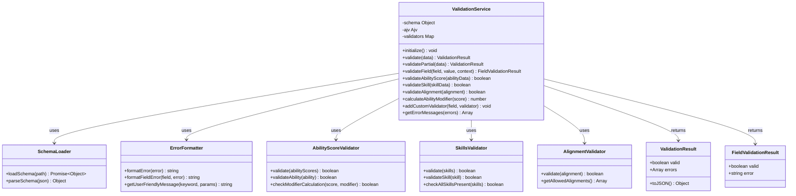

# D&D 5e Character Schema Validation Service

## Metadata

- **Name**: D&D 5e Character Schema Validation Service
- **Type**: Enabler
- **ID**: ENB-847291
- **Approval**: Approved
- **Capability ID**: CAP-968967
- **Owner**: Product Team
- **Status**: Ready for Implementation
- **Priority**: High
- **Analysis Review**: Required
- **Code Review**: Required

## Technical Overview
### Purpose
A centralized validation service that provides D&D 5e character schema validation for both client-side (UI forms) and server-side (REST API) components, ensuring consistent validation rules across the entire application by using the official D&D 5e JSON schema definition.

### Implementation Learnings

#### Critical Schema Alignment
**Issue**: Frontend forms sent data structures that didn't match the JSON schema, causing 400 Bad Request errors.

**Root Causes Identified**:
1. **Ability Scores**: Schema requires object with `{ score, modifier, savingThrowProficiency }`, not simple number
2. **Skills**: Schema requires object with each skill as property (e.g., `acrobatics: { proficient, expertise, modifier }`), not array
3. **Hit Points**: Schema uses `maximum`, not `max`
4. **Alignment**: Schema enum rejects empty strings, requires valid value or field omission
5. **Required Fields**: Schema strictly enforces `characterName`, `race`, `class`, `level`, `abilityScores`

**Solutions Implemented**:
```javascript
// CORRECT ability scores structure
abilityScores: {
    strength: { 
        score: 10,               // Required: 1-30
        modifier: 0,             // Required: Calculated as floor((score-10)/2)
        savingThrowProficiency: false  // Required: boolean
    },
    // ... other 5 abilities
}

// CORRECT skills structure (camelCase keys)
skills: {
    acrobatics: { proficient: false, expertise: false, modifier: 0 },
    animalHandling: { proficient: false, expertise: false, modifier: 0 },
    // ... other 16 skills
}

// CORRECT hit points
hitPoints: {
    current: 10,
    maximum: 10,    // NOT 'max'
    temporary: 0
}

// CORRECT alignment (valid enum or undefined)
alignment: 'True Neutral'  // One of 9 enum values, NOT empty string
```

**Key Mapping - Display Names to Schema Keys**:
```javascript
// Skills display → schema property mapping
{
    'Animal Handling': 'animalHandling',
    'Sleight of Hand': 'sleightOfHand',
    // Other skills use lowercase, no spaces
}
```

**Prevention Guidelines**:
1. **Schema Review First**: ALWAYS review `character-schema.json` BEFORE implementing forms
2. **Generate Types**: Create TypeScript interfaces directly from JSON schema
3. **Validation During Development**: Add detailed console logging of validation errors
4. **Early API Testing**: Test POST/PUT with actual schema as soon as endpoints exist
5. **Schema Documentation**: Document nested object structures in this enabler
6. **Automatic Calculations**: Calculate derived values (modifiers) automatically in forms
7. **Default Values**: Use valid default values, never empty strings for enums

#### Schema Property Reference

**Required Top-Level Fields**:
- `characterName` (string)
- `race` (string)  
- `class` (string)
- `level` (integer, 1-20)
- `abilityScores` (object with 6 abilities)

**Ability Score Object Structure**:
```typescript
{
    strength: { score: number(1-30), modifier: number, savingThrowProficiency: boolean },
    dexterity: { score: number(1-30), modifier: number, savingThrowProficiency: boolean },
    constitution: { score: number(1-30), modifier: number, savingThrowProficiency: boolean },
    intelligence: { score: number(1-30), modifier: number, savingThrowProficiency: boolean },
    wisdom: { score: number(1-30), modifier: number, savingThrowProficiency: boolean },
    charisma: { score: number(1-30), modifier: number, savingThrowProficiency: boolean }
}
```

**Skills Object Structure** (all 18 required as properties):
```typescript
{
    acrobatics: { proficient: boolean, expertise: boolean, modifier: number },
    animalHandling: { proficient: boolean, expertise: boolean, modifier: number },
    arcana: { proficient: boolean, expertise: boolean, modifier: number },
    athletics: { proficient: boolean, expertise: boolean, modifier: number },
    deception: { proficient: boolean, expertise: boolean, modifier: number },
    history: { proficient: boolean, expertise: boolean, modifier: number },
    insight: { proficient: boolean, expertise: boolean, modifier: number },
    intimidation: { proficient: boolean, expertise: boolean, modifier: number },
    investigation: { proficient: boolean, expertise: boolean, modifier: number },
    medicine: { proficient: boolean, expertise: boolean, modifier: number },
    nature: { proficient: boolean, expertise: boolean, modifier: number },
    perception: { proficient: boolean, expertise: boolean, modifier: number },
    performance: { proficient: boolean, expertise: boolean, modifier: number },
    persuasion: { proficient: boolean, expertise: boolean, modifier: number },
    religion: { proficient: boolean, expertise: boolean, modifier: number },
    sleightOfHand: { proficient: boolean, expertise: boolean, modifier: number },
    stealth: { proficient: boolean, expertise: boolean, modifier: number },
    survival: { proficient: boolean, expertise: boolean, modifier: number }
}
```

**Alignment Enum Values**:
- "Lawful Good", "Neutral Good", "Chaotic Good"
- "Lawful Neutral", "True Neutral", "Chaotic Neutral"  
- "Lawful Evil", "Neutral Evil", "Chaotic Evil"

#### Validation Error Handling Best Practices

**Development-Time Logging**:
```javascript
// Add during development
console.log('Submitting character data:', formData);

if (!response.ok) {
    const errorData = await response.json();
    console.error('API Error:', errorData);
    console.error('Validation Errors:', JSON.stringify(errorData.errors, null, 2));
}
```

**Production Error Display**:
- Parse validation errors array from API response
- Display user-friendly field-specific error messages
- Highlight invalid form fields
- Provide actionable correction guidance

**Error Response Structure**:
```json
{
    "error": "Validation Error",
    "message": "Invalid character data",
    "errors": [
        {
            "field": "abilityScores.strength",
            "message": "must be object",
            "keyword": "type",
            "params": { "type": "object" }
        }
    ]
}
```

### Mongoose Model Synchronization

**Critical**: The Mongoose Character model MUST be kept in sync with the JSON schema to prevent silent data loss.

**Issue Encountered**: Mongoose model defined `traits` (singular, string values) while JSON schema defined `personality` (different name, array values). This caused:
- Validation to pass (JSON schema validated request)
- Data to be silently dropped by MongoDB (Mongoose rejected undefined field)
- Character updates to appear successful but not persist

**Requirements for Model Synchronization**:

1. **Field Name Matching**:
```javascript
// JSON Schema
"personality": {
    "type": "object",
    "properties": {
        "personalityTraits": { "type": "array", "items": { "type": "string" } }
    }
}

// Mongoose Model MUST match exactly
personality: {
    personalityTraits: [String],  // Same name, same type structure
    ...
}
```

2. **Type Matching**:
   - Schema arrays → Mongoose arrays: `[String]`, `[Number]`, etc.
   - Schema objects → Mongoose subdocuments or nested objects
   - Schema enums → Mongoose enum arrays
   - Schema nested required → Mongoose nested required

3. **Automated Validation**:
Create test to compare schema properties against Mongoose model paths:
```javascript
const schemaProps = Object.keys(characterSchema.properties);
const modelPaths = Object.keys(CharacterModel.schema.paths);
const missing = schemaProps.filter(prop => !modelPaths.includes(prop));
expect(missing).toEqual([]); // Test fails if model missing schema fields
```

4. **Subdocument Configuration**:
Always disable `_id` on subdocuments to prevent MongoDB artifacts:
```javascript
const subdocSchema = new mongoose.Schema({
    field: String
}, { _id: false });  // CRITICAL: prevents _id generation
```

5. **Update Workflow**:
   - When JSON schema changes, update Mongoose model IMMEDIATELY
   - Run schema comparison tests
   - Update API documentation
   - Update frontend TypeScript interfaces
   - Deploy backend before frontend to ensure compatibility

## Functional Requirements

| ID | Name | Requirement | Priority | Status | Approval |
|----|------|-------------|----------|--------|----------|
| FR-VAL001 | Schema Loading | The service SHALL load and parse the D&D 5e character schema from `specifications/reference/character-schema.json` | High | Implemented | Approved |
| FR-VAL002 | Full Validation | The service SHALL provide a method to validate complete D&D 5e character objects against the schema | High | Implemented | Approved |
| FR-VAL003 | Partial Validation | The service SHALL provide a method to validate partial character data (for updates) against the schema | High | Implemented | Approved |
| FR-VAL004 | Field-Level Validation | The service SHALL provide a method to validate individual fields in real-time | High | Implemented | Approved |
| FR-VAL005 | Required Fields Check | The service SHALL validate that all required fields (characterName, race, class, level, abilityScores) are present | High | Implemented | Approved |
| FR-VAL006 | Ability Scores Validation | The service SHALL validate all six ability scores with score (1-30), modifier, and savingThrowProficiency | High | Implemented | Approved |
| FR-VAL007 | Skills Validation | The service SHALL validate all 18 D&D 5e skills with proficiency and modifier | High | Implemented | Approved |
| FR-VAL008 | Alignment Validation | The service SHALL validate alignment against the nine allowed enum values | Medium | Implemented | Approved |
| FR-VAL009 | Level Range Validation | The service SHALL validate character level is between 1 and 20 | High | Implemented | Approved |
| FR-VAL010 | Inventory Validation | The service SHALL validate inventory structure including currency, weapons, armor, and equipment | Medium | Implemented | Approved |
| FR-VAL011 | Spellcasting Validation | The service SHALL validate optional spellcasting data structure when present | Medium | Implemented | Approved |
| FR-VAL012 | Error Messages | The service SHALL return clear, specific error messages identifying which fields failed validation and why | High | Implemented | Approved |
| FR-VAL013 | Custom Validators | The service SHALL support custom validation functions for calculated fields (modifiers, proficiency bonus) | Medium | Implemented | Approved |
| FR-VAL014 | Client & Server Use | The service SHALL be usable in both browser (client-side) and Node.js (server-side) environments | High | Implemented | Approved |

## Non-Functional Requirements

| ID | Name | Type | Requirement | Priority | Status | Approval |
|----|------|------|-------------|----------|--------|----------|
| NFR-VAL001 | Performance | Performance | Validation SHALL complete within 100ms for a complete character object | High | Implemented | Approved |
| NFR-VAL002 | Consistency | Reliability | Validation rules SHALL be identical across client and server implementations | High | Implemented | Approved |
| NFR-VAL003 | Reusability | Maintainability | The service SHALL be a single source of truth for all validation logic | High | Implemented | Approved |
| NFR-VAL004 | Error Clarity | Usability | Error messages SHALL be user-friendly and actionable | Medium | Implemented | Approved |

## Dependencies

### Internal Upstream Dependency

| Enabler ID | Description |
|------------|-------------|
| | None - This is a foundational validation service |

### Internal Downstream Impact

| Enabler ID | Description |
|------------|-------------|
| ENB-432891 | Player Character REST API - Create Endpoint - Uses validation service |
| ENB-745321 | Player Character REST API - Update Endpoint - Uses validation service |
| ENB-384629 | Character Creation Form Component - Uses validation service for client-side validation |
| ENB-652108 | Character Edit Form Component - Uses validation service for client-side validation |
| ENB-492038 | MongoDB Character Database - Uses schema for database-level validation |

### External Dependencies

**External Upstream Dependencies**: 
- D&D 5e Character Schema (`specifications/reference/character-schema.json`)
- Ajv JSON Schema validator library

**External Downstream Impact**: All UI and API components depend on this service for validation

## Technical Specifications (Template)

### Enabler Dependency Flow Diagram

```mermaid
flowchart TD
    ENB_847291["ENB-847291<br/>D&D 5e Schema Validation Service<br/>✓"]
    
    SCHEMA["D&D 5e Schema<br/>character-schema.json<br/>📋"]
    AJV["Ajv Validator<br/>JSON Schema Engine<br/>⚙️"]
    
    CREATE_API["Create API<br/>ENB-432891<br/>📝"]
    UPDATE_API["Update API<br/>ENB-745321<br/>✏️"]
    CREATE_FORM["Create Form<br/>ENB-384629<br/>📝"]
    EDIT_FORM["Edit Form<br/>ENB-652108<br/>✏️"]
    MONGODB["MongoDB<br/>ENB-492038<br/>💾"]
    
    SCHEMA -->|Loads| ENB_847291
    AJV -->|Powers| ENB_847291
    
    CREATE_API -->|Validate Full Character| ENB_847291
    UPDATE_API -->|Validate Partial Update| ENB_847291
    CREATE_FORM -->|Validate Field| ENB_847291
    EDIT_FORM -->|Validate Field| ENB_847291
    MONGODB -->|Schema Rules| ENB_847291
    
    ENB_847291 -->|Valid/Errors| CREATE_API
    ENB_847291 -->|Valid/Errors| UPDATE_API
    ENB_847291 -->|Valid/Errors| CREATE_FORM
    ENB_847291 -->|Valid/Errors| EDIT_FORM
    ENB_847291 -->|Schema Definition| MONGODB

    classDef enabler fill:#e3f2fd,stroke:#1976d2,stroke-width:2px
    classDef external fill:#fff3e0,stroke:#f57c00,stroke-width:2px
    classDef consumer fill:#f3e5f5,stroke:#7b1fa2,stroke-width:2px
    
    class ENB_847291 enabler
    class SCHEMA,AJV external
    class CREATE_API,UPDATE_API,CREATE_FORM,EDIT_FORM,MONGODB consumer
```


### API Technical Specifications (if applicable)

| API Type | Operation | Channel / Endpoint | Description | Request / Publish Payload | Response / Subscribe Data |
|----------|-----------|---------------------|-------------|----------------------------|----------------------------|
| Module | validate | `ValidationService.validate(data)` | Validates complete character object | Complete D&D 5e character object | `{ valid: boolean, errors: Array<{field: string, message: string}> }` |
| Module | validatePartial | `ValidationService.validatePartial(data)` | Validates partial character data | Partial character object (for updates) | `{ valid: boolean, errors: Array<{field: string, message: string}> }` |
| Module | validateField | `ValidationService.validateField(field, value, context)` | Validates single field | Field name, value, optional context | `{ valid: boolean, error: string }` |
| Module | getSchema | `ValidationService.getSchema()` | Returns the loaded D&D 5e schema | None | D&D 5e JSON Schema object |

### Data Models


### Class Diagrams


### Sequence Diagrams


### Dataflow Diagrams
```mermaid
flowchart TD
    Start([Service Initialization]) --> LoadSchema[Load D&D 5e Schema]
    LoadSchema --> ParseJSON[Parse JSON Schema]
    ParseJSON --> InitAjv[Initialize Ajv Validator]
    InitAjv --> CompileSchema[Compile Schema]
    CompileSchema --> RegisterCustom[Register Custom Validators]
    RegisterCustom --> Ready[Service Ready]
    
    Ready --> WaitRequest{Validation Request}
    
    WaitRequest -->|Full Validation| ValidateFull[Validate Complete Character]
    WaitRequest -->|Partial Validation| ValidatePartial[Validate Partial Data]
    WaitRequest -->|Field Validation| ValidateField[Validate Single Field]
    
    ValidateFull --> RunAjv[Run Ajv Schema Validation]
    ValidatePartial --> RunAjv
    ValidateField --> CheckFieldRules[Check Field-Specific Rules]
    
    RunAjv --> AjvResult{Ajv Result}
    
    AjvResult -->|Valid| RunCustom[Run Custom Validators]
    AjvResult -->|Invalid| FormatErrors[Format Error Messages]
    
    RunCustom --> CustomResult{Custom Valid?}
    CustomResult -->|Yes| ReturnSuccess[Return {valid: true, errors: []}]
    CustomResult -->|No| FormatErrors
    
    CheckFieldRules --> FieldResult{Field Valid?}
    FieldResult -->|Yes| ReturnFieldSuccess[Return {valid: true}]
    FieldResult -->|No| ReturnFieldError[Return {valid: false, error: message}]
    
    FormatErrors --> ReturnErrors[Return {valid: false, errors: [...]}]
    
    ReturnSuccess --> WaitRequest
    ReturnErrors --> WaitRequest
    ReturnFieldSuccess --> WaitRequest
    ReturnFieldError --> WaitRequest
```

### State Diagrams


## External Dependencies

- **Ajv**: JSON Schema validator (v8+) for validating against D&D 5e schema
- **D&D 5e Character Schema**: JSON Schema definition in `specifications/reference/character-schema.json`
- **Node.js / Browser**: Service must work in both environments (isomorphic)

## Testing Strategy

### Unit Tests
- Test schema loading and parsing
- Test validation of valid complete character (from sample-characters.json)
- Test validation of valid minimal character (only required fields)
- Test validation failures for missing required fields
- Test validation failures for invalid ability scores (out of range, missing properties)
- Test validation failures for invalid skills (missing skills, wrong types)
- Test validation failures for invalid alignment (not in enum)
- Test validation failures for invalid level (0, 21, negative)
- Test partial validation for character updates
- Test field-level validation for individual fields
- Test custom validators (modifier calculations)
- Test error message formatting

### Integration Tests
- Test integration with Create API endpoint validation
- Test integration with Update API endpoint validation
- Test integration with Create Form client-side validation
- Test integration with Edit Form client-side validation
- Test validation consistency between client and server
- Test performance with large character objects

### Validation Test Cases
```javascript
// Valid minimal character
{
  "characterName": "Test Character",
  "race": "Human",
  "class": "Fighter",
  "level": 1,
  "abilityScores": {
    "strength": { "score": 10, "modifier": 0, "savingThrowProficiency": false },
    "dexterity": { "score": 10, "modifier": 0, "savingThrowProficiency": false },
    "constitution": { "score": 10, "modifier": 0, "savingThrowProficiency": false },
    "intelligence": { "score": 10, "modifier": 0, "savingThrowProficiency": false },
    "wisdom": { "score": 10, "modifier": 0, "savingThrowProficiency": false },
    "charisma": { "score": 10, "modifier": 0, "savingThrowProficiency": false }
  }
}
// Expected: { valid: true, errors: [] }

// Valid complete character (from sample-characters.json)
{
  "characterName": "Thorin Ironforge",
  "race": "Mountain Dwarf",
  "class": "Fighter",
  "level": 5,
  "alignment": "Lawful Good",
  // ... all other fields from sample
}
// Expected: { valid: true, errors: [] }

// Invalid - missing required field
{
  "characterName": "Test",
  "race": "Elf",
  "class": "Wizard"
  // Missing level and abilityScores
}
// Expected: { valid: false, errors: [
//   { field: "level", message: "must have required property 'level'" },
//   { field: "abilityScores", message: "must have required property 'abilityScores'" }
// ]}

// Invalid - level out of range
{
  "characterName": "Test",
  "race": "Human",
  "class": "Fighter",
  "level": 25,
  "abilityScores": { ... }
}
// Expected: { valid: false, errors: [
//   { field: "level", message: "must be <= 20" }
// ]}

// Invalid - invalid alignment
{
  "characterName": "Test",
  "race": "Human",
  "class": "Fighter",
  "level": 5,
  "alignment": "Bad Guy",
  "abilityScores": { ... }
}
// Expected: { valid: false, errors: [
//   { field: "alignment", message: "must be equal to one of the allowed values" }
// ]}

// Invalid - missing ability score properties
{
  "characterName": "Test",
  "race": "Human",
  "class": "Fighter",
  "level": 1,
  "abilityScores": {
    "strength": { "score": 16 },  // Missing modifier and savingThrowProficiency
    // ... other abilities
  }
}
// Expected: { valid: false, errors: [
//   { field: "abilityScores.strength", message: "must have required property 'modifier'" },
//   { field: "abilityScores.strength", message: "must have required property 'savingThrowProficiency'" }
// ]}

// Partial validation - valid update
{
  "level": 6,
  "hitPoints": {
    "current": 55,
    "maximum": 55,
    "temporary": 0
  }
}
// Expected: { valid: true, errors: [] }

// Field validation
ValidationService.validateField("level", 15)
// Expected: { valid: true }

ValidationService.validateField("level", 25)
// Expected: { valid: false, error: "level must be <= 20" }

ValidationService.validateField("alignment", "Lawful Good")
// Expected: { valid: true }

ValidationService.validateField("alignment", "Chaotic Bad")
// Expected: { valid: false, error: "alignment must be one of: Lawful Good, Neutral Good, ..." }
```

## Implementation Example

```javascript
// validation-service.js
import Ajv from 'ajv';
import characterSchema from '../reference/character-schema.json';

class ValidationService {
  constructor() {
    this.schema = null;
    this.ajv = null;
    this.validateFn = null;
  }

  initialize() {
    this.schema = characterSchema;
    this.ajv = new Ajv({ allErrors: true, verbose: true });
    this.validateFn = this.ajv.compile(this.schema);
  }

  validate(characterData) {
    const valid = this.validateFn(characterData);
    
    if (valid) {
      return { valid: true, errors: [] };
    }
    
    return {
      valid: false,
      errors: this.formatErrors(this.validateFn.errors)
    };
  }

  validatePartial(partialData) {
    // For partial updates, only validate provided fields
    const errors = [];
    
    for (const [field, value] of Object.entries(partialData)) {
      const fieldResult = this.validateField(field, value);
      if (!fieldResult.valid) {
        errors.push({ field, message: fieldResult.error });
      }
    }
    
    return {
      valid: errors.length === 0,
      errors
    };
  }

  validateField(field, value, context = {}) {
    // Implement field-specific validation logic
    switch (field) {
      case 'level':
        if (value < 1 || value > 20) {
          return { valid: false, error: 'level must be between 1 and 20' };
        }
        break;
      case 'alignment':
        const allowedAlignments = [
          'Lawful Good', 'Neutral Good', 'Chaotic Good',
          'Lawful Neutral', 'True Neutral', 'Chaotic Neutral',
          'Lawful Evil', 'Neutral Evil', 'Chaotic Evil'
        ];
        if (!allowedAlignments.includes(value)) {
          return { valid: false, error: `alignment must be one of: ${allowedAlignments.join(', ')}` };
        }
        break;
      // Add more field-specific validations
    }
    
    return { valid: true };
  }

  formatErrors(ajvErrors) {
    return ajvErrors.map(error => ({
      field: error.instancePath.substring(1).replace(/\//g, '.'),
      message: error.message,
      keyword: error.keyword,
      params: error.params
    }));
  }

  getSchema() {
    return this.schema;
  }
}

export default new ValidationService();
```

## Usage Examples

```javascript
// Server-side (REST API)
import ValidationService from './validation-service';

// Initialize once at startup
ValidationService.initialize();

// In Create API endpoint
app.post('/api/characters', (req, res) => {
  const result = ValidationService.validate(req.body);
  
  if (!result.valid) {
    return res.status(400).json({
      error: 'Validation failed',
      details: result.errors
    });
  }
  
  // Proceed with creating character
});

// In Update API endpoint
app.put('/api/characters/:id', (req, res) => {
  const result = ValidationService.validatePartial(req.body);
  
  if (!result.valid) {
    return res.status(400).json({
      error: 'Validation failed',
      details: result.errors
    });
  }
  
  // Proceed with updating character
});

// Client-side (UI Form)
import ValidationService from './validation-service';

// Initialize
ValidationService.initialize();

// In form component
const handleFieldChange = (field, value) => {
  const result = ValidationService.validateField(field, value);
  
  if (!result.valid) {
    setFieldError(field, result.error);
  } else {
    clearFieldError(field);
  }
};

const handleSubmit = (formData) => {
  const result = ValidationService.validate(formData);
  
  if (!result.valid) {
    setFormErrors(result.errors);
    return;
  }
  
  // Submit to API
};
```
