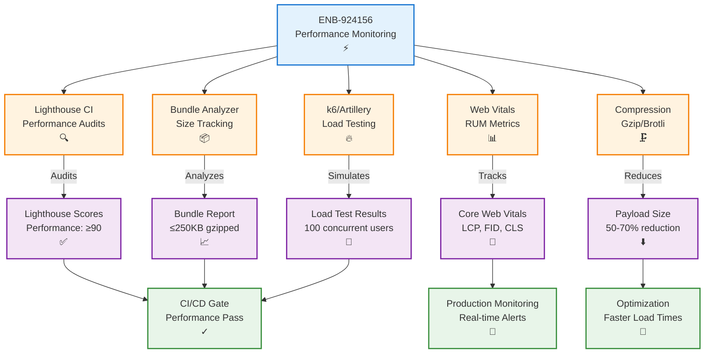

# Performance Monitoring and Optimization Implementation

## Metadata

- **Name**: Performance Monitoring and Optimization Implementation
- **Type**: Enabler
- **ID**: ENB-924156
- **Approval**: Approved
- **Capability ID**: CAP-456829
- **Owner**: Product Team
- **Status**: Ready for Implementation
- **Priority**: High
- **Analysis Review**: Required
- **Code Review**: Required

## Technical Overview
### Purpose
Implement performance monitoring infrastructure, optimization tooling, and automated performance testing to ensure the player character application meets defined performance standards including page load times, API response times, Core Web Vitals, and resource utilization targets.

## Functional Requirements

| ID | Name | Requirement | Priority | Status | Approval |
|----|------|-------------|----------|--------|----------|
| FR-PERF001 | Lighthouse CI Integration | The project SHALL integrate Lighthouse CI for automated performance audits | High | Implemented | Approved |
| FR-PERF002 | Bundle Analysis | The project SHALL use webpack-bundle-analyzer to track bundle sizes | High | Implemented | Approved |
| FR-PERF003 | Performance Budget | The project SHALL enforce performance budgets in the build process | High | Implemented | Approved |
| FR-PERF004 | Web Vitals Tracking | The project SHALL track Core Web Vitals (LCP, FID, CLS) in production | High | Implemented | Approved |
| FR-PERF005 | API Monitoring | The project SHALL monitor API response times and error rates | High | Implemented | Approved |
| FR-PERF006 | Database Profiling | The project SHALL enable MongoDB slow query logging and profiling | High | Implemented | Approved |
| FR-PERF007 | Code Splitting | The project SHALL implement code splitting for route-based lazy loading | High | Implemented | Approved |
| FR-PERF008 | Image Optimization | The project SHALL automatically optimize images (WebP, lazy loading) | Medium | Implemented | Approved |
| FR-PERF009 | Compression | The project SHALL enable gzip/brotli compression for static assets | High | Implemented | Approved |
| FR-PERF010 | Caching Headers | The project SHALL configure appropriate cache-control headers | High | Implemented | Approved |
| FR-PERF011 | Performance Tests | The project SHALL include performance tests in the test suite | Medium | Implemented | Approved |
| FR-PERF012 | Load Testing | The project SHALL support load testing with k6 or Artillery | Medium | Implemented | Approved |

## Non-Functional Requirements

| ID | Name | Type | Requirement | Priority | Status | Approval |
|----|------|------|-------------|----------|--------|----------|
| NFR-PERF001 | Build Time | Performance | Performance checks SHALL not increase build time by more than 30 seconds | Medium | Implemented | Approved |
| NFR-PERF002 | Monitoring Overhead | Performance | Monitoring SHALL not add more than 5KB to bundle size | High | Implemented | Approved |
| NFR-PERF003 | Alert Latency | Performance | Performance alerts SHALL fire within 5 minutes of threshold breach | High | Implemented | Approved |

## Dependencies

### Internal Upstream Dependency

| Enabler ID | Description |
|------------|-------------|
| ENB-228934 | TDD Implementation - Performance tests integration |

### Internal Downstream Impact

| Enabler ID | Description |
|------------|-------------|
| ENB-432891 | Create API - Must meet API performance targets |
| ENB-813945 | List API - Must meet API performance targets |
| ENB-745321 | Update API - Must meet API performance targets |
| ENB-492038 | MongoDB - Must meet database performance targets |
| ENB-384629 | Create Form UI - Must meet frontend performance targets |
| ENB-652108 | Edit Form UI - Must meet frontend performance targets |
| ENB-729164 | List Display UI - Must meet frontend performance targets |

### External Dependencies

**External Upstream Dependencies**: 
- Lighthouse CI - Performance auditing
- webpack-bundle-analyzer - Bundle size analysis
- web-vitals - Core Web Vitals measurement
- k6 or Artillery - Load testing
- Compression middleware (compression, shrink-ray-current)

**External Downstream Impact**: Users experience improved application performance

## Technical Specifications

### Enabler Dependency Flow Diagram


### Configuration Files

#### lighthouserc.js
```javascript
module.exports = {
  ci: {
    collect: {
      startServerCommand: 'npm run start',
      url: ['http://localhost:3000/', 'http://localhost:3000/characters/create'],
      numberOfRuns: 3,
    },
    assert: {
      preset: 'lighthouse:recommended',
      assertions: {
        'categories:performance': ['error', { minScore: 0.9 }],
        'categories:accessibility': ['warn', { minScore: 0.9 }],
        'categories:best-practices': ['warn', { minScore: 0.9 }],
        'categories:seo': ['warn', { minScore: 0.9 }],
        // Performance-specific assertions
        'first-contentful-paint': ['error', { maxNumericValue: 1500 }],
        'largest-contentful-paint': ['error', { maxNumericValue: 2500 }],
        'cumulative-layout-shift': ['error', { maxNumericValue: 0.1 }],
        'total-blocking-time': ['error', { maxNumericValue: 300 }],
        'speed-index': ['warn', { maxNumericValue: 3000 }],
        // Resource size assertions
        'resource-summary:script:size': ['error', { maxNumericValue: 256000 }], // 250KB
        'resource-summary:stylesheet:size': ['warn', { maxNumericValue: 51200 }], // 50KB
        'resource-summary:document:size': ['warn', { maxNumericValue: 20480 }], // 20KB
        'resource-summary:total:size': ['warn', { maxNumericValue: 512000 }], // 500KB
      },
    },
    upload: {
      target: 'temporary-public-storage',
    },
  },
};
```

#### webpack.config.js (Performance additions)
```javascript
const BundleAnalyzerPlugin = require('webpack-bundle-analyzer').BundleAnalyzerPlugin;
const CompressionPlugin = require('compression-webpack-plugin');

module.exports = {
  // ... existing config
  
  optimization: {
    splitChunks: {
      chunks: 'all',
      cacheGroups: {
        vendor: {
          test: /[\\/]node_modules[\\/]/,
          name: 'vendors',
          priority: 10,
        },
        common: {
          minChunks: 2,
          priority: 5,
          reuseExistingChunk: true,
        },
      },
    },
    runtimeChunk: 'single',
  },
  
  performance: {
    maxEntrypointSize: 250000, // 250KB
    maxAssetSize: 250000,
    hints: 'error',
  },
  
  plugins: [
    // Bundle analysis (only in analyze mode)
    process.env.ANALYZE && new BundleAnalyzerPlugin({
      analyzerMode: 'static',
      reportFilename: 'bundle-report.html',
      openAnalyzer: false,
    }),
    
    // Gzip compression
    new CompressionPlugin({
      algorithm: 'gzip',
      test: /\.(js|css|html|svg)$/,
      threshold: 8192,
      minRatio: 0.8,
    }),
    
    // Brotli compression (higher compression ratio)
    new CompressionPlugin({
      algorithm: 'brotliCompress',
      test: /\.(js|css|html|svg)$/,
      threshold: 8192,
      minRatio: 0.8,
      filename: '[path][base].br',
    }),
  ].filter(Boolean),
};
```

#### package.json (Performance scripts)
```json
{
  "scripts": {
    "build": "webpack --mode production",
    "build:analyze": "ANALYZE=true webpack --mode production",
    "lighthouse": "lhci autorun",
    "lighthouse:local": "lighthouse http://localhost:3000 --view",
    "perf:test": "jest --testMatch='**/tests/performance/**/*.test.js'",
    "load:test": "k6 run tests/load/basic-load-test.js"
  },
  "devDependencies": {
    "@lhci/cli": "^0.12.0",
    "webpack-bundle-analyzer": "^4.9.0",
    "compression-webpack-plugin": "^10.0.0",
    "web-vitals": "^3.5.0",
    "k6": "^0.0.0"
  },
  "dependencies": {
    "compression": "^1.7.4"
  }
}
```

### Web Vitals Tracking

#### src/utils/web-vitals.js
```javascript
import { onCLS, onFID, onLCP, onFCP, onTTFB } from 'web-vitals';

/**
 * Tracks Core Web Vitals and sends to analytics endpoint.
 * 
 * @param {Function} sendToAnalytics - Callback to send metrics to analytics
 */
export function initWebVitals(sendToAnalytics) {
  onCLS(sendToAnalytics);
  onFID(sendToAnalytics);
  onLCP(sendToAnalytics);
  onFCP(sendToAnalytics);
  onTTFB(sendToAnalytics);
}

/**
 * Send metrics to backend analytics endpoint.
 * 
 * @param {Object} metric - Web Vitals metric object
 */
function sendToAnalytics(metric) {
  const body = JSON.stringify({
    name: metric.name,
    value: metric.value,
    rating: metric.rating,
    delta: metric.delta,
    id: metric.id,
    navigationType: metric.navigationType,
  });

  // Use `navigator.sendBeacon()` if available, falling back to `fetch()`
  if (navigator.sendBeacon) {
    navigator.sendBeacon('/api/analytics/web-vitals', body);
  } else {
    fetch('/api/analytics/web-vitals', {
      method: 'POST',
      body,
      headers: { 'Content-Type': 'application/json' },
      keepalive: true,
    });
  }
}

// Initialize tracking on page load
if (typeof window !== 'undefined') {
  initWebVitals(sendToAnalytics);
}
```

### Code Splitting Example

#### src/App.jsx
```javascript
import React, { lazy, Suspense } from 'react';
import { BrowserRouter, Routes, Route } from 'react-router-dom';

// Lazy load route components for code splitting
const CharacterList = lazy(() => import('./features/character-list/CharacterList'));
const CharacterCreate = lazy(() => import('./features/character-creation/CharacterCreate'));
const CharacterEdit = lazy(() => import('./features/character-edit/CharacterEdit'));

/**
 * Main application component with route-based code splitting.
 * 
 * @component
 */
function App() {
  return (
    <BrowserRouter>
      <Suspense fallback={<div>Loading...</div>}>
        <Routes>
          <Route path="/" element={<CharacterList />} />
          <Route path="/characters/create" element={<CharacterCreate />} />
          <Route path="/characters/:id/edit" element={<CharacterEdit />} />
        </Routes>
      </Suspense>
    </BrowserRouter>
  );
}

export default App;
```

### Image Optimization

#### next.config.js (if using Next.js)
```javascript
module.exports = {
  images: {
    formats: ['image/webp', 'image/avif'],
    deviceSizes: [640, 750, 828, 1080, 1200, 1920, 2048, 3840],
    imageSizes: [16, 32, 48, 64, 96, 128, 256, 384],
    minimumCacheTTL: 60 * 60 * 24 * 365, // 1 year
  },
};
```

#### src/components/OptimizedImage.jsx
```javascript
import React from 'react';

/**
 * Optimized image component with lazy loading and WebP support.
 * 
 * @component
 * @param {Object} props
 * @param {string} props.src - Image source URL
 * @param {string} props.alt - Alt text for accessibility
 * @param {string} props.className - CSS classes
 */
function OptimizedImage({ src, alt, className }) {
  const webpSrc = src.replace(/\.(jpg|png)$/, '.webp');
  
  return (
    <picture>
      <source srcSet={webpSrc} type="image/webp" />
      
    </picture>
  );
}

export default OptimizedImage;
```

### API Performance Monitoring

#### src/middleware/performance-monitoring.js
```javascript
/**
 * Express middleware to track API response times and log slow requests.
 * 
 * @param {Object} req - Express request object
 * @param {Object} res - Express response object
 * @param {Function} next - Express next middleware function
 */
function performanceMonitoring(req, res, next) {
  const startTime = Date.now();
  
  // Intercept response to measure duration
  res.on('finish', () => {
    const duration = Date.now() - startTime;
    
    // Log slow requests (> 200ms)
    if (duration > 200) {
      console.warn(`Slow API request: ${req.method} ${req.path} - ${duration}ms`);
    }
    
    // Send metrics to monitoring system
    sendMetric({
      type: 'api_response_time',
      method: req.method,
      path: req.path,
      statusCode: res.statusCode,
      duration,
      timestamp: new Date().toISOString(),
    });
  });
  
  next();
}

/**
 * Send performance metric to monitoring backend.
 * 
 * @param {Object} metric - Performance metric data
 */
function sendMetric(metric) {
  // Send to your monitoring system (e.g., Datadog, New Relic, custom backend)
  // This is a placeholder - implement based on your monitoring solution
}

module.exports = performanceMonitoring;
```

### Database Performance Configuration

#### src/config/database.js
```javascript
import { MongoClient } from 'mongodb';

const MONGO_URI = process.env.MONGO_URI || 'mongodb://localhost:27017';
const DB_NAME = 'player_characters';

/**
 * MongoDB connection with performance optimizations.
 */
const client = new MongoClient(MONGO_URI, {
  // Connection pool settings for optimal performance
  minPoolSize: 10,
  maxPoolSize: 50,
  maxIdleTimeMS: 30000,
  
  // Compression for network efficiency
  compressors: ['zlib'],
  
  // Read preference for load distribution
  readPreference: 'primaryPreferred',
  
  // Write concern for performance (adjust based on durability needs)
  w: 1,
  journal: true,
  
  // Enable monitoring
  monitorCommands: true,
});

// Enable slow query logging
client.on('commandStarted', (event) => {
  event.startTime = Date.now();
});

client.on('commandSucceeded', (event) => {
  const duration = Date.now() - event.startTime;
  
  // Log slow queries (> 50ms)
  if (duration > 50) {
    console.warn(`Slow MongoDB query: ${event.commandName} - ${duration}ms`, {
      command: event.command,
    });
  }
});

export default client;
```

### Load Testing Script

#### tests/load/basic-load-test.js (k6)
```javascript
import http from 'k6/http';
import { check, sleep } from 'k6';

/**
 * k6 load test configuration for character API endpoints.
 * 
 * Simulates 100 concurrent users for 1 minute.
 */
export const options = {
  stages: [
    { duration: '30s', target: 50 },  // Ramp up to 50 users
    { duration: '1m', target: 100 },  // Stay at 100 users
    { duration: '30s', target: 0 },   // Ramp down to 0
  ],
  thresholds: {
    http_req_duration: ['p(95)<200'],  // 95% of requests under 200ms
    http_req_failed: ['rate<0.01'],    // Error rate under 1%
  },
};

export default function () {
  // Test character list endpoint
  const listResponse = http.get('http://localhost:3001/api/characters');
  check(listResponse, {
    'list status is 200': (r) => r.status === 200,
    'list response time < 200ms': (r) => r.timings.duration < 200,
  });
  
  sleep(1);
  
  // Test character creation endpoint
  const createPayload = JSON.stringify({
    characterName: 'Load Test Character',
    race: 'Human',
    class: 'Fighter',
    level: 1,
    alignment: 'Lawful Good',
    abilityScores: {
      strength: { score: 16, modifier: 3, savingThrowProficiency: true },
      dexterity: { score: 14, modifier: 2, savingThrowProficiency: false },
      constitution: { score: 15, modifier: 2, savingThrowProficiency: true },
      intelligence: { score: 10, modifier: 0, savingThrowProficiency: false },
      wisdom: { score: 12, modifier: 1, savingThrowProficiency: false },
      charisma: { score: 8, modifier: -1, savingThrowProficiency: false },
    },
  });
  
  const createResponse = http.post(
    'http://localhost:3001/api/characters',
    createPayload,
    { headers: { 'Content-Type': 'application/json' } }
  );
  
  check(createResponse, {
    'create status is 201': (r) => r.status === 201,
    'create response time < 200ms': (r) => r.timings.duration < 200,
  });
  
  sleep(1);
}
```

### Performance Test Suite

#### tests/performance/api-performance.test.js
```javascript
import request from 'supertest';
import app from '../../src/app';

describe('API Performance Tests', () => {
  it('should respond to list endpoint within 200ms', async () => {
    const startTime = Date.now();
    
    await request(app)
      .get('/api/characters')
      .expect(200);
    
    const duration = Date.now() - startTime;
    expect(duration).toBeLessThan(200);
  });
  
  it('should create character within 200ms', async () => {
    const character = createTestCharacter();
    const startTime = Date.now();
    
    await request(app)
      .post('/api/characters')
      .send(character)
      .expect(201);
    
    const duration = Date.now() - startTime;
    expect(duration).toBeLessThan(200);
  });
  
  it('should handle 100 concurrent requests', async () => {
    const requests = Array.from({ length: 100 }, () =>
      request(app).get('/api/characters')
    );
    
    const startTime = Date.now();
    const responses = await Promise.all(requests);
    const duration = Date.now() - startTime;
    
    // All requests should succeed
    responses.forEach(response => {
      expect(response.status).toBe(200);
    });
    
    // Average response time should be under 200ms
    const avgDuration = duration / 100;
    expect(avgDuration).toBeLessThan(200);
  });
});
```

### CI/CD Integration

#### .github/workflows/performance.yml
```yaml
name: Performance Tests

on:
  pull_request:
  push:
    branches: [main]

jobs:
  lighthouse:
    runs-on: ubuntu-latest
    steps:
      - uses: actions/checkout@v3
      - uses: actions/setup-node@v3
        with:
          node-version: '18'
      
      - name: Install dependencies
        run: npm ci
      
      - name: Build application
        run: npm run build
      
      - name: Run Lighthouse CI
        run: npm run lighthouse
      
      - name: Upload Lighthouse results
        uses: actions/upload-artifact@v3
        with:
          name: lighthouse-results
          path: .lighthouseci/
  
  bundle-size:
    runs-on: ubuntu-latest
    steps:
      - uses: actions/checkout@v3
      - uses: actions/setup-node@v3
        with:
          node-version: '18'
      
      - name: Install dependencies
        run: npm ci
      
      - name: Build with bundle analyzer
        run: npm run build:analyze
      
      - name: Check bundle size
        run: |
          BUNDLE_SIZE=$(du -b dist/main.*.js.gz | cut -f1)
          MAX_SIZE=256000  # 250KB in bytes
          if [ $BUNDLE_SIZE -gt $MAX_SIZE ]; then
            echo "Bundle size $BUNDLE_SIZE exceeds maximum $MAX_SIZE"
            exit 1
          fi
  
  load-test:
    runs-on: ubuntu-latest
    steps:
      - uses: actions/checkout@v3
      - uses: actions/setup-node@v3
        with:
          node-version: '18'
      
      - name: Install dependencies
        run: npm ci
      
      - name: Start application
        run: npm start &
        
      - name: Wait for application
        run: npx wait-on http://localhost:3000
      
      - name: Run load tests
        run: npm run load:test
```

## Performance Dashboard

### Metrics to Display
- **Core Web Vitals Trends**: LCP, FID, CLS over time
- **API Response Time Percentiles**: P50, P95, P99
- **Database Query Performance**: Slow queries, average execution time
- **Bundle Size History**: Track bundle growth over releases
- **Lighthouse Score Trends**: Performance, Accessibility, Best Practices, SEO
- **Error Rates**: API errors, client-side errors
- **Resource Utilization**: CPU, memory, network

### Alerting Rules
```yaml
# Example alerting configuration (Prometheus/Grafana)
groups:
  - name: performance_alerts
    rules:
      - alert: HighAPILatency
        expr: histogram_quantile(0.95, http_request_duration_seconds) > 0.2
        for: 5m
        annotations:
          summary: "API P95 latency is above 200ms"
      
      - alert: SlowDatabaseQueries
        expr: mongodb_query_duration_p95 > 0.05
        for: 5m
        annotations:
          summary: "Database P95 query time is above 50ms"
      
      - alert: BundleSizeIncrease
        expr: bundle_size_bytes > 256000
        annotations:
          summary: "JavaScript bundle exceeds 250KB"
      
      - alert: PoorWebVitals
        expr: web_vitals_lcp > 2.5
        for: 10m
        annotations:
          summary: "Largest Contentful Paint exceeds 2.5s"
```

## Testing Strategy

### Performance Testing Pyramid
1. **Unit Performance Tests**: Test individual function performance
2. **API Performance Tests**: Test endpoint response times
3. **Load Tests**: Test system under concurrent load
4. **Lighthouse Audits**: Test overall page performance
5. **Real User Monitoring**: Track actual user experiences

## Success Criteria

- ✅ Lighthouse CI integrated and passing (score ≥ 90)
- ✅ Bundle size stays under 250KB gzipped
- ✅ Core Web Vitals tracked in production
- ✅ API P95 response time ≤ 200ms
- ✅ Database P95 query time ≤ 50ms
- ✅ Load tests pass with 100 concurrent users
- ✅ Performance budgets enforced in CI/CD
- ✅ Automated alerts configured for performance regressions
