# Player Character Website

## Metadata

- **Name**: Player Character Website
- **Type**: Enabler
- **ID**: ENB-968967
- **Approval**: Not Approved
- **Capability ID**: CAP-182373
- **Owner**: Product Team
- **Status**: Ready for Implementation
- **Priority**: High
- **Analysis Review**: Required
- **Code Review**: Not Required

## Technical Overview
### Purpose
A website to view the player character information

### Implementation Learnings

#### Theme Provider Integration
**Issue**: Styled-components ThemeProvider received undefined theme causing "Cannot read properties of undefined (reading 'background')" error.

**Root Cause**: ThemeProvider was wrapped incorrectly - custom theme context and styled-components ThemeProvider weren't properly connected.

**Solution**: 
1. Custom ThemeProvider must be outermost
2. Use useTheme() hook inside a child component to access theme
3. Pass theme object to styled-components ThemeProvider
4. Correct pattern:
```jsx
function AppContent() {
    const theme = useTheme(); // Get theme from custom context
    return (
        <StyledThemeProvider theme={theme}> {/* Pass to styled-components */}
            {/* App content */}
        </StyledThemeProvider>
    );
}

function App() {
    return (
        <ThemeProvider> {/* Custom theme provider outermost */}
            <AppContent />
        </ThemeProvider>
    );
}
```

**Prevention**: Always verify theme provider hierarchy and test theme access in styled components during initial setup.

#### API Response Structure Handling
**Issue**: Frontend couldn't parse API responses, causing ".map is not a function" errors.

**Root Cause**: API returns `{ success: true, data: [...] }` but frontend expected direct array or `{ characters: [...] }`.

**Solution**:
```javascript
const data = await response.json();
// Handle API wrapper object
setCharacters(Array.isArray(data) ? data : (data.data || []));
```

**Prevention**: 
- Document API response structure in technical specs
- Add response type definitions/interfaces
- Test API integration early in development
- Use console logging during development to verify response structure

#### Schema Validation Alignment
**Issue**: Character creation failed with 400 Bad Request due to schema mismatches.

**Root Causes**:
1. **Ability Scores Structure**: Frontend sent simple numbers, schema expected objects with `score`, `modifier`, `savingThrowProficiency`
2. **Skills Structure**: Frontend sent array of skill names, schema expected object with each skill as property containing `proficient`, `expertise`, `modifier`
3. **Hit Points**: Frontend used `max`, schema expected `maximum`
4. **Alignment**: Frontend sent empty string, schema required valid enum value or omission

**Solutions**:
1. Match frontend state structure to schema exactly:
```javascript
abilityScores: {
    strength: { score: 10, modifier: 0, savingThrowProficiency: false },
    // ... other abilities
}

skills: {
    acrobatics: { proficient: false, expertise: false, modifier: 0 },
    // ... other skills
}

hitPoints: {
    current: 10,
    maximum: 10,  // Not 'max'
    temporary: 0
}

alignment: 'True Neutral'  // Valid enum value, not empty string
```

2. Calculate derived values (like ability modifiers) automatically:
```javascript
const modifier = Math.floor((score - 10) / 2);
```

**Prevention**:
- Review JSON schema BEFORE implementing forms
- Create TypeScript interfaces from schema
- Add schema documentation to enabler specs
- Implement schema validation on both client and server
- Use detailed error logging during development
- Test with actual API early in development cycle

#### Docker Build Context Issues
**Issue**: Dockerfile couldn't access files outside its build context.

**Root Cause**: Service Dockerfile needed `specifications/reference` directory but build context was `./service`.

**Solution**:
1. Change docker-compose build context to root: `context: .`
2. Update Dockerfile paths to be relative to root: `COPY service/package*.json ./`
3. Update volume mounts in docker-compose for hot reload

**Prevention**: 
- Plan build context before writing Dockerfiles
- Document required directories in deployment specs
- Use .dockerignore to optimize build context size

#### Environment-Specific Package Scripts
**Issue**: Husky prepare script failed in Docker builds (sh: husky: not found).

**Root Cause**: Git hooks (husky) are for local development only, not needed in containers.

**Solution**: Remove husky prepare script from package.json or use conditional scripts.

**Prevention**: 
- Separate dev dependencies from production in package.json
- Use different npm scripts for local vs container environments
- Document build environment differences in enablers

#### Import Path Management
**Issue**: Module not found errors for schema imports after Docker context changes.

**Root Cause**: Relative import paths (`../../../specifications/reference/character-schema.json`) became invalid when directory structure changed in container.

**Solution**: Update import paths to match container structure (`../../specifications/reference/character-schema.json`).

**Prevention**:
- Use absolute imports or path aliases
- Document import path conventions
- Test imports after any structural changes
- Consider using path mapping in bundler config

### Development Workflow Best Practices

1. **Schema-First Development**: Always review and understand the data schema before implementing UI forms or API handlers
2. **Early Integration Testing**: Test frontend-backend integration as soon as basic endpoints exist
3. **Structured Error Logging**: Add detailed console logging during development to catch data structure mismatches
4. **Incremental Docker Builds**: Test Docker builds frequently, not just at deployment time
5. **Type Safety**: Consider TypeScript to catch structure mismatches at compile time
6. **API Documentation**: Document exact request/response structures in enabler specs

## Functional Requirements

| ID | Name | Requirement | Priority | Status | Approval |
|----|------|-------------|----------|--------|----------|
| FR-XXXXXX | [Name] | [Requirement Description] | [Priority] | [Status] | [Approval] |

## Non-Functional Requirements

| ID | Name | Type | Requirement | Priority | Status | Approval |
|----|------|------|-------------|----------|--------|----------|
| NFR-XXXXXX | [Name] | [Type] | [Requirement Description] | [Priority] | [Status] | [Approval] |

## Dependencies

### Internal Upstream Dependency

| Enabler ID | Description |
|------------|-------------|
| | |

### Internal Downstream Impact

| Enabler ID | Description |
|------------|-------------|
| | |

### External Dependencies

**External Upstream Dependencies**: None identified.

**External Downstream Impact**: None identified.

## Technical Specifications (Template)

### Enabler Dependency Flow Diagram

```mermaid
flowchart TD
    ENB_XXXXXX["ENB-968967<br/>[Enabler Name]<br/>📡"]

    %% Add your dependency flows here

    classDef enabler fill:#e3f2fd,stroke:#1976d2,stroke-width:2px
    class ENB_XXXXXX enabler
```

### API Technical Specifications (if applicable)

| API Type | Operation | Channel / Endpoint | Description | Request / Publish Payload | Response / Subscribe Data |
|----------|-----------|---------------------|-------------|----------------------------|----------------------------|
| | | | | | |

### Data Models

### Class Diagrams

### Sequence Diagrams

### Dataflow Diagrams

### State Diagrams


